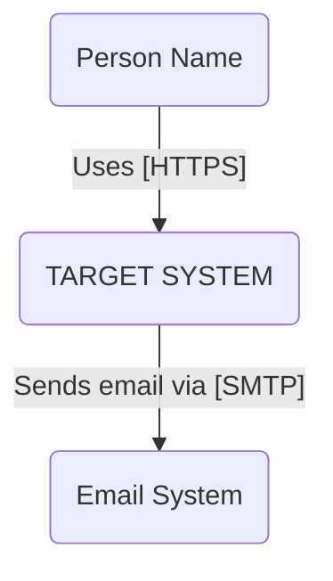
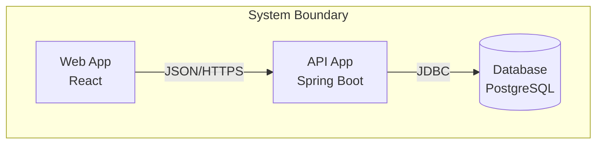

# C4 System Architecture Blueprint

Generate architecture documentation following the C4 model by Simon Brown.
This is a **Level 4 Tactical Readout** - not a generic README.

## Core Principles

### 1. Containers are Applications, Not Docker Images
A C4 "Container" is a **runnable application or data store** (API, Web App, Database, Queue).
Docker, Kubernetes, and AWS are **deployment infrastructure** - they go in a separate section.

### 2. Technology Choices are Mandatory
Every container must specify its technology stack. "API" is insufficient.
Correct: "API Gateway (Java / Spring Boot)"

### 3. Perspectives Keep Diagrams Clean
Security protocols, team ownership, and failover rules are **orthogonal data**.
Layer them separately, don't clutter the structural diagram.

---

## Template: ARCHITECTURE.md

When the user requests architecture documentation, generate this structure:

````markdown
# SYSTEM ARCHITECTURE: [SYSTEM_NAME]

> **STATUS:** `[DRAFT | PROD-READY | DEPRECATED]`
> **OWNER:** `[Team Name]`
> **DOC VERSION:** `v1.0`

---

## Chapter 1: System Context (Level 1)

**Scope:** Who is using this system and what is the mission?

| Actor / System | Type | Description |
| :--- | :--- | :--- |
| **[User Persona]** | `Person` | [e.g., Retail Customer checking balance] |
| **[SYSTEM_NAME]** | `System` | **[The Scope]** [e.g., Internet Banking System] |
| **[External Sys A]** | `System` | [e.g., Mainframe / Email Service (SES)] |

### Context Diagram (Mermaid)


---

## Chapter 2: Container Inventory (Level 2)

**Definition:** A "Container" is a runnable application or data store.

> **CRITICAL:** Do NOT list "Docker" or "Kubernetes" here. Those are deployment details.

| ID | Container Name | Technology Choice (MANDATORY) | Responsibility | Type |
| :--- | :--- | :--- | :--- | :--- |
| **C1** | `Single Page App` | React / TypeScript | Delivers UI to customer browser | `Web App` |
| **C2** | `API Gateway` | Java / Spring Boot | Handles auth & biz logic | `API` |
| **C3** | `Primary DB` | PostgreSQL 14 | Stores user transactions | `Database` |
| **C4** | `Audit Queue` | Kafka Topic | Buffers audit logs | `Queue` |

> **ARCHITECT NOTE:** If you list "Docker" as a technology above, you are incorrect. Listing *what runs inside* the Docker container is correct.

### Container Diagram (Mermaid)


---

## Chapter 3: Perspectives Overlay

**Concept:** Orthogonal information layered onto the architecture without cluttering the main diagram.

### Security Perspective
- **C1 (Web App):** `TLS 1.3` / `OIDC Auth`
- **C2 (API):** `OAuth 2.0 Scopes` / `Input Sanitization`
- **C3 (Database):** `AES-256 At Rest`

### Ownership Perspective
- **Frontend Team:** Owns `C1`
- **Core Backend Team:** Owns `C2`, `C3`

---

## Chapter 4: Deployment Mapping

**Definition:** How Containers (Level 2) map to Infrastructure. This is where Docker/AWS belongs.

| Container (App) | Infrastructure Node | Environment |
| :--- | :--- | :--- |
| `API Application` | AWS Fargate (Docker) | Production |
| `Primary DB` | AWS RDS Instance | Production |
| `SPA Frontend` | AWS S3 + Cloudfront | Production |
````

---

## Container Types Reference

Use these categories for the "Type" column:

| Type | Examples |
|------|----------|
| `Web App` | SPA, Server-rendered app, Static site |
| `API` | REST API, GraphQL, gRPC service |
| `Service` | Background worker, Scheduled job |
| `Database` | PostgreSQL, MongoDB, Redis |
| `Queue` | Kafka Topic, RabbitMQ Queue, SQS |
| `File Store` | S3 Bucket, Azure Blob, NFS |
| `Cache` | Redis Cache, Memcached |

---

## Common Mistakes to Avoid

### Mistake 1: Docker as Technology
```
WRONG: | API | Docker | Handles requests |
RIGHT: | API | Python / FastAPI | Handles requests |
```
Docker is deployment infrastructure, not application technology.

### Mistake 2: Message Bus as Single Box
```
WRONG: One giant "Message Bus" container
RIGHT: Individual queues as separate containers (Audit Queue, Order Queue, etc.)
```

### Mistake 3: Security in Main Diagram
```
WRONG: Box labeled "API (Spring Boot, OAuth 2.0, TLS 1.3)"
RIGHT: Clean "API (Spring Boot)" with security in Perspectives section
```

### Mistake 4: Missing Protocols
```
WRONG: SPA --> API (arrow with no label)
RIGHT: SPA -- "JSON/HTTPS" --> API
```
Always specify communication protocols on arrows.

---

## Quick Reference

### Level 1: System Context
- **Audience:** Everyone (executives, architects, developers)
- **Shows:** System + actors + external dependencies
- **Question answered:** "What does this system do and who uses it?"

### Level 2: Container
- **Audience:** Architects, tech leads, developers
- **Shows:** Applications and data stores inside the system
- **Question answered:** "What are the major building blocks?"

### Level 3: Component (Optional)
- **Audience:** Developers on specific containers
- **Shows:** Internal components of a single container
- **Question answered:** "How is this container structured internally?"

### Level 4: Code (Rare)
- **Audience:** Developers debugging/extending
- **Shows:** Class diagrams, sequence diagrams
- **Usually:** Generated from code, not maintained manually

---

## Usage Examples

### Request: "Create architecture for a chat application"

Generate ARCHITECTURE.md with:
- Context: Users, Chat System, Push Notification Service
- Containers: React SPA, WebSocket Server (Node.js), Message Store (MongoDB), Redis PubSub
- Perspectives: E2E encryption, team ownership
- Deployment: AWS ECS, DocumentDB, ElastiCache

### Request: "Document our microservices"

For each microservice:
1. Add as separate container row
2. Specify technology (Python/FastAPI, Go/Chi, etc.)
3. Show inter-service communication protocols
4. Map each to deployment infrastructure

---

## References

- [C4 Model Official](https://c4model.com/)
- [Simon Brown - Software Architecture for Developers](https://softwarearchitecturefordevelopers.com/)
- [Structurizr](https://structurizr.com/) - C4 tooling
