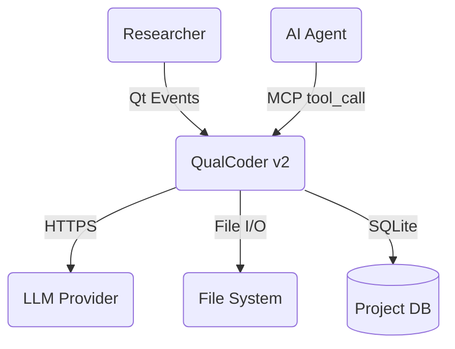
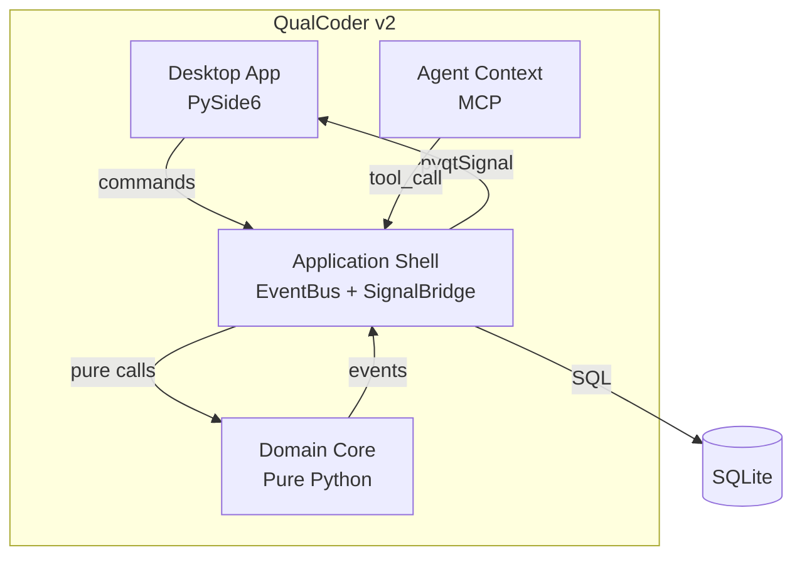
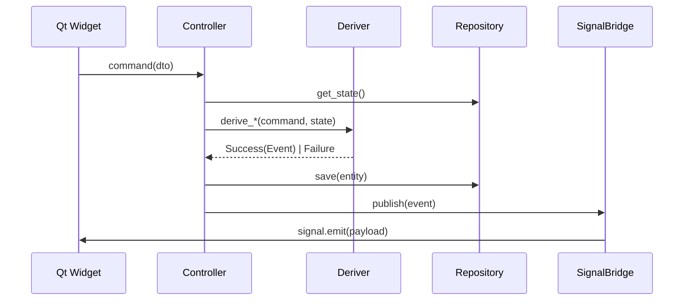
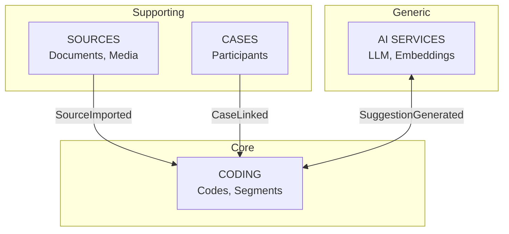

# QualCoder v2 Architecture Understanding

Quick reference for understanding and documenting QualCoder v2 architecture.

## Reference Document

Full architecture documentation: `docs/ARCHITECTURE.md`

---

## System Overview

QualCoder v2 is a desktop qualitative data analysis tool following **Functional DDD**.

```
┌─────────────────────────────────────────────────────────────┐
│                    QualCoder v2 System                       │
├─────────────────────────────────────────────────────────────┤
│  Presentation (PySide6)  ←──pyqtSignal──  SignalBridge      │
│           ↓ commands                           ↑ events     │
│  Application (Controllers, EventBus)                        │
│           ↓ function calls                     ↑ Result     │
│  Domain (Pure: Entities, Derivers, Events)                  │
│           ↓ data                               ↑ queries    │
│  Infrastructure (SQLite Repositories)                       │
└─────────────────────────────────────────────────────────────┘
```

---

## Containers (C4 Level 2)

| ID | Container | Technology | Purpose |
|----|-----------|------------|---------|
| C1 | Desktop App | PySide6 | GUI, user interaction |
| C2 | Domain Core | Pure Python | Business logic (no I/O) |
| C3 | Application Shell | EventBus + SignalBridge | Orchestration |
| C4 | Project Database | SQLite | Persistent storage |
| C5 | Agent Context | MCP Protocol | AI agent interface |
| C6 | Vector Store | ChromaDB | Semantic search |

---

## Bounded Contexts

| Context | Directory | Key Entities |
|---------|-----------|--------------|
| **Coding** | `src/domain/coding/` | Code, Category, Segment |
| **Sources** | `src/domain/sources/` | Source, Speaker |
| **Cases** | `src/domain/cases/` | Case, CaseAttribute |
| **Analysis** | `src/domain/analysis/` | Report, Insight |
| **Projects** | `src/domain/projects/` | Project, Settings |
| **Collaboration** | `src/domain/collaboration/` | Coder, Session |
| **AI Services** | `src/domain/ai_services/` | Embedding, Suggestion |

---

## Mermaid Diagram Patterns

### Context Diagram (Who uses the system)



### Container Diagram (Major building blocks)



### Data Flow Diagram (How requests flow)



### Bounded Context Diagram



---

## Directory to Architecture Mapping

```
src/
├── domain/           → C2: Domain Core (PURE - no I/O)
│   ├── coding/       → Coding bounded context
│   ├── sources/      → Sources bounded context
│   └── shared/       → Cross-cutting types
│
├── application/      → C3: Application Shell
│   ├── coding/       → Controllers for Coding
│   ├── event_bus.py  → Event distribution
│   └── signal_bridge/→ Domain → Qt bridge
│
├── infrastructure/   → Repositories, Adapters
│   └── coding/       → SQLite repos for Coding
│
├── presentation/     → C1: Desktop App
│   ├── organisms/    → Complex widgets
│   ├── pages/        → Page layouts
│   └── screens/      → Top-level windows
│
└── agent_context/    → C5: Agent Context
    └── schemas/      → MCP tool definitions
```

---

## Creating New Architecture Diagrams

### When adding a new bounded context

1. Add to Bounded Contexts table
2. Update container diagram if needed
3. Show integration events with existing contexts

### When adding a new container

1. Add to Containers table with technology
2. Update container diagram
3. Document data flow

### Diagram Guidelines

- **Always label arrows** with protocol/data type
- **Use subgraphs** for system boundaries
- **Container names** include technology: `API<br/>FastAPI`
- **Never use Docker** as technology (it's deployment)

---

## Quick Architecture Questions

| Question | Answer Location |
|----------|-----------------|
| "How does coding work?" | `docs/ARCHITECTURE.md` Section 5 (Data Flow) |
| "What bounded contexts exist?" | `docs/ARCHITECTURE.md` Section 9 |
| "How do events flow?" | `docs/ARCHITECTURE.md` Section 5 + diagrams |
| "What technology for X?" | `docs/ARCHITECTURE.md` Section 6 (Perspectives) |
| "Directory structure?" | `docs/ARCHITECTURE.md` Section 8 |
