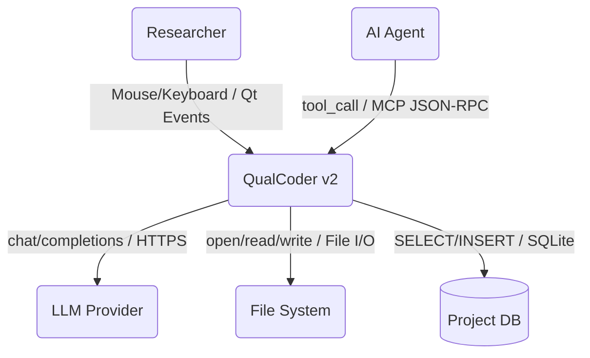
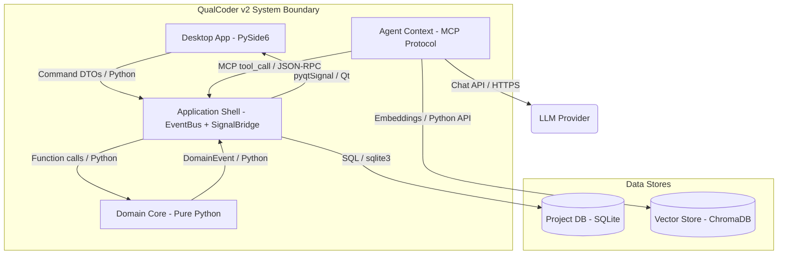
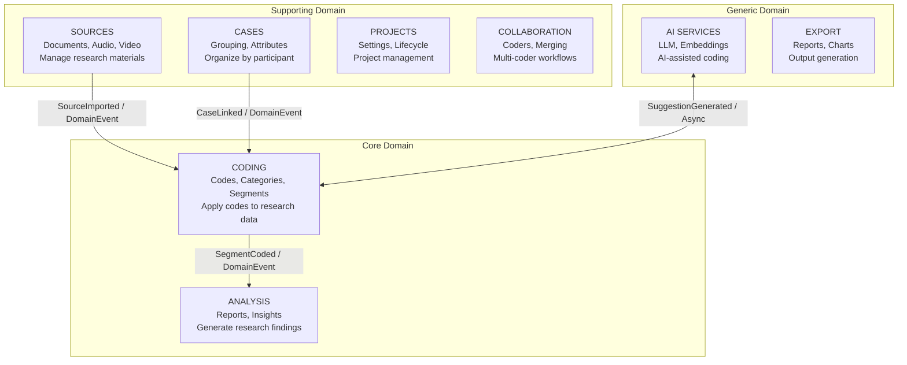
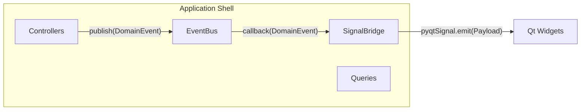
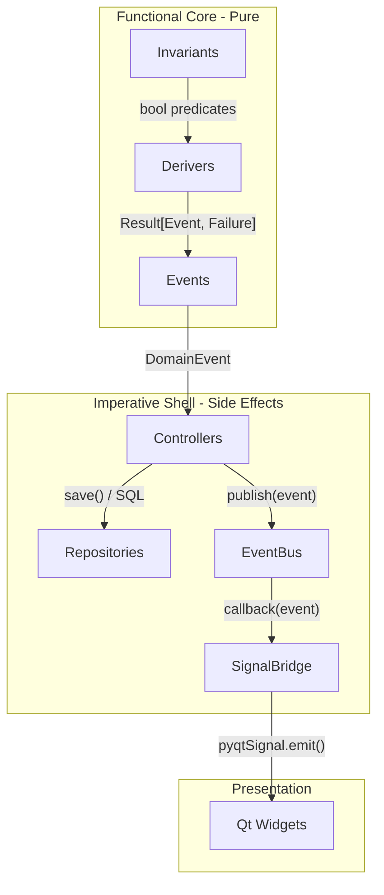
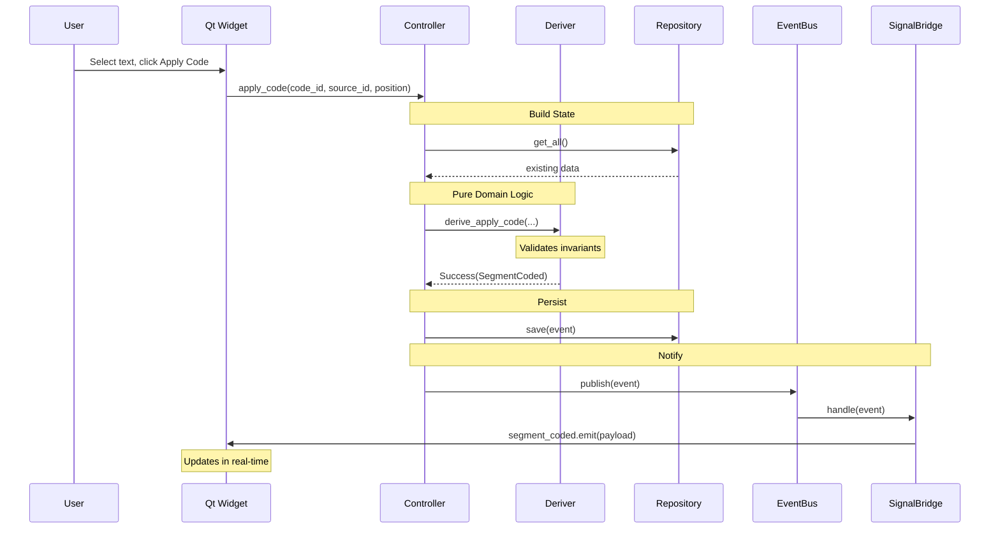
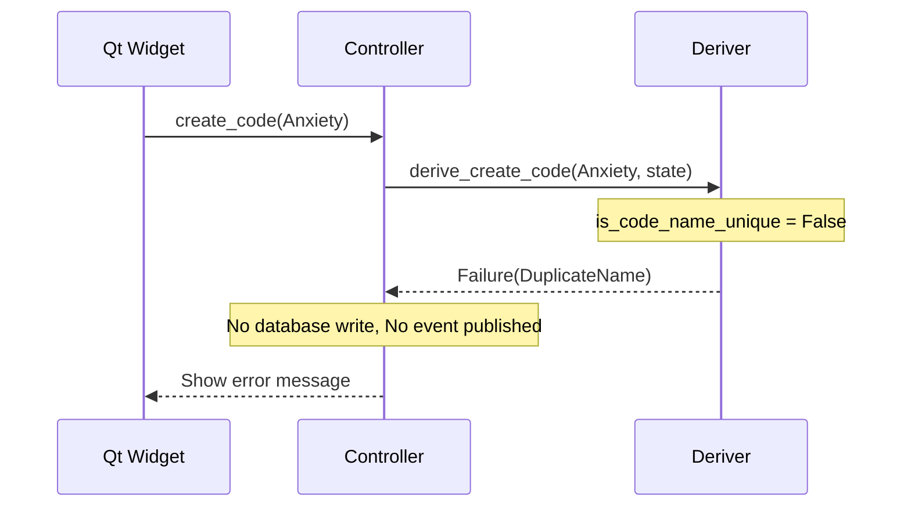

# QualCoder v2 System Architecture

> **Status:** `DRAFT`
> **Owner:** `QualCoder Core Team`
> **Version:** `v2.0`

This document provides a C4 model architecture overview of QualCoder v2. For hands-on learning with code examples, see the [Onboarding Tutorials](../tutorials/README.md).

---

## 1. System Context (C4 Level 1)

**Scope:** QualCoder v2 is a desktop qualitative data analysis tool for researchers to apply semantic codes to research data and generate insights.

| Actor / System | Type | Description |
|----------------|------|-------------|
| **Researcher** | Person | Qualitative researcher applying codes to research data |
| **AI Agent** | Person | Automated agent suggesting codes and generating insights |
| **QualCoder v2** | System | The Scope - Desktop QDA tool with AI assistance |
| **LLM Provider** | System | External AI service (OpenAI, Anthropic, local Ollama) |
| **File System** | System | Local storage for project files, media, exports |

### Context Diagram



---

## 2. Container Inventory (C4 Level 2)

**Definition:** A "Container" is a runnable application or data store.

| ID | Container Name | Technology | Responsibility | Type |
|----|----------------|------------|----------------|------|
| C1 | Desktop Application | Python 3.10+ / PySide6 | Main GUI, user interaction | Desktop App |
| C2 | Domain Core | Python / Pure Functions | Business logic, invariants, derivers | Library |
| C3 | Application Shell | Python / EventBus + SignalBridge | Orchestration, event routing | Library |
| C4 | Project Database | SQLite 3 | Stores codes, segments, sources | Database |
| C5 | Agent Context | Python / MCP Protocol | Exposes domain to AI agents | API |
| C6 | Vector Store | ChromaDB (embedded) | Stores embeddings for search | Database |

### Container Diagram



---

## 3. Component View (C4 Level 3)

### Domain Core Components (C2)

Organized by **Bounded Contexts** - each context is a cohesive business capability.



### Bounded Context Summary

| Context | Entities | Key Operations |
|---------|----------|----------------|
| **Coding** | Code, Category, Segment | Create code, apply to text, merge codes |
| **Analysis** | Report, Insight, Matrix | Generate frequency, co-occurrence |
| **Sources** | Source, Speaker, Transcript | Import files, detect speakers |
| **Cases** | Case, CaseAttribute | Link sources, assign attributes |
| **Projects** | Project, Settings | Open, save, export project |
| **Collaboration** | Coder, CodingSession | Switch coder, compare, merge |
| **AI Services** | Embedding, Suggestion | Generate suggestions, search |
| **Export** | ExportJob, Chart | Export reports, generate charts |

### Application Shell Components (C3)



---

## 4. Functional Core / Imperative Shell

QualCoder v2 follows the **Functional Core / Imperative Shell** pattern:



### The 5 Building Blocks

| Block | Layer | Purpose | Naming |
|-------|-------|---------|--------|
| Invariants | Domain | Pure predicates - "Is this allowed?" | `is_*`, `can_*` |
| Derivers | Domain | Pure functions - "What happened?" | `derive_*` |
| Events | Domain | Immutable records of changes | `*Created`, `*Deleted` |
| EventBus | Application | Pub/sub event distribution | `subscribe`, `publish` |
| SignalBridge | Application | Thread-safe domain to Qt bridge | `*_signal` |

See [Onboarding Tutorials](../tutorials/README.md) for hands-on examples.

---

## 5. Data Flow

### Success Flow: Apply Code to Text



### Failure Flow



---

## 6. Perspectives Overlay

### Security Perspective

| Container | Security Controls |
|-----------|-------------------|
| C1 Desktop App | Local execution, no network auth required |
| C4 Project DB | File-level permissions, optional encryption |
| C5 Agent Context | MCP protocol validation, tool schema enforcement |
| LLM Provider | API key storage in OS keychain, HTTPS only |

### Ownership Perspective

| Team / Role | Owns |
|-------------|------|
| Core Team | Domain Core (C2), Application Shell (C3) |
| UI Team | Desktop Application (C1), Presentation components |
| AI Team | Agent Context (C5), AI Services bounded context |

### Technology Perspective

| Layer | Technology | Why |
|-------|------------|-----|
| UI Framework | PySide6 | Qt bindings, cross-platform, mature |
| Database | SQLite | Embedded, portable projects, no server |
| Vector Store | ChromaDB | Embedded, Python-native, simple API |
| Event System | Custom EventBus | Need subscribe_all, history, type-based |
| Result Type | Custom | Minimal (~50 lines), no dependency |

---

## 7. Deployment Mapping

**Definition:** How Containers (Level 2) map to Infrastructure.

| Container | Infrastructure | Environment |
|-----------|----------------|-------------|
| Desktop Application | Native executable (PyInstaller) | User's machine |
| Project Database | SQLite file in project folder | User's file system |
| Vector Store | ChromaDB files in project folder | User's file system |
| LLM Provider | Cloud API or local (Ollama) | External / Local |

### Distribution

```
QualCoder v2
├── macOS: .dmg installer (arm64, x86_64)
├── Windows: .msi installer
├── Linux: .deb, .rpm, AppImage
└── PyPI: pip install qualcoder-v2
```

---

## 8. Directory Structure

```
src/
├── domain/                     # C2: Domain Core (Pure)
│   ├── coding/                 # Bounded Context
│   │   ├── entities.py         # Code, Category, Segment
│   │   ├── invariants.py       # is_valid_*, can_*
│   │   ├── derivers.py         # derive_*
│   │   ├── events.py           # *Created, *Deleted
│   │   └── tests/              # No mocks needed
│   ├── sources/
│   ├── cases/
│   ├── analysis/
│   ├── projects/
│   ├── collaboration/
│   ├── ai_services/
│   └── shared/
│       ├── types.py            # Result, DomainEvent, IDs
│       └── validation.py       # Reusable helpers
│
├── application/                # C3: Application Shell
│   ├── event_bus.py            # Pub/sub infrastructure
│   ├── signal_bridge/
│   │   ├── base.py             # Thread-safe bridge
│   │   └── payloads.py         # Qt-friendly DTOs
│   ├── controllers/            # Command handlers
│   └── queries/                # Read-side
│
├── infrastructure/             # Repositories, Adapters
│   ├── repositories/           # SQLite access
│   └── adapters/               # File I/O, LLM clients
│
├── presentation/               # C1: Desktop App (PySide6)
│   ├── organisms/              # Complex widgets
│   ├── pages/                  # Page layouts
│   └── screens/                # Top-level windows
│
└── agent_context/              # C5: Agent Context (MCP)
    └── schemas/                # Tool definitions
```

---

## 9. Bounded Contexts

| Context | Purpose | Key Events | Integration Pattern |
|---------|---------|------------|---------------------|
| Coding | Apply semantic codes to data | CodeCreated, SegmentCoded | Core - others depend on it |
| Sources | Manage documents, media | SourceImported, SourceDeleted | Open Host Service |
| Cases | Group and categorize | CaseCreated, SourceLinked | Conformist to Coding |
| Analysis | Generate insights | ReportGenerated | Subscribes to Coding events |
| Projects | Lifecycle management | ProjectOpened, ProjectExported | Anti-Corruption Layer |
| Collaboration | Multi-coder workflows | CoderSwitched, CodingsMerged | Published Language |
| AI Services | LLM, embeddings | SuggestionGenerated | Partnership with Coding |
| Export | Reports, charts | ReportExported | Downstream consumer |

---

## 10. Design Decisions

### Why Functional DDD?

| Concern | Traditional OOP | Functional DDD |
|---------|-----------------|----------------|
| Testing | Mocks required | Pure functions, no mocks |
| Side effects | Hidden in methods | Explicit via events |
| State | Mutable objects | Immutable data |
| Debugging | Stack traces | Event replay |

### Why Custom Components?

| Component | Why Custom | Alternative |
|-----------|------------|-------------|
| EventBus | Need subscribe_all, history | Blinker, PyPubSub |
| SignalBridge | No library for domain to Qt threading | None available |
| Result Type | Minimal, no dependency | returns library |

See [Decision: Library Alternatives](../decisions/decision-002%20library-alternatives-analysis.md) for details.

---

## 11. Further Reading

### Tutorials (Hands-on Learning)

Start with the [Onboarding Tutorial](../tutorials/README.md) - a progressive guide using a toy example (adding "priority" to Codes).

| Part | Topic |
|------|-------|
| [Part 0](../tutorials/00-big-picture.md) | The Big Picture |
| [Part 1](../tutorials/01-first-invariant.md) | Your First Invariant |
| [Part 2](../tutorials/02-first-deriver.md) | Your First Deriver |
| [Part 3](../tutorials/03-result-type.md) | The Result Type |
| [Part 4](../tutorials/04-event-flow.md) | Events Flow Through |
| [Part 5](../tutorials/05-signal-bridge.md) | SignalBridge Payloads |
| [Part 6](../tutorials/06-testing.md) | Testing Without Mocks |
| [Part 7](../tutorials/07-complete-flow.md) | Complete Flow Reference |

### Reference Documents

- [Common Patterns and Recipes](../tutorials/appendices/A-common-patterns.md)
- [When to Create New Patterns](../tutorials/appendices/B-when-to-create.md)
- [Library Alternatives Analysis](../decisions/decision-002%20library-alternatives-analysis.md)

### C4 Model References

- [C4 Model Official](https://c4model.com/)
- [Simon Brown - Software Architecture for Developers](https://softwarearchitecturefordevelopers.com/)

---

*Architecture documentation for QualCoder v2. Last updated: 2026-01.*
