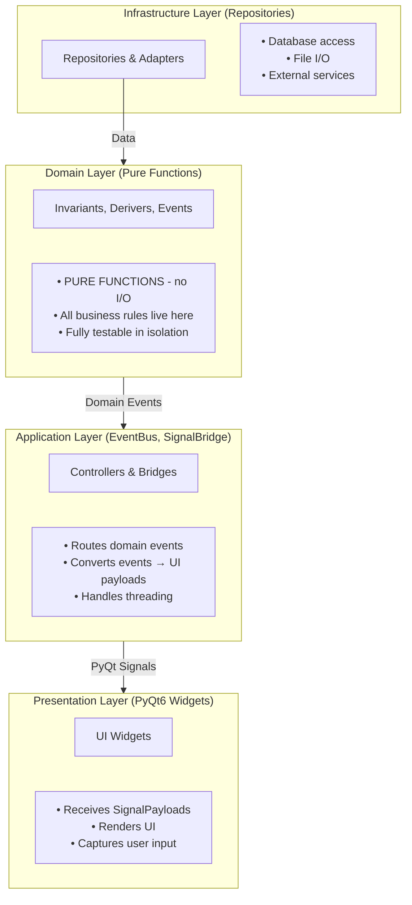
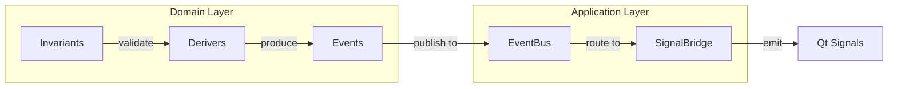
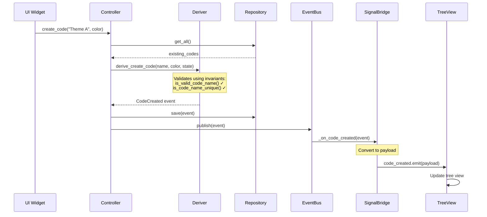

# Part 0: The Big Picture

Before diving into code, let's understand *why* QualCoder v2 uses this architecture.

## The Problem: Why Traditional Approaches Fail

QualCoder is a qualitative data analysis tool with complex requirements:

### 1. Complex Validation Rules

Consider creating a new Code:
- Name can't be empty
- Name must be unique (case-insensitive)
- If assigning to a category, that category must exist
- Color must have valid RGB values

These rules interact. Testing them in a traditional `Code.create()` method means:
- Mocking the database for uniqueness checks
- Setting up category fixtures
- Testing each combination of valid/invalid inputs

### 2. Real-Time UI Updates

When an AI agent creates a Code in a background thread:
- The codebook tree must update immediately
- The activity feed must show what happened
- Other views might need to refresh

Traditional approaches scatter this logic:
- Observer patterns couple components
- Signals/slots become spaghetti
- Race conditions lurk in threading

### 3. Testing is Painful

To test "creating a code with a duplicate name fails":

**Traditional approach:**
```python
def test_duplicate_name_rejected():
    # Setup database connection
    db = setup_test_database()
    # Create existing code
    repo = CodeRepository(db)
    repo.save(Code(name="Theme A", ...))
    # Create service with dependencies
    service = CodeService(repo, event_bus, ...)
    # Finally test
    with pytest.raises(DuplicateNameError):
        service.create_code("Theme A", ...)
```

**With fDDD:**
```python
def test_duplicate_name_rejected():
    state = CodingState(existing_codes=(Code(name="Theme A", ...),))
    result = derive_create_code("Theme A", ..., state=state)
    assert isinstance(result, Failure)
    assert isinstance(result.error, DuplicateName)
```

No database. No mocks. Just data in, data out.

## The Solution: Functional Core / Imperative Shell

The architecture separates **pure logic** from **side effects**:



**Key insight:** The Domain Layer is a "pure functional core" - given the same inputs, it always produces the same outputs. Side effects (database writes, UI updates) happen at the edges.

## The 5 Building Blocks



### 1. Invariants

Pure predicate functions that validate business rules.

```python
def is_valid_code_name(name: str) -> bool:
    """Name must be non-empty and <= 100 chars."""
    return is_non_empty_string(name) and is_within_length(name, 1, 100)
```

Properties:
- Take data, return `bool`
- No side effects
- Named `is_*` or `can_*`

### 2. Derivers

Pure functions that compose invariants and derive events.

```python
def derive_create_code(name, color, state) -> CodeCreated | Failure:
    if not is_valid_code_name(name):
        return Failure(EmptyName())
    if not is_code_name_unique(name, state.existing_codes):
        return Failure(DuplicateName(name))
    return CodeCreated(name=name, color=color, ...)
```

Properties:
- Take command + state, return event or failure
- Compose multiple invariants
- Pattern: `(command, state) -> Success | Failure`

### 3. Events

Immutable records of things that happened.

```python
@dataclass(frozen=True)
class CodeCreated(DomainEvent):
    code_id: CodeId
    name: str
    color: Color
```

Properties:
- Past tense naming (`CodeCreated`, not `CreateCode`)
- Immutable (frozen dataclass)
- Carry all data needed by subscribers

### 4. EventBus

Pub/sub infrastructure for domain events.

```python
# Subscribe
bus.subscribe("coding.code_created", handle_code_created)

# Publish
bus.publish(CodeCreated(...))
```

Properties:
- Decouples publishers from subscribers
- Type-based or string-based subscription
- Thread-safe

### 5. SignalBridge

Converts domain events to PyQt signals.

```python
class CodingSignalBridge(BaseSignalBridge):
    code_created = pyqtSignal(object)  # Emits CodeCreatedPayload

    def _register_converters(self):
        self.register_converter(
            "coding.code_created",
            CodeCreatedConverter(),
            "code_created"
        )
```

Properties:
- Bridges background threads to Qt main thread
- Converts domain events to UI-friendly payloads
- One bridge per bounded context

## How They Work Together

When a user clicks "Create Code":



## Next Steps

Now that you understand the big picture, let's write your first invariant.

**Next:** [Part 1: Your First Invariant](./01-first-invariant.md)
