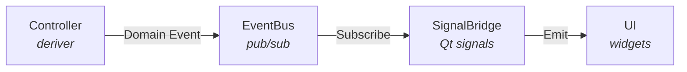
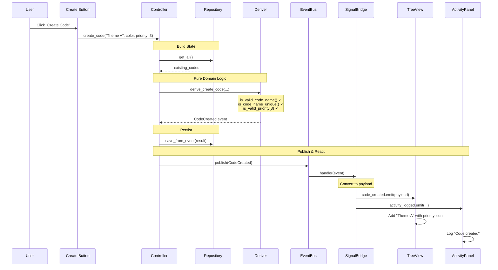

# Part 4: Events Flow Through the System

Let's trace how a `CodeCreated` event travels from the deriver to the UI.

## The Journey

When a user creates a Code, the event travels through four layers:



Let's trace each step.

## Step 1: Controller Calls Deriver

A Controller orchestrates the operation:

```python
# In a hypothetical CodingController
class CodingController:
    def __init__(self, code_repo, event_bus):
        self._code_repo = code_repo
        self._event_bus = event_bus

    def create_code(
        self,
        name: str,
        color: Color,
        priority: Optional[int] = None,
    ) -> CodeCreated | Failure:
        # 1. Build state from repositories
        state = CodingState(
            existing_codes=tuple(self._code_repo.get_all()),
            existing_categories=tuple(self._category_repo.get_all()),
        )

        # 2. Call the pure deriver
        result = derive_create_code(
            name=name,
            color=color,
            memo=None,
            category_id=None,
            priority=priority,
            owner="local",
            state=state,
        )

        # 3. Handle failure
        if isinstance(result, Failure):
            return result

        # 4. Persist (side effect)
        self._code_repo.save_from_event(result)

        # 5. Publish event (side effect)
        self._event_bus.publish(result)

        return result
```

Key points:
- The **deriver is pure** - it just computes
- The **controller handles side effects** - persistence, publishing
- State is built **before** calling the deriver

## Step 2: EventBus Receives and Routes

Look at `src/application/event_bus.py`:

```python
class EventBus:
    def publish(self, event: Any) -> None:
        """Publish an event to all matching subscribers."""
        event_type = self._get_event_type(event)

        # Get handlers for this event type
        type_handlers = list(self._handlers.get(event_type, []))

        # Invoke each handler
        for handler in type_handlers:
            handler(event)
```

The EventBus:
1. Extracts the event type (e.g., `"coding.code_created"`)
2. Finds all subscribers for that type
3. Calls each handler synchronously

Event type is derived from the class:
- `CodeCreated` in module `src.domain.coding.events`
- Becomes `"coding.code_created"`

## Step 3: SignalBridge Receives Event

The SignalBridge subscribes to domain events and converts them to Qt signals.

From `src/application/signal_bridge/base.py`:

```python
class BaseSignalBridge(QObject, ABC):
    def start(self) -> None:
        """Start listening to domain events."""
        for event_type in self._converters:
            handler = self._make_handler(event_type)
            self._event_bus.subscribe(event_type, handler)

    def _dispatch_event(self, event_type: str, event: Any) -> None:
        """Dispatch a domain event to the appropriate signal."""
        converter, signal_name = self._converters[event_type]

        # Convert event to UI-friendly payload
        payload = converter.convert(event)

        # Get the signal
        signal = self._signals.get(signal_name)

        # Emit thread-safely
        self._emit_threadsafe(signal, payload)
```

A context-specific bridge might look like:

```python
class CodingSignalBridge(BaseSignalBridge):
    # Define Qt signals
    code_created = Signal(object)
    code_deleted = Signal(object)
    code_renamed = Signal(object)

    def _get_context_name(self) -> str:
        return "coding"

    def _register_converters(self) -> None:
        self.register_converter(
            "coding.code_created",
            CodeCreatedConverter(),
            "code_created"  # Signal to emit
        )
```

## Step 4: Converter Transforms Event to Payload

The converter maps domain event fields to UI-friendly payload:

```python
class CodeCreatedConverter:
    def convert(self, event: CodeCreated) -> CodeCreatedPayload:
        return CodeCreatedPayload(
            timestamp=event.occurred_at,
            session_id="local",
            is_ai_action=False,
            event_type="coding.code_created",
            code_id=event.code_id.value,
            name=event.name,
            color_hex=event.color.to_hex(),
            priority=event.priority,  # Include new field
            category_id=event.category_id.value if event.category_id else None,
        )
```

Why convert?
- Domain events use domain types (`CodeId`, `Color`)
- UI needs primitive types (`int`, `str`, `#hex`)
- Payloads are UI-optimized DTOs

## Step 5: Qt Signal Emits (Thread-Safe)

The SignalBridge ensures emission happens on the Qt main thread:

```python
def _emit_threadsafe(self, signal: Any, payload: Any) -> None:
    if is_main_thread():
        # Already on main thread - emit directly
        signal.emit(payload)
    else:
        # Queue for main thread
        QMetaObject.invokeMethod(...)
```

This is critical:
- Domain events might come from background threads (AI agent)
- Qt widgets can only be updated from the main thread
- SignalBridge handles the threading automatically

## Step 6: UI Widget Receives Payload

A Qt widget connects to the signal:

```python
class CodebookTreeView(QTreeView):
    def __init__(self, signal_bridge: CodingSignalBridge):
        super().__init__()
        # Connect to signal
        signal_bridge.code_created.connect(self._on_code_created)

    def _on_code_created(self, payload: CodeCreatedPayload):
        """Handle new code creation."""
        # Add to tree model
        item = QStandardItem(payload.name)
        item.setData(payload.code_id, Qt.ItemDataRole.UserRole)
        item.setForeground(QColor(payload.color_hex))
        self.model().appendRow(item)
```

## Tracing the Full Flow

Let's trace "Create Code with priority=3":



## Observing the Flow

To observe this in practice, you could:

1. **Add logging** to each step
2. **Use EventBus history** (`EventBus(history_size=100)`)
3. **Set breakpoints** in deriver, controller, bridge, widget

## Why This Architecture?

1. **Separation of concerns** - Each layer has one job
2. **Testability** - Deriver tests don't need UI, UI tests don't need domain
3. **Decoupling** - UI doesn't know about derivers, just payloads
4. **Threading** - SignalBridge handles cross-thread communication
5. **Reactivity** - UI automatically updates when events flow

## Summary

Events flow through:

1. **Controller** calls pure deriver, handles side effects
2. **EventBus** routes events to subscribers
3. **SignalBridge** converts events to UI payloads
4. **Qt Signals** emit payloads thread-safely
5. **UI Widgets** update from payloads

Each step is isolated and testable.

## Next Steps

Let's look at how to update the SignalBridge for our new priority field.

**Next:** [Part 5: Adding a SignalBridge Payload](./05-signal-bridge.md)
