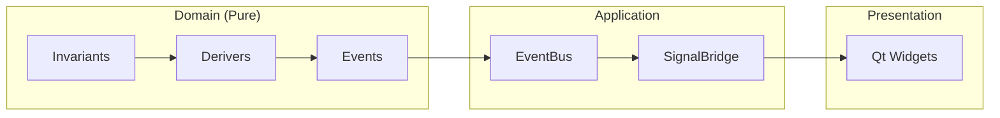

# Onboarding Tutorial: QualCoder v2 fDDD Architecture

Welcome to the QualCoder v2 architecture tutorial! This hands-on guide teaches you the **Functional Domain-Driven Design (fDDD)** patterns through a practical example: adding a "priority" field to Codes.

## Prerequisites

- Python 3.10+ familiarity
- Basic understanding of classes and dataclasses
- No prior DDD or functional programming experience required

## Learning Path

Work through these parts in order. Each builds on the previous.

| Part | Topic | What You'll Learn |
|------|-------|-------------------|
| [Part 0](./00-big-picture.md) | The Big Picture | Why this architecture exists |
| [Part 1](./01-first-invariant.md) | Your First Invariant | Write a pure validation function |
| [Part 2](./02-first-deriver.md) | Your First Deriver | Compose invariants into events |
| [Part 3](./03-result-type.md) | The Result Type | Why `Success \| Failure` beats exceptions |
| [Part 4](./04-event-flow.md) | Events Flow Through | Trace events from domain to UI |
| [Part 5](./05-signal-bridge.md) | SignalBridge Payloads | Connect domain to PySide6 |
| [Part 6](./06-testing.md) | Testing Without Mocks | Appreciate pure function testability |
| [Part 7](./07-complete-flow.md) | Complete Flow Reference | Full diagram of Code creation |

## Appendices

| Appendix | Topic |
|----------|-------|
| [Appendix A](./appendices/A-common-patterns.md) | Common Patterns & Recipes |
| [Appendix B](./appendices/B-when-to-create.md) | When to Create New Patterns |

## The Toy Example: Adding Priority to Codes

Throughout this tutorial, we use one consistent example: adding an optional "priority" field (1-5) to Codes. This simple feature touches every layer of the architecture:

```
Priority: Optional[int]  # 1 (low) to 5 (high), or None
```

You'll learn:
- How to validate priority with a pure **Invariant**
- How to integrate validation into a **Deriver**
- How events carry the new field through the system
- How the UI receives updates via **SignalBridge**

## How to Use This Tutorial

1. **Read with the codebase open** - Reference the actual files as you go
2. **Follow along** - The code snippets show patterns, not copy-paste solutions
3. **Experiment** - Try modifying examples to solidify understanding

## Architecture Overview



## Key Files Reference

As you work through the tutorial, you'll reference these files:

```
src/domain/coding/
├── invariants.py     # Pure validation functions
├── derivers.py       # Event derivation logic
├── events.py         # Domain event definitions
├── entities.py       # Code, Category, Segment entities
└── tests/
    ├── test_invariants.py
    └── test_derivers.py

src/domain/shared/
└── types.py          # Success, Failure, typed IDs

src/application/
├── event_bus.py      # Pub/sub for domain events
└── signal_bridge/
    ├── base.py       # BaseSignalBridge
    └── payloads.py   # UI-friendly DTOs
```

## After the Tutorial

You should be able to:

1. Explain why invariants are pure functions
2. Write a new invariant and its tests
3. Modify a deriver to use new invariants
4. Trace an event from deriver to UI
5. Know where to look when adding new features

Ready? Start with [Part 0: The Big Picture](./00-big-picture.md).
