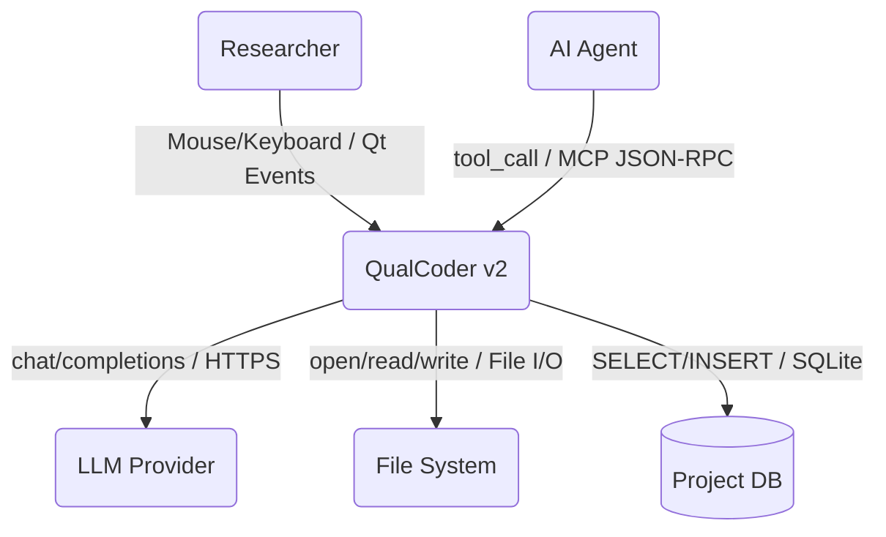
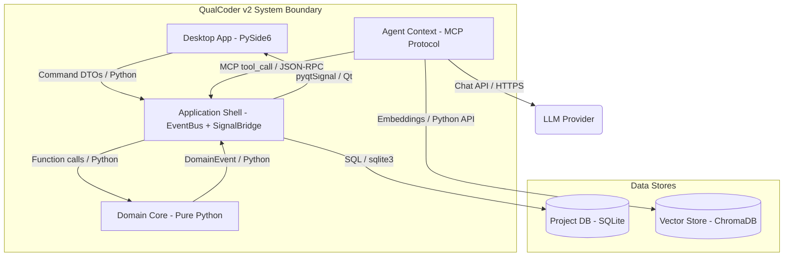
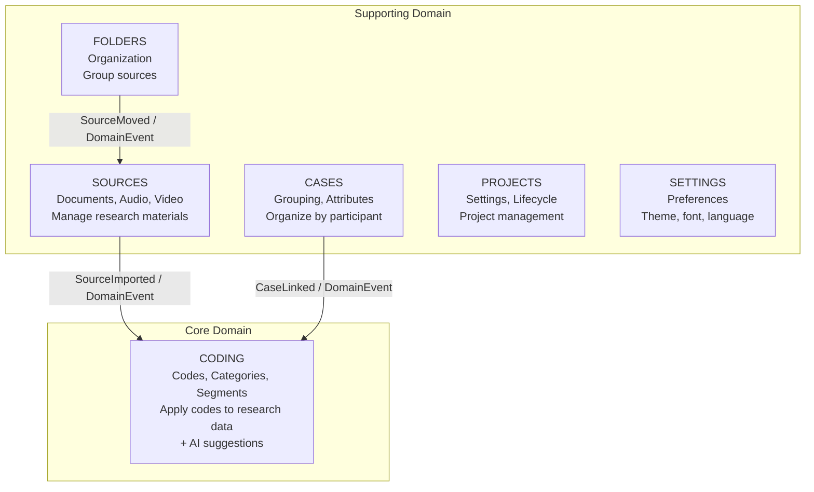
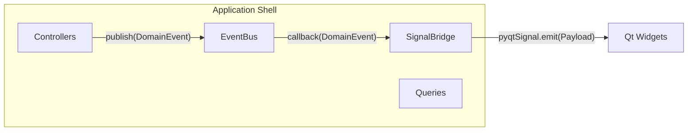
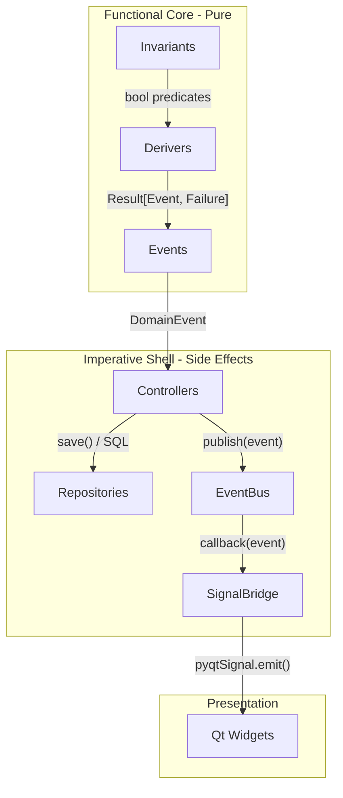
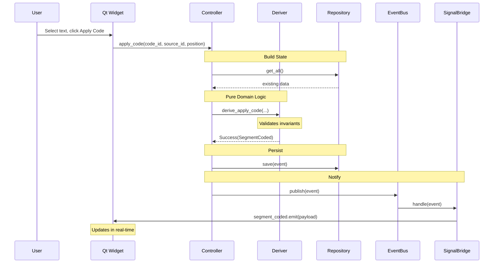
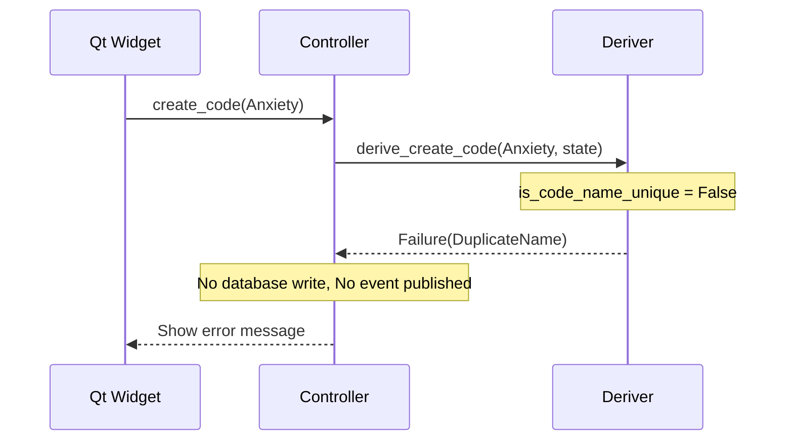

# QualCoder v2 System Architecture

> **Status:** `DRAFT`
> **Owner:** `QualCoder Core Team`
> **Version:** `v2.0`

This document provides a C4 model architecture overview of QualCoder v2. For hands-on learning with code examples, see the [Onboarding Tutorials](./tutorials/README.md).

---

## 1. System Context (C4 Level 1)

**Scope:** QualCoder v2 is a desktop qualitative data analysis tool for researchers to apply semantic codes to research data and generate insights.

| Actor / System | Type | Description |
|----------------|------|-------------|
| **Researcher** | Person | Qualitative researcher applying codes to research data |
| **AI Agent** | Person | Automated agent suggesting codes and generating insights |
| **QualCoder v2** | System | The Scope - Desktop QDA tool with AI assistance |
| **LLM Provider** | System | External AI service (OpenAI, Anthropic, local Ollama) |
| **File System** | System | Local storage for project files, media, exports |

### Context Diagram



---

## 2. Container Inventory (C4 Level 2)

**Definition:** A "Container" is a runnable application or data store.

| ID | Container Name | Technology | Responsibility | Type |
|----|----------------|------------|----------------|------|
| C1 | Desktop Application | Python 3.10+ / PySide6 | Main GUI, user interaction | Desktop App |
| C2 | Domain Core | Python / Pure Functions | Business logic, invariants, derivers | Library |
| C3 | Application Shell | Python / EventBus + SignalBridge | Orchestration, event routing | Library |
| C4 | Project Database | SQLite 3 | Stores codes, segments, sources | Database |
| C5 | Agent Context | Python / MCP Protocol | Exposes domain to AI agents via HTTP | API |
| C6 | Vector Store | ChromaDB (embedded) | Stores embeddings for search | Database |

### Container Diagram



---

## 3. Component View (C4 Level 3)

### Domain Core Components (C2)

Organized by **Bounded Contexts** - each context is a cohesive business capability.



### Bounded Context Summary

| Context | Entities | Key Operations |
|---------|----------|----------------|
| **Coding** | Code, Category, Segment, AISuggestion | Create code, apply to text, merge codes, AI suggestions |
| **Sources** | Source, Folder | Import files, manage folders |
| **Cases** | Case, CaseAttribute | Link sources, assign attributes |
| **Projects** | Project | Open, close, manage lifecycle |
| **Settings** | Settings | Configure preferences (theme, font, language) |
| **Folders** | Folder | Organize sources in folders |

### Application Shell Components (C3)



---

## 4. Functional Core / Imperative Shell

QualCoder v2 follows the **Functional Core / Imperative Shell** pattern:



### The 5 Building Blocks

| Block | Layer | Purpose | Naming |
|-------|-------|---------|--------|
| Invariants | Domain | Pure predicates - "Is this allowed?" | `is_*`, `can_*` |
| Derivers | Domain | Pure functions - "What happened?" | `derive_*` |
| Events | Domain | Immutable records of changes | `*Created`, `*Deleted` |
| EventBus | Application | Pub/sub event distribution | `subscribe`, `publish` |
| SignalBridge | Application | Thread-safe domain to Qt bridge | `*_signal` |

See [Onboarding Tutorials](./tutorials/README.md) for hands-on examples.

---

## 5. Data Flow

### Success Flow: Apply Code to Text



### Failure Flow



---

## 6. Perspectives Overlay

### Security Perspective

| Container | Security Controls |
|-----------|-------------------|
| C1 Desktop App | Local execution, no network auth required |
| C4 Project DB | File-level permissions, optional encryption |
| C5 Agent Context | MCP protocol validation, localhost-only HTTP server, tool schema enforcement |
| LLM Provider | API key storage in OS keychain, HTTPS only |

### Ownership Perspective

| Team / Role | Owns |
|-------------|------|
| Core Team | Domain Core (C2), Application Shell (C3) |
| UI Team | Desktop Application (C1), Presentation components |
| AI Team | Agent Context (C5), AI Services bounded context |

### Technology Perspective

| Layer | Technology | Why |
|-------|------------|-----|
| UI Framework | PySide6 | Qt bindings, cross-platform, mature |
| Database | SQLite | Embedded, portable projects, no server |
| Vector Store | ChromaDB | Embedded, Python-native, simple API |
| Event System | Custom EventBus | Need subscribe_all, history, type-based |
| Result Type | Custom | Minimal (~50 lines), no dependency |

---

## 7. Deployment Mapping

**Definition:** How Containers (Level 2) map to Infrastructure.

| Container | Infrastructure | Environment |
|-----------|----------------|-------------|
| Desktop Application | Native executable (PyInstaller) | User's machine |
| Project Database | SQLite file in project folder | User's file system |
| Vector Store | ChromaDB files in project folder | User's file system |
| LLM Provider | Cloud API or local (Ollama) | External / Local |

### Distribution

```
QualCoder v2
├── macOS: .dmg installer (arm64, x86_64)
├── Windows: .msi installer
├── Linux: .deb, .rpm, AppImage
└── PyPI: pip install qualcoder-v2
```

---

## 8. Directory Structure

```
src/
├── contexts/                   # Bounded Contexts (vertical slices)
│   ├── coding/                 # Coding Context (includes AI coding)
│   │   ├── core/               # Domain (Pure)
│   │   │   ├── entities.py     # Code, Category, Segment
│   │   │   ├── ai_entities.py  # AI-specific entities
│   │   │   ├── invariants.py
│   │   │   ├── derivers.py
│   │   │   ├── events.py
│   │   │   ├── commandHandlers/  # Use cases
│   │   │   └── tests/
│   │   ├── infra/              # Repositories, AI providers
│   │   ├── interface/          # Signal bridges, MCP tools
│   │   └── presentation/       # Context-specific UI
│   ├── sources/                # Source file management
│   ├── cases/                  # Case/participant management
│   ├── projects/               # Project lifecycle
│   ├── settings/               # User settings
│   └── folders/                # Folder organization
│
├── shared/                     # Cross-cutting concerns
│   ├── common/                 # Shared types
│   │   ├── types.py            # DomainEvent, typed IDs
│   │   ├── operation_result.py # OperationResult pattern
│   │   └── failure_events.py   # Base failure types
│   ├── core/                   # Shared domain logic
│   │   └── sync_handlers.py    # Cross-context sync
│   ├── infra/                  # Shared infrastructure
│   │   ├── event_bus.py        # Pub/sub infrastructure
│   │   ├── signal_bridge/      # Thread-safe Qt bridge
│   │   ├── app_context/        # Application context, factories
│   │   ├── lifecycle.py        # Project lifecycle
│   │   └── state.py            # Project state cache
│   └── presentation/           # Shared UI components
│       ├── organisms/          # Reusable complex widgets
│       ├── molecules/          # Small composite widgets
│       ├── templates/          # Page layouts, app shell
│       └── services/           # Dialog service, etc.
│
├── tests/                      # E2E tests
│   └── e2e/
│
└── main.py                     # Application entry point

design_system/                  # Reusable UI components, tokens
```

---

## 9. Bounded Contexts

### Implemented Contexts

| Context | Purpose | Key Events | Integration Pattern |
|---------|---------|------------|---------------------|
| **Coding** | Apply semantic codes to data | CodeCreated, SegmentCoded | Core - others depend on it |
| **Sources** | Manage documents, media | SourceImported, SourceDeleted | Open Host Service |
| **Cases** | Group and categorize | CaseCreated, SourceLinked | Conformist to Coding |
| **Projects** | Lifecycle management | ProjectOpened, ProjectClosed | Anti-Corruption Layer |
| **Settings** | User preferences | SettingsUpdated | Independent |
| **Folders** | Folder organization | FolderCreated, SourceMoved | Supporting |

### Planned Contexts (Future)

| Context | Purpose | Key Events | Integration Pattern |
|---------|---------|------------|---------------------|
| Analysis | Generate insights | ReportGenerated | Subscribes to Coding events |
| Collaboration | Multi-coder workflows | CoderSwitched, CodingsMerged | Published Language |
| Export | Reports, charts | ReportExported | Downstream consumer |

> **Note:** AI coding capabilities are integrated within the Coding context (`ai_entities.py`, `ai_derivers.py`, etc.) rather than as a separate AI Services context.

---

## 10. Design Decisions

### Why Functional DDD?

| Concern | Traditional OOP | Functional DDD |
|---------|-----------------|----------------|
| Testing | Mocks required | Pure functions, no mocks |
| Side effects | Hidden in methods | Explicit via events |
| State | Mutable objects | Immutable data |
| Debugging | Stack traces | Event replay |

### Why Custom Components?

| Component | Why Custom | Alternative |
|-----------|------------|-------------|
| EventBus | Need subscribe_all, history | Blinker, PyPubSub |
| SignalBridge | No library for domain to Qt threading | None available |
| Result Type | Minimal, no dependency | returns library |

---

## 11. Further Reading

### Tutorials (Hands-on Learning)

Start with the [Onboarding Tutorial](./tutorials/README.md) - a progressive guide using a toy example (adding "priority" to Codes).

| Part | Topic |
|------|-------|
| [Part 0](./tutorials/00-big-picture.md) | The Big Picture |
| [Part 1](./tutorials/01-first-invariant.md) | Your First Invariant |
| [Part 2](./tutorials/02-first-deriver.md) | Your First Deriver |
| [Part 3](./tutorials/03-result-type.md) | The Result Type |
| [Part 4](./tutorials/04-event-flow.md) | Events Flow Through |
| [Part 5](./tutorials/05-signal-bridge.md) | SignalBridge Payloads |
| [Part 6](./tutorials/06-testing.md) | Testing Without Mocks |
| [Part 7](./tutorials/07-complete-flow.md) | Complete Flow Reference |

### Reference Documents

- [Common Patterns and Recipes](./tutorials/appendices/A-common-patterns.md)
- [When to Create New Patterns](./tutorials/appendices/B-when-to-create.md)
- [MCP Setup Guide](./user-manual/mcp-setup.md) - Connect AI assistants to QualCoder
- [MCP API Reference](./api/mcp-api.md) - Technical API documentation

### C4 Model References

- [C4 Model Official](https://c4model.com/)
- [Simon Brown - Software Architecture for Developers](https://softwarearchitecturefordevelopers.com/)

---

*Architecture documentation for QualCoder v2. Last updated: 2026-01.*
