# QualCoder v2 System Architecture

> **Status:** `DRAFT`
> **Owner:** `QualCoder Core Team`
> **Version:** `v2.0`

This document provides a C4 model architecture overview of QualCoder v2. For hands-on learning with code examples, see the [Onboarding Tutorials](./tutorials/README.md).

---

## 1. System Context (C4 Level 1)

**Scope:** QualCoder v2 is a desktop qualitative data analysis tool for researchers to apply semantic codes to research data and generate insights.

| Actor / System | Type | Description |
|----------------|------|-------------|
| **Researcher** | Person | Qualitative researcher applying codes to research data |
| **AI Agent** | Person | Automated agent suggesting codes and generating insights |
| **QualCoder v2** | System | The Scope - Desktop QDA tool with AI assistance |
| **LLM Provider** | System | External AI service (OpenAI, Anthropic, local Ollama) |
| **File System** | System | Local storage for project files, media, exports |

### Context Diagram

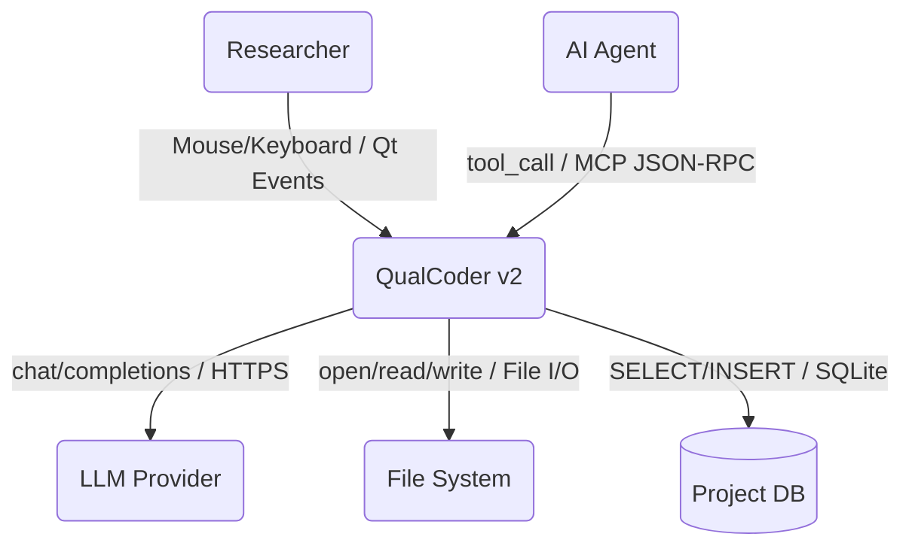
```mermaid
graph TD
    Researcher(Researcher) -- "Mouse/Keyboard / Qt Events" --> QC(QualCoder v2)
    Agent(AI Agent) -- "tool_call / MCP JSON-RPC" --> QC
    QC -- "chat/completions / HTTPS" --> LLM(LLM Provider)
    QC -- "open/read/write / File I/O" --> FS(File System)
    QC -- "SELECT/INSERT / SQLite" --> DB[(Project DB)]
```

---

## 2. Container Inventory (C4 Level 2)

**Definition:** A "Container" is a runnable application or data store.

| ID | Container Name | Technology | Responsibility | Type |
|----|----------------|------------|----------------|------|
| C1 | Desktop Application | Python 3.10+ / PySide6 | Main GUI, user interaction | Desktop App |
| C2 | Domain Core | Python / Pure Functions | Business logic, invariants, derivers | Library |
| C3 | Application Shell | Python / EventBus + SignalBridge | Orchestration, event routing | Library |
| C4 | Project Database | SQLite 3 | Stores codes, segments, sources | Database |
| C5 | Agent Context | Python / MCP Protocol | Exposes domain to AI agents via HTTP | API |
| C6 | Vector Store | ChromaDB (embedded) | Stores embeddings for search | Database |
| C7 | Version Control | Git + sqlite-diffable | Database history, snapshots, restore | Storage |

### Container Diagram

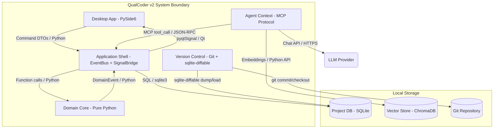
```mermaid
graph TB
    subgraph QualCoder v2 System Boundary
        UI[Desktop App - PySide6]
        DOMAIN[Domain Core - Pure Python]
        APP[Application Shell - EventBus + SignalBridge]
        AGENT[Agent Context - MCP Protocol]
        VCS[Version Control - Git + sqlite-diffable]

        UI -- "Command DTOs / Python" --> APP
        APP -- "Function calls / Python" --> DOMAIN
        DOMAIN -- "DomainEvent / Python" --> APP
        APP -- "pyqtSignal / Qt" --> UI
        AGENT -- "MCP tool_call / JSON-RPC" --> APP
    end

    subgraph Local Storage
        DB[(Project DB - SQLite)]
        VEC[(Vector Store - ChromaDB)]
        GIT[(Git Repository)]
    end

    APP -- "SQL / sqlite3" --> DB
    AGENT -- "Embeddings / Python API" --> VEC
    VCS -- "sqlite-diffable dump/load" --> DB
    VCS -- "git commit/checkout" --> GIT

    LLM(LLM Provider)
    AGENT -- "Chat API / HTTPS" --> LLM
```

---

## 3. Component View (C4 Level 3)

### Domain Core Components (C2)

Organized by **Bounded Contexts** - each context is a cohesive business capability.

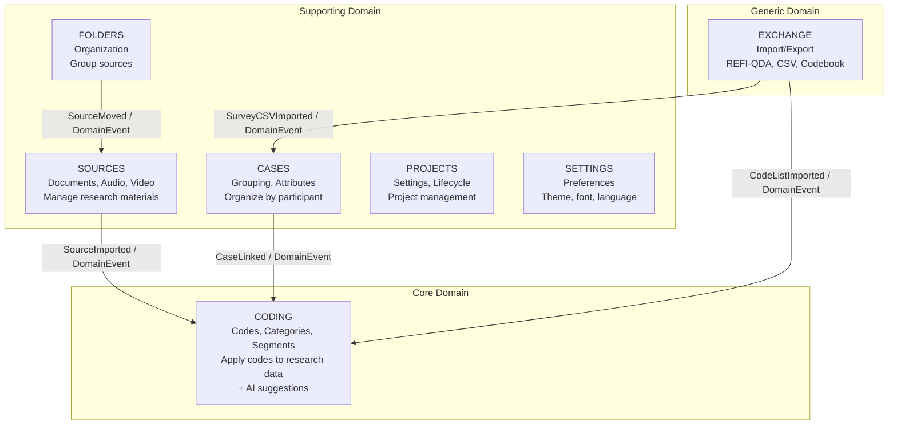
```mermaid
graph TB
    subgraph Core Domain
        COD[CODING<br>Codes, Categories, Segments<br>Apply codes to research data<br>+ AI suggestions]
    end

    subgraph Supporting Domain
        SRC[SOURCES<br>Documents, Audio, Video<br>Manage research materials]
        CAS[CASES<br>Grouping, Attributes<br>Organize by participant]
        PRJ[PROJECTS<br>Settings, Lifecycle<br>Project management]
        FLD[FOLDERS<br>Organization<br>Group sources]
        SET[SETTINGS<br>Preferences<br>Theme, font, language]
    end

    subgraph Generic Domain
        EXC[EXCHANGE<br>Import/Export<br>REFI-QDA, CSV, Codebook]
    end

    SRC -->|"SourceImported / DomainEvent"| COD
    CAS -->|"CaseLinked / DomainEvent"| COD
    FLD -->|"SourceMoved / DomainEvent"| SRC
    EXC -->|"CodeListImported / DomainEvent"| COD
    EXC -->|"SurveyCSVImported / DomainEvent"| CAS
```

### Bounded Context Summary

| Context | Entities | Key Operations |
|---------|----------|----------------|
| **Coding** | Code, Category, Segment, AISuggestion | Create code, apply to text, merge codes, AI suggestions |
| **Sources** | Source, Folder | Import files, manage folders |
| **Cases** | Case, CaseAttribute | Link sources, assign attributes |
| **Projects** | Project | Open, close, manage lifecycle |
| **Settings** | Theme, Font, Language, Backup, AVCoding, Observability | Configure preferences, observability |
| **Folders** | Folder | Organize sources in folders |
| **Exchange** | — (stateless) | Import/export codebooks, coded HTML, REFI-QDA, RQDA, CSV |

### Application Shell Components (C3)

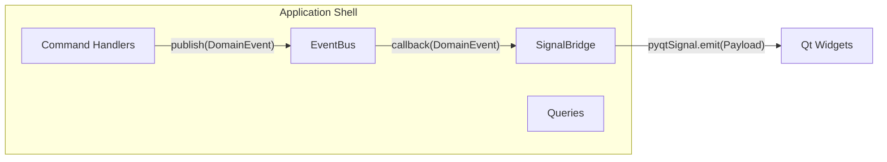
```mermaid
graph LR
    subgraph Application Shell
        EB[EventBus]
        SB[SignalBridge]
        CTRL[Command Handlers]
        QRY[Queries]
    end

    CTRL -- "publish(DomainEvent)" --> EB
    EB -- "callback(DomainEvent)" --> SB
    SB -- "pyqtSignal.emit(Payload)" --> UI[Qt Widgets]
```

---

## 4. Event System Architecture

QualCoder v2 follows the **Functional Core / Imperative Shell** pattern with a layered event system that bridges domain logic to the UI.

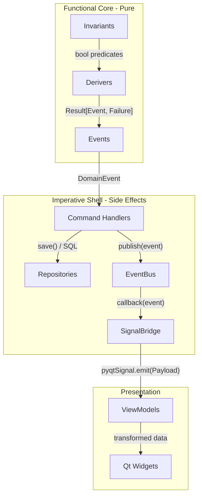
```mermaid
graph TB
    subgraph Functional Core - Pure
        INV[Invariants]
        DER[Derivers]
        EVT[Events]
    end

    subgraph Imperative Shell - Side Effects
        CTRL[Command Handlers]
        REPO[Repositories]
        BUS[EventBus]
        SB[SignalBridge]
    end

    subgraph Presentation
        VM[ViewModels]
        QT[Qt Widgets]
    end

    INV -- "bool predicates" --> DER
    DER -- "Result[Event, Failure]" --> EVT
    EVT -- "DomainEvent" --> CTRL
    CTRL -- "save() / SQL" --> REPO
    CTRL -- "publish(event)" --> BUS
    BUS -- "callback(event)" --> SB
    SB -- "pyqtSignal.emit(Payload)" --> VM
    VM -- "transformed data" --> QT
```

### 4.1 The 5 Building Blocks

| Block | Layer | Purpose | Naming |
|-------|-------|---------|--------|
| Invariants | Domain | Pure predicates - "Is this allowed?" | `is_*`, `can_*` |
| Derivers | Domain | Pure functions - "What happened?" | `derive_*` |
| Events | Domain | Immutable records of changes | `*Created`, `*Deleted` |
| EventBus | Application | Pub/sub event distribution | `subscribe`, `publish` |
| SignalBridge | Application | Thread-safe domain-to-Qt bridge | `*_signal` |

### 4.2 EventBus

Thread-safe pub/sub system (`src/shared/infra/event_bus.py`) with RLock for concurrent access.

**API:**

| Method | Purpose |
|--------|---------|
| `subscribe(event_type, handler)` | Subscribe to specific event type string (e.g., `"coding.code_created"`) |
| `subscribe_type(event_class, handler)` | Subscribe by event class (auto-derives type string) |
| `subscribe_all(handler)` | Wildcard subscription — receives all published events |
| `publish(event)` | Synchronous dispatch to all matching handlers |
| `unsubscribe(event_type, handler)` | Remove a subscription |
| `handler_count(event_type=None)` | Query active subscription counts |

**Event Type Resolution:**
- **Explicit** (preferred): Class-level `event_type: ClassVar[str] = "coding.code_created"`
- **Auto-derived** (deprecated): `{module}.{class_name}` → `"coding.code_created"`
- Types cached in `_type_cache` for performance

**Key Properties:**
- **Synchronous** — handlers run in the publishing thread before `publish()` returns
- **Weak references** — subscriptions use `weakref.ref()` to prevent cycles; dead handlers auto-removed
- **Error isolation** — handler exceptions are logged but don't prevent other handlers from executing
- **Optional history** — circular buffer for event tracing (`history_size` parameter); query with `get_history()`
- **Metrics** — integrates with OpenTelemetry: `events_published`, `event_handler_duration`, `event_handler_errors`

### 4.3 SignalBridge

Thread-safe bridge from domain events to Qt signals (`src/shared/infra/signal_bridge/`).

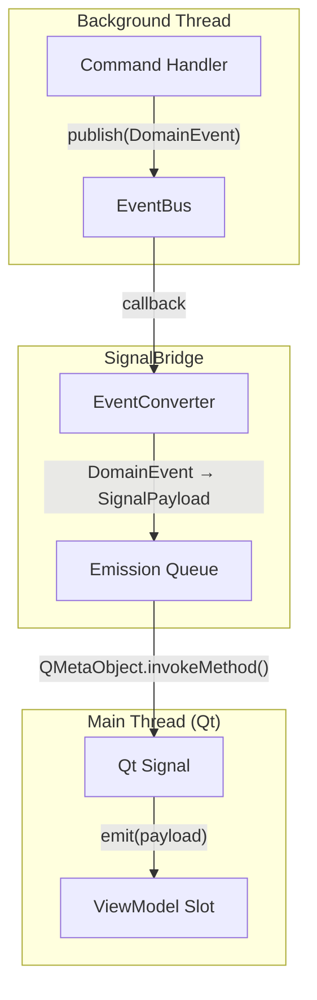
```mermaid
graph TB
    subgraph "Background Thread"
        CMD[Command Handler]
        EB[EventBus]
    end

    subgraph "SignalBridge"
        CONV[EventConverter]
        QUEUE[Emission Queue]
    end

    subgraph "Main Thread (Qt)"
        SIG[Qt Signal]
        VM[ViewModel Slot]
    end

    CMD -- "publish(DomainEvent)" --> EB
    EB -- "callback" --> CONV
    CONV -- "DomainEvent → SignalPayload" --> QUEUE
    QUEUE -- "QMetaObject.invokeMethod()" --> SIG
    SIG -- "emit(payload)" --> VM
```

**BaseSignalBridge** — abstract base class for all bridges:

| Feature | Details |
|---------|---------|
| **Singleton** | `Bridge.instance(event_bus)` creates once; `Bridge.instance()` returns existing |
| **Converter registration** | `register_converter(event_type, converter, signal_name)` maps events to signals |
| **Thread detection** | Main thread → emit directly; background thread → queue + `invokeMethod()` |
| **Batch emission** | Queued emissions processed as a batch on main thread |
| **Activity logging** | Every emission creates an `ActivityItem` for the activity feed |

**EventConverter protocol** — transforms domain events into typed signal payloads:

```python
class CodeCreatedConverter(EventConverter[CodeCreated, CodePayload]):
    def convert(self, event: CodeCreated) -> CodePayload:
        return CodePayload(
            event_type="code_created",
            code_id=event.code_id.value,
            name=event.name,
            color=event.color,
            timestamp=event.occurred_at,
        )
```

**Implemented Signal Bridges:**

| Bridge | Context | Location | Key Signals |
|--------|---------|----------|-------------|
| `CodingSignalBridge` | Coding | `src/contexts/coding/interface/signal_bridge.py` | code_created, code_renamed, code_deleted, codes_merged, segment_coded, segment_uncoded |
| `CasesSignalBridge` | Cases | `src/contexts/cases/interface/signal_bridge.py` | case_created, case_updated, case_removed, source_linked, source_unlinked |
| `ProjectSignalBridge` | Projects + Folders | `src/shared/infra/signal_bridge/projects.py` | project_opened, project_closed, source_added, source_removed, folder_created, snapshot_created |
| `SettingsSignalBridge` | Settings | `src/shared/infra/signal_bridge/settings.py` | settings_changed |

### 4.4 Domain Events by Context

**Coding** (`src/contexts/coding/core/events.py`):
- `CodeCreated`, `CodeRenamed`, `CodeColorChanged`, `CodeMemoUpdated`, `CodeDeleted`, `CodesMerged`, `CodeMovedToCategory`
- `CategoryCreated`, `CategoryRenamed`, `CategoryDeleted`
- `SegmentCoded`, `SegmentUncoded`, `SegmentMemoUpdated`
- `BatchCreated`, `BatchUndone`

**Cases** (`src/contexts/cases/core/events.py`):
- `CaseCreated`, `CaseUpdated`, `CaseRemoved`
- `CaseAttributeSet`, `CaseAttributeRemoved`
- `SourceLinkedToCase`, `SourceUnlinkedFromCase`

**Projects** (`src/contexts/projects/core/events.py`):
- `ProjectCreated`, `ProjectOpened`, `ProjectClosed`, `ProjectRenamed`
- `SourceAdded`, `SourceRemoved`, `SourceRenamed`, `SourceOpened`, `SourceStatusChanged`
- `ScreenChanged`, `NavigatedToSegment`

**Folders** (`src/contexts/folders/core/events.py`):
- `FolderCreated`, `FolderRenamed`, `FolderDeleted`, `SourceMovedToFolder`

**Settings** (`src/contexts/settings/core/events.py`):
- `ThemeChanged`, `FontChanged`, `LanguageChanged`
- `BackupConfigChanged`, `AVCodingConfigChanged`, `ObservabilityConfigChanged`

**Exchange** (`src/contexts/exchange/core/events.py`):
- `CodebookExported`, `CodedHTMLExported`, `RefiQdaExported`
- `CodeListImported`, `SurveyCSVImported`, `RefiQdaImported`, `RqdaImported`

**Version Control** (`src/contexts/projects/core/vcs_events.py`):
- `VersionControlInitialized`, `SnapshotCreated`, `SnapshotRestored`
- Decision events (internal): `AutoCommitDecided`, `RestoreDecided`, `InitializeDecided`

**Sync** (`src/shared/core/sync/events.py`):
- `SyncPullStarted`, `SyncPullCompleted`, `SyncPullFailed`, `RemoteChangesReceived`

### 4.5 Failure Events

Failure events follow a structured type format (`src/shared/common/failure_events.py`):

```python
@dataclass(frozen=True)
class FailureEvent:
    event_type: str   # "CODE_NOT_CREATED/DUPLICATE_NAME"
    event_id: str
    occurred_at: datetime
```

The `event_type` encodes both operation and reason separated by `/`:
- `CODE_NOT_CREATED/INVALID_COLOR`
- `SOURCE_NOT_ADDED/DUPLICATE_NAME`
- `CASE_NOT_CREATED/EMPTY_NAME`

Command handlers publish failures through the same EventBus, enabling policies and UI to react uniformly to both success and failure outcomes.

### 4.6 Batch Import & Reload Suppression

During bulk operations (e.g., multi-file import), ViewModels use a **suppress_reloads** depth counter to avoid O(n) UI refreshes:

```python
@contextlib.contextmanager
def suppress_reloads(self):
    self._suppress_reloads += 1
    try:
        yield
    finally:
        self._suppress_reloads = max(0, self._suppress_reloads - 1)
        if self._suppress_reloads == 0:  # Only outermost exit emits
            self.sources_changed.emit()
            self.summary_changed.emit()
```

This supports nesting — inner contexts accumulate changes silently, and only the outermost exit triggers a single UI refresh.

See [Onboarding Tutorials](./tutorials/README.md) for hands-on examples.

### 4.7 Threading & Unified Event Loop

QualCoder v2 uses **qasync** to run asyncio and Qt on a single unified event loop. This eliminates cross-thread marshalling between the MCP server and the Qt UI.

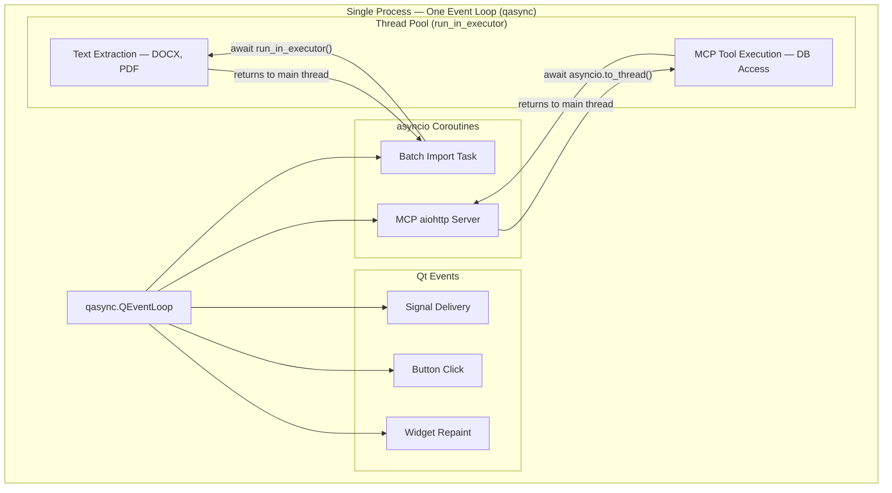
```mermaid
graph TB
    subgraph "Single Process — One Event Loop (qasync)"
        LOOP["qasync.QEventLoop"]

        subgraph "Qt Events"
            PAINT[Widget Repaint]
            CLICK[Button Click]
            SIGNAL[Signal Delivery]
        end

        subgraph "asyncio Coroutines"
            MCP[MCP aiohttp Server]
            BATCH[Batch Import Task]
        end

        subgraph "Thread Pool (run_in_executor)"
            EXTRACT[Text Extraction — DOCX, PDF]
            TOOL[MCP Tool Execution — DB Access]
        end
    end

    LOOP --> PAINT
    LOOP --> CLICK
    LOOP --> SIGNAL
    LOOP --> MCP
    LOOP --> BATCH

    BATCH -- "await run_in_executor()" --> EXTRACT
    EXTRACT -- "returns to main thread" --> BATCH
    MCP -- "await asyncio.to_thread()" --> TOOL
    TOOL -- "returns to main thread" --> MCP
```

**Setup** (`main.py`):

```python
loop = qasync.QEventLoop(self._app)   # Wraps QApplication
asyncio.set_event_loop(loop)

with loop:
    loop.create_task(self._mcp_server.serve_async())  # MCP as coroutine
    loop.run_forever()                                 # Qt + asyncio interleaved
```

**Three execution contexts:**

| Context | Runs On | Used For | Example |
|---------|---------|----------|---------|
| Qt events | Main thread | UI repaints, signal delivery, widget interaction | Button clicks, progress bar updates |
| asyncio coroutines | Main thread | Orchestration, awaiting I/O | MCP request routing, batch import loop |
| Thread pool | Worker thread | CPU-bound or blocking work | DOCX/PDF text extraction, DB queries from MCP tools |

**Key pattern — async/await splitting:**

```python
# Main thread: validate (fast)
source_type = detect_source_type(file_path)

# Worker thread: extract text (slow, 5-30s for DOCX)
fulltext = await loop.run_in_executor(None, extract_text, source_type, file_path)

# Main thread again: persist and publish (thread-safe)
self._source_repo.save(source)
self._event_bus.publish(SourceAdded(...))
```

Each `await` yields control back to the event loop, so Qt processes repaints and clicks between files. The UI never freezes.

**MCP tool execution** uses `asyncio.to_thread()` to run tool handlers on a worker thread. Repositories use a thread-local connection factory for DB access, and SignalBridge detects non-main-thread callers and queues signals via `QueuedConnection`.

**Why not separate threads?** The previous architecture ran the MCP server in its own thread with a `_MainThreadExecutor` that marshalled calls to Qt via `QMetaObject.invokeMethod` + `threading.Event.wait(30s)`. This caused cascading timeouts when the main thread was busy with long-running imports. The unified loop eliminates this class of bugs entirely.

---

## 5. Data Flow

### Success Flow: Apply Code to Text

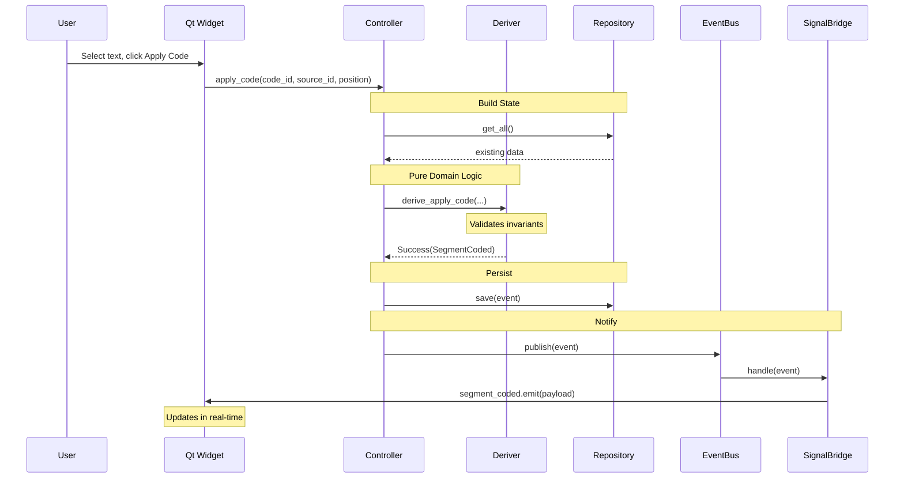
```mermaid
sequenceDiagram
    participant User
    participant UI as Qt Widget
    participant Ctrl as Controller
    participant Der as Deriver
    participant Repo as Repository
    participant EB as EventBus
    participant SB as SignalBridge

    User->>UI: Select text, click Apply Code
    UI->>Ctrl: apply_code(code_id, source_id, position)

    Note over Ctrl,Repo: Build State
    Ctrl->>Repo: get_all()
    Repo-->>Ctrl: existing data

    Note over Ctrl,Der: Pure Domain Logic
    Ctrl->>Der: derive_apply_code(...)

    Note over Der: Validates invariants
    Der-->>Ctrl: Success(SegmentCoded)

    Note over Ctrl,Repo: Persist
    Ctrl->>Repo: save(event)

    Note over Ctrl,SB: Notify
    Ctrl->>EB: publish(event)
    EB->>SB: handle(event)
    SB->>UI: segment_coded.emit(payload)

    Note over UI: Updates in real-time
```

### Failure Flow

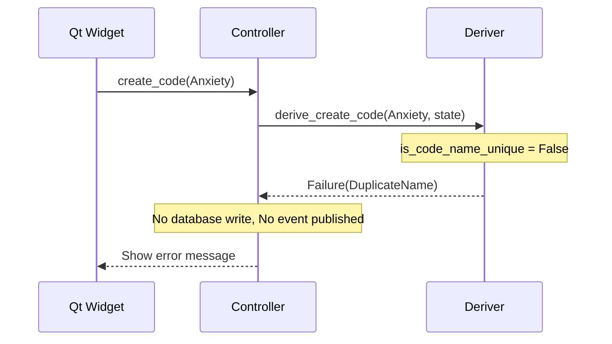
```mermaid
sequenceDiagram
    participant UI as Qt Widget
    participant Ctrl as Controller
    participant Der as Deriver

    UI->>Ctrl: create_code(Anxiety)
    Ctrl->>Der: derive_create_code(Anxiety, state)

    Note over Der: is_code_name_unique = False
    Der-->>Ctrl: Failure(DuplicateName)

    Note over Ctrl: No database write, No event published
    Ctrl-->>UI: Show error message
```

---

## 6. Perspectives Overlay

### Security Perspective

| Container | Security Controls |
|-----------|-------------------|
| C1 Desktop App | Local execution, no network auth required |
| C4 Project DB | File-level permissions, optional encryption |
| C5 Agent Context | MCP protocol validation, localhost-only HTTP server, tool schema enforcement |
| LLM Provider | API key storage in OS keychain, HTTPS only |

### Ownership Perspective

| Team / Role | Owns |
|-------------|------|
| Core Team | Domain Core (C2), Application Shell (C3) |
| UI Team | Desktop Application (C1), Presentation components |
| AI Team | Agent Context (C5), AI Services bounded context |

### Technology Perspective

| Layer | Technology | Why |
|-------|------------|-----|
| UI Framework | PySide6 | Qt bindings, cross-platform, mature |
| Database | SQLite | Embedded, portable projects, no server |
| Vector Store | ChromaDB | Embedded, Python-native, simple API |
| Event System | Custom EventBus | Thread-safe pub/sub with subscribe_all, history buffer, type-based routing, weak refs, metrics |
| Result Type | Custom `OperationResult` + `returns` library | Command handlers use custom; MCP/infra uses `returns` |
| Version Control | Git + sqlite-diffable | Cross-platform, human-readable diffs |

---

## 7. Storage Architecture

QualCoder v2 uses a layered storage architecture with SQLite as the primary database and optional Git-based version control.

### Storage Layers

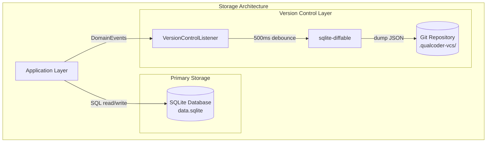
```mermaid
graph TB
    subgraph "Storage Architecture"
        APP[Application Layer]

        subgraph "Primary Storage"
            SQLITE[(SQLite Database<br>data.sqlite)]
        end

        subgraph "Version Control Layer"
            VCS[VersionControlListener]
            DIFF[sqlite-diffable]
            GIT[(Git Repository<br>.qualcoder-vcs/)]
        end
    end

    APP -- "SQL read/write" --> SQLITE
    APP -- "DomainEvents" --> VCS
    VCS -- "500ms debounce" --> DIFF
    DIFF -- "dump JSON" --> GIT
```

### 7.1 Primary Storage (SQLite)

SQLite is always the source of truth for local data:

| Aspect | Details |
|--------|---------|
| File | `data.sqlite` in project folder |
| Schema | Created by SQLAlchemy models |
| Access | Via repository pattern (one per bounded context) |
| Threading | Connection-per-request, thread-safe |

### 7.2 Version Control (Git + sqlite-diffable)

Every mutation to the database is automatically versioned using Git.

**How it works:**

1. **VersionControlListener** subscribes to domain mutation events
2. After 500ms debounce, triggers auto-commit
3. **sqlite-diffable** dumps SQLite to JSON directory structure
4. **Git** commits the changes with descriptive message

```
project_folder/
├── data.sqlite                 # Primary database
└── .qualcoder-vcs/             # Git repository
    ├── .git/
    └── data/                   # sqlite-diffable output
        ├── codes.json
        ├── segments.json
        └── sources.json
```

**Key Components:**

| Component | Location | Purpose |
|-----------|----------|---------|
| `VersionControlListener` | `src/contexts/projects/infra/` | Debounces events, triggers commit |
| `SqliteDiffableAdapter` | `src/contexts/projects/infra/` | Converts SQLite ↔ JSON |
| `GitRepositoryAdapter` | `src/contexts/projects/infra/` | Git operations (init, commit, log) |
| Decision Events | `src/contexts/projects/core/vcs_events.py` | `AutoCommitDecided`, `RestoreDecided` |

**Data Flow:**

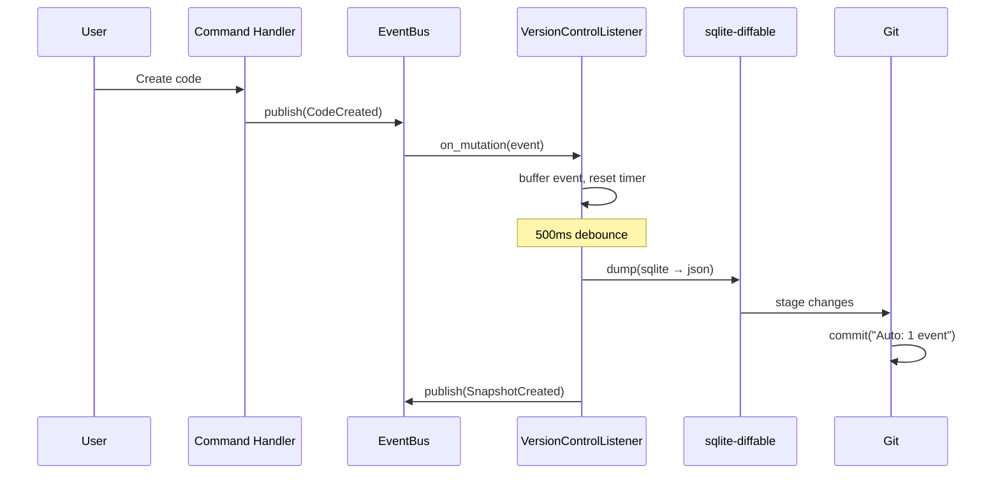
```mermaid
sequenceDiagram
    participant User
    participant Handler as Command Handler
    participant Bus as EventBus
    participant VCL as VersionControlListener
    participant Diff as sqlite-diffable
    participant Git

    User->>Handler: Create code
    Handler->>Bus: publish(CodeCreated)
    Bus->>VCL: on_mutation(event)
    VCL->>VCL: buffer event, reset timer

    Note over VCL: 500ms debounce

    VCL->>Diff: dump(sqlite → json)
    Diff->>Git: stage changes
    Git->>Git: commit("Auto: 1 event")
    VCL->>Bus: publish(SnapshotCreated)
```

**Restore Flow:**

Users can restore to any point in history via the timeline view:

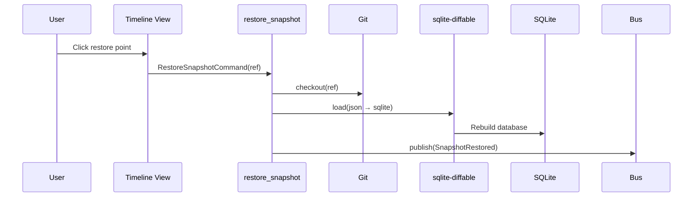
```mermaid
sequenceDiagram
    participant User
    participant Timeline as Timeline View
    participant Handler as restore_snapshot
    participant Git
    participant Diff as sqlite-diffable
    participant DB as SQLite

    User->>Timeline: Click restore point
    Timeline->>Handler: RestoreSnapshotCommand(ref)
    Handler->>Git: checkout(ref)
    Handler->>Diff: load(json → sqlite)
    Diff->>DB: Rebuild database
    Handler->>Bus: publish(SnapshotRestored)
```

### 7.3 Storage Decision Matrix

| Need | Solution |
|------|----------|
| Local-only project | SQLite only |
| Version history & undo | Enable Git VCS |
| Large file storage | S3 + DVC |

---

## 8. Deployment Mapping

**Definition:** How Containers (Level 2) map to Infrastructure.

| Container | Infrastructure | Environment |
|-----------|----------------|-------------|
| Desktop Application | Native executable (PyInstaller) | User's machine |
| Project Database | SQLite file in project folder | User's file system |
| Vector Store | ChromaDB files in project folder | User's file system |
| Version Control | Git repository in project folder | User's file system |
| LLM Provider | Cloud API or local (Ollama) | External / Local |

### Distribution

```
QualCoder v2
├── macOS: .dmg installer (arm64, x86_64)
├── Windows: .msi installer
├── Linux: .deb, .rpm, AppImage
└── PyPI: pip install qualcoder-v2
```

---

## 9. Directory Structure

```
src/
├── contexts/                   # Bounded Contexts (vertical slices)
│   ├── coding/                 # Coding Context (includes AI coding)
│   │   ├── core/               # Domain (Pure)
│   │   │   ├── entities.py     # Code, Category, Segment
│   │   │   ├── ai_entities.py  # AI-specific entities
│   │   │   ├── invariants.py
│   │   │   ├── derivers.py
│   │   │   ├── events.py
│   │   │   ├── commandHandlers/  # Use cases
│   │   │   └── tests/
│   │   ├── infra/              # Repositories, AI providers
│   │   ├── interface/          # Signal bridges, MCP tools
│   │   └── presentation/       # Context-specific UI
│   ├── sources/                # Source file management
│   ├── cases/                  # Case/participant management
│   ├── projects/               # Project lifecycle + VCS
│   ├── exchange/               # Import/export (REFI-QDA, CSV, codebook)
│   ├── settings/               # User settings
│   └── folders/                # Folder organization
│
├── shared/                     # Cross-cutting concerns
│   ├── common/                 # Shared types
│   │   ├── types.py            # DomainEvent, typed IDs
│   │   ├── operation_result.py # OperationResult pattern
│   │   └── failure_events.py   # Base failure types
│   ├── core/                   # Shared domain logic
│   │   └── sync_handlers.py    # Cross-context sync
│   ├── infra/                  # Shared infrastructure
│   │   ├── event_bus.py        # Pub/sub infrastructure
│   │   ├── signal_bridge/      # Thread-safe Qt bridge
│   │   ├── app_context/        # Application context, factories
│   │   ├── lifecycle.py        # Project lifecycle
│   │   └── state.py            # Project state cache
│   └── presentation/           # Shared UI components
│       ├── organisms/          # Reusable complex widgets
│       ├── molecules/          # Small composite widgets
│       ├── templates/          # Page layouts, app shell
│       └── services/           # Dialog service, etc.
│
├── tests/                      # E2E tests
│   └── e2e/
│
└── main.py                     # Application entry point

design_system/                  # Reusable UI components, tokens
```

---

## 10. Bounded Contexts

### Implemented Contexts

| Context | Purpose | Key Events | Integration Pattern |
|---------|---------|------------|---------------------|
| **Coding** | Apply semantic codes to data | CodeCreated, SegmentCoded | Core - others depend on it |
| **Sources** | Manage documents, media | SourceAdded, SourceRemoved | Open Host Service |
| **Cases** | Group and categorize | CaseCreated, SourceLinked | Conformist to Coding |
| **Projects** | Lifecycle + version control | ProjectOpened, SnapshotCreated | Anti-Corruption Layer |
| **Exchange** | Import/export projects and data | CodeListImported, RefiQdaExported | Generic — delegates to Coding, Cases, Sources |
| **Settings** | User preferences | ThemeChanged | Independent |
| **Folders** | Folder organization | FolderCreated, SourceMoved | Supporting |

### Planned Contexts (Future)

| Context | Purpose | Key Events | Integration Pattern |
|---------|---------|------------|---------------------|
| Analysis | Generate insights | ReportGenerated | Subscribes to Coding events |
| Collaboration | Multi-coder workflows | CoderSwitched, CodingsMerged | Published Language |

> **Note:** AI coding capabilities are integrated within the Coding context (`ai_entities.py`, `ai_derivers.py`, etc.) rather than as a separate AI Services context.
> The previously planned Export context has been implemented as the Exchange bounded context.

---

## 11. Design Decisions

### Why Functional DDD?

| Concern | Traditional OOP | Functional DDD |
|---------|-----------------|----------------|
| Testing | Mocks required | Pure functions, no mocks |
| Side effects | Hidden in methods | Explicit via events |
| State | Mutable objects | Immutable data |
| Debugging | Stack traces | Event replay |

### Why Custom Components?

| Component | Why Custom | Alternative |
|-----------|------------|-------------|
| EventBus | Thread-safe, subscribe_all, history buffer, weak refs, metrics | Blinker, PyPubSub |
| SignalBridge | Thread-safe domain-to-Qt bridge with converter pattern, batch emission | None available |
| Result Type | Custom `OperationResult` for command handlers; `returns` library for MCP/infra | Either alone |

---

## 12. Further Reading

### Tutorials (Hands-on Learning)

Start with the [Onboarding Tutorial](./tutorials/README.md) - a progressive guide using a toy example (adding "priority" to Codes).

| Part | Topic |
|------|-------|
| [Part 0](./tutorials/00-big-picture.md) | The Big Picture |
| [Part 1](./tutorials/01-first-invariant.md) | Your First Invariant |
| [Part 2](./tutorials/02-first-deriver.md) | Your First Deriver |
| [Part 3](./tutorials/03-result-type.md) | The Result Type |
| [Part 4](./tutorials/04-event-flow.md) | Events Flow Through |
| [Part 5](./tutorials/05-signal-bridge.md) | SignalBridge Payloads |
| [Part 6](./tutorials/06-testing.md) | Testing Without Mocks |
| [Part 7](./tutorials/07-complete-flow.md) | Complete Flow Reference |

### Reference Documents

- [Common Patterns and Recipes](./tutorials/appendices/A-common-patterns.md)
- [When to Create New Patterns](./tutorials/appendices/B-when-to-create.md)
- [MCP Setup Guide](./user-manual/mcp-setup.md) - Connect AI assistants to QualCoder
- [MCP API Reference](./api/mcp-api.md) - Technical API documentation

### C4 Model References

- [C4 Model Official](https://c4model.com/)
- [Simon Brown - Software Architecture for Developers](https://softwarearchitecturefordevelopers.com/)

---

*Architecture documentation for QualCoder v2. Last updated: 2026-03.*
