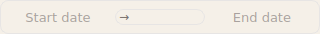

# Advanced Components

Complex components: modals, context menus, editors, pagination, filters, and upload.

## Modal

Material Design dialog.


```python
from design_system import Modal, ModalHeader, ModalBody, ModalFooter

modal = Modal(size="default")  # sm, default, lg, xl

# ModalHeader with title and optional close button
modal.set_header(ModalHeader(title="Confirm Action"))

# ModalBody is the content container
modal.body.addWidget(Label("Are you sure you want to proceed?"))

# ModalFooter contains action buttons
modal.add_button("Cancel", variant="outline", on_click=modal.reject)
modal.add_button("Confirm", variant="primary", on_click=modal.accept)

# Show
result = modal.exec()  # Returns QDialog.Accepted or QDialog.Rejected
```

### Modal Properties

| Property | Type | Default | Description |
|----------|------|---------|-------------|
| `size` | str | `"default"` | `"sm"`, `"default"`, `"lg"`, `"xl"` |

### Modal Methods

| Method | Description |
|--------|-------------|
| `set_header(widget)` | Set header widget |
| `add_button(text, variant, on_click)` | Add footer button |
| `exec()` | Show modal and wait |
| `accept()` | Accept and close |
| `reject()` | Reject and close |

---

## Toggle / LabeledToggle

Switch component.


```python
from design_system import Toggle, LabeledToggle

toggle = Toggle()
toggle.setChecked(True)
toggle.toggled.connect(lambda checked: print(f"Toggled: {checked}"))

# LabeledToggle includes text label
labeled = LabeledToggle(label="Enable feature")
labeled.toggled.connect(lambda checked: handle_toggle(checked))
```

### Toggle Signals

| Signal | Description |
|--------|-------------|
| `toggled(checked)` | Toggle state changed |

---

## ContextMenu

Right-click menu.


```python
from design_system import ContextMenu

menu = ContextMenu()
menu.add_item("Edit", icon="mdi6.pencil", on_click=edit_handler)
menu.add_item("Delete", icon="mdi6.delete", variant="danger", on_click=delete_handler)
menu.add_separator()
submenu = menu.add_submenu("More Options")
submenu.add_item("Option 1", on_click=handler1)

# Show at cursor
menu.exec(QCursor.pos())
```

### ContextMenu Methods

| Method | Description |
|--------|-------------|
| `add_item(text, icon, variant, on_click)` | Add menu item |
| `add_separator()` | Add divider |
| `add_submenu(text)` | Add submenu |
| `exec(pos)` | Show at position |

---

## FilterPanel

Collapsible filter panel.


```python
from design_system import FilterPanel, FilterSection

filters = FilterPanel()
filters.add_section("File Type", ["Text", "Audio", "Video", "Image"])
filters.add_section("Status", ["Coded", "Uncoded", "In Progress"])

filters.filters_changed.connect(lambda f: print(f"Filters: {f}"))

# Methods
current = filters.get_filters()
filters.clear_filters()
filters.set_collapsed(True)
```

### FilterPanel Signals

| Signal | Description |
|--------|-------------|
| `filters_changed(filters)` | Filter selection changed |

---

## ViewToggle

Toggle between view modes.


```python
from design_system import ViewToggle

toggle = ViewToggle(views=["grid", "list", "table"], current="list")
toggle.view_changed.connect(lambda view: switch_to_view(view))

toggle.set_view("grid")
current = toggle.current_view()
```

---

## CodeEditor

Code editor with syntax highlighting.


```python
from design_system import CodeEditor

editor = CodeEditor(
    language="python",
    read_only=False,
    show_line_numbers=True
)

editor.set_code("def hello():\n    print('Hello')")
code = editor.get_code()
editor.set_language("sql")

editor.code_changed.connect(lambda code: print("Code changed"))
```

### CodeEditor Properties

| Property | Type | Default | Description |
|----------|------|---------|-------------|
| `language` | str | `"python"` | Syntax language |
| `read_only` | bool | `False` | Read-only mode |
| `show_line_numbers` | bool | `True` | Show line numbers |

---

## RichTextEditor

Rich text editor with formatting toolbar.


```python
from design_system import RichTextEditor

editor = RichTextEditor(show_toolbar=True)

editor.set_html("<p>Hello <b>World</b></p>")
editor.set_plain_text("Plain text content")

html = editor.get_html()
text = editor.get_plain_text()

editor.content_changed.connect(lambda html: save_content(html))
```

---

## MemoEditor

Memo/note editor for annotations.


```python
from design_system import MemoEditor

memo = MemoEditor(title="Research Notes")

memo.set_content("My notes here...")
content = memo.get_content()

memo.content_changed.connect(lambda text: auto_save(text))
memo.save_clicked.connect(lambda: save_memo())
```

---

## Pagination

Page navigation.


```python
from design_system import Pagination, SimplePagination

# Full pagination
pager = Pagination(current_page=1, total_pages=10)
pager.page_changed.connect(lambda page: load_page(page))
pager.go_to_page(5)
pager.set_total_pages(20)

# Simple prev/next
simple = SimplePagination()
simple.previous_clicked.connect(prev_handler)
simple.next_clicked.connect(next_handler)
```

### Pagination Signals

| Signal | Description |
|--------|-------------|
| `page_changed(page)` | Page changed |

---

## DateRangePicker

Date range selection.



```python
from design_system import DateRangePicker, QuickDateSelect

picker = DateRangePicker()
picker.range_changed.connect(lambda start, end: print(f"Range: {start} to {end}"))

# QuickDateSelect provides preset options
quick = QuickDateSelect()
quick.range_selected.connect(lambda start, end: apply_range(start, end))
```

---

## DropZone

Drag-and-drop file upload.


```python
from design_system import DropZone, CompactDropZone

zone = DropZone(
    accepted_types=[".txt", ".pdf", ".docx"],
    max_files=10,
    max_size_mb=50
)

zone.files_dropped.connect(lambda files: handle_upload(files))
zone.browse_clicked.connect(open_file_dialog)

zone.enable_drop()
zone.disable_drop()

# Compact variant
compact = CompactDropZone(accepted_types=[".txt", ".pdf"])
compact.files_dropped.connect(handle_upload)
```

### DropZone Properties

| Property | Type | Default | Description |
|----------|------|---------|-------------|
| `accepted_types` | list | `[]` | Allowed extensions |
| `max_files` | int | `10` | Maximum files |
| `max_size_mb` | int | `50` | Max file size (MB) |

### DropZone Signals

| Signal | Description |
|--------|-------------|
| `files_dropped(files)` | Files dropped |
| `browse_clicked` | Browse button clicked |

---

## ImageAnnotationLayer

Image annotation with drawing tools.

```python
from design_system import ImageAnnotationLayer, ImageAnnotation, AnnotationMode

layer = ImageAnnotationLayer()
layer.load_image("/path/to/image.jpg")

# Set drawing mode
layer.set_mode(AnnotationMode.RECTANGLE)  # SELECT, RECTANGLE, POLYGON, FREEHAND

# Signals
layer.annotation_created.connect(lambda ann: print(f"Created: {ann.id}"))
layer.annotation_selected.connect(lambda id: print(f"Selected: {id}"))
layer.annotation_deleted.connect(lambda id: print(f"Deleted: {id}"))

# Methods
annotations = layer.get_annotations()
layer.clear_annotations()
layer.delete_annotation("annotation-id")
```

### AnnotationMode

| Mode | Description |
|------|-------------|
| `SELECT` | Select existing annotations |
| `RECTANGLE` | Draw rectangles |
| `POLYGON` | Draw polygons |
| `FREEHAND` | Freehand drawing |

---

## DiffViewer

Side-by-side diff viewer.

```python
from design_system import DiffViewer

diff = DiffViewer()
diff.set_content("Original content...", "Modified content...")
```
