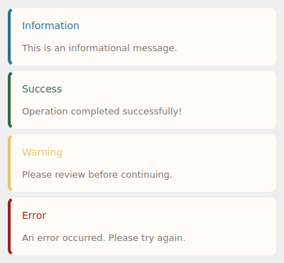
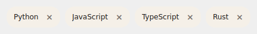

# Core Components

Fundamental UI building blocks: buttons, inputs, labels, cards, and more.

## Button

Styled button with multiple variants and sizes.


```python
from design_system import Button

# Variants: primary, secondary, outline, ghost, danger, success, icon
button = Button("Save", variant="primary")
button = Button("Cancel", variant="outline")
button = Button("Delete", variant="danger")

# Sizes: sm, md, lg
button = Button("Small", size="sm")
button = Button("Large", size="lg")

# Icon button
button = Button("", variant="icon")

# Connect click handler
button.clicked.connect(lambda: print("Clicked!"))
```

### Button Properties

| Property | Type | Default | Description |
|----------|------|---------|-------------|
| `text` | str | `""` | Button label |
| `variant` | str | `"primary"` | Visual style |
| `size` | str | `"md"` | Button size |

### Button Variants

| Variant | Use Case |
|---------|----------|
| `primary` | Primary actions (Save, Submit) |
| `secondary` | Secondary actions |
| `outline` | Alternative actions |
| `ghost` | Subtle actions |
| `danger` | Destructive actions (Delete) |
| `success` | Positive actions (Confirm) |
| `icon` | Icon-only buttons |

---

## Input

Text input field with validation support.


```python
from design_system import Input

input_field = Input(placeholder="Enter name...")

# Error state
input_field.set_error(True)
is_error = input_field.is_error()

# Get/set value
text = input_field.text()
input_field.setText("Hello")
```

### Input Properties

| Property | Type | Default | Description |
|----------|------|---------|-------------|
| `placeholder` | str | `""` | Placeholder text |

### Input Methods

| Method | Returns | Description |
|--------|---------|-------------|
| `text()` | str | Get current text |
| `setText(text)` | None | Set text value |
| `set_error(bool)` | None | Set error state |
| `is_error()` | bool | Check error state |
| `clear()` | None | Clear input |

---

## Label

Text label with style variants.

```python
from design_system import Label

# Variants: default, muted, secondary, title, description, hint, error
title = Label("Main Title", variant="title")
description = Label("Some description", variant="description")
hint = Label("Optional field", variant="hint")
error = Label("Invalid input", variant="error")
```

### Label Variants

| Variant | Typography | Use Case |
|---------|------------|----------|
| `default` | Base, primary | Standard text |
| `title` | 2xl, semibold | Headings |
| `description` | Base, secondary | Explanatory text |
| `hint` | Small, hint | Help text |
| `error` | Small, error | Error messages |
| `muted` | Small, disabled | De-emphasized |
| `secondary` | Base, secondary | Secondary text |

---

## Card

Container with elevation and shadow.


```python
from design_system import Card, CardHeader

# Basic card
card = Card()
card.add_widget(Label("Content"))

# Card with header
card = Card()
header = CardHeader(title="Card Title", description="Optional description")
card.add_widget(header)
card.add_widget(Label("Body content"))

# Elevation levels: 1-4
card = Card(elevation=2)
```

### Card Properties

| Property | Type | Default | Description |
|----------|------|---------|-------------|
| `elevation` | int | `1` | Shadow level (1-4) |

### CardHeader

```python
from design_system import CardHeader

header = CardHeader(
    title="Section Title",
    description="Optional description text"
)
```

---

## Badge

Small tag/label for status or counts.


```python
from design_system import Badge

# Variants: default, secondary, outline, destructive, success, warning, info, primary
badge = Badge("New", variant="primary")
badge = Badge("3", variant="info")
badge = Badge("Error", variant="destructive")
```

### Badge Variants

| Variant | Color | Use Case |
|---------|-------|----------|
| `default` | Gray | Neutral labels |
| `primary` | Primary | Active items |
| `secondary` | Secondary | Alternative |
| `outline` | Border only | Subtle |
| `destructive` | Red | Errors, warnings |
| `success` | Green | Success states |
| `warning` | Yellow | Cautions |
| `info` | Blue | Information |

---

## Alert

Callout component for messages.



```python
from design_system import Alert

# Variants: default, destructive, success, warning, info
alert = Alert(
    title="Success!",
    description="Your changes have been saved.",
    variant="success"
)
```

### Alert Properties

| Property | Type | Default | Description |
|----------|------|---------|-------------|
| `title` | str | `""` | Alert heading |
| `description` | str | `""` | Alert body text |
| `variant` | str | `"default"` | Visual style |

---

## Avatar

Circular avatar with text or image.


```python
from design_system import Avatar

avatar = Avatar(text="JD", size=40)  # Shows initials
```

### Avatar Properties

| Property | Type | Default | Description |
|----------|------|---------|-------------|
| `text` | str | `""` | Initials to display |
| `size` | int | `40` | Avatar diameter in pixels |

---

## Chip

Tag with optional close button.



```python
from design_system import Chip

chip = Chip("Python", closable=True)
chip.close_clicked.connect(lambda: print("Closed"))
```

### Chip Properties

| Property | Type | Default | Description |
|----------|------|---------|-------------|
| `text` | str | `""` | Chip label |
| `closable` | bool | `False` | Show close button |

### Chip Signals

| Signal | Description |
|--------|-------------|
| `close_clicked` | Emitted when close button clicked |

---

## FileIcon

File type icon with colored background.


```python
from design_system import FileIcon

# Types: text, audio, video, image, pdf
icon = FileIcon(file_type="pdf")
icon = FileIcon(file_type="audio")
```

### File Types

| Type | Color | Icon |
|------|-------|------|
| `text` | Blue | Document |
| `audio` | Purple | Microphone |
| `video` | Red | Video |
| `image` | Green | Image |
| `pdf` | Orange | PDF |

---

## Separator

Horizontal or vertical divider line.

```python
from design_system import Separator

h_sep = Separator(orientation="horizontal")
v_sep = Separator(orientation="vertical")
```

### Separator Properties

| Property | Type | Default | Description |
|----------|------|---------|-------------|
| `orientation` | str | `"horizontal"` | Line direction |
