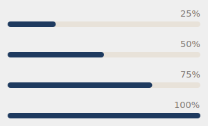

# Feedback Components

User feedback components: spinners, toasts, progress bars, and stat cards.

## Spinner / LoadingIndicator / LoadingOverlay

Loading spinners.


```python
from design_system import Spinner, LoadingIndicator, LoadingOverlay

# Simple Spinner widget
spinner = Spinner(size=24, color="#009688")
spinner.start()
spinner.stop()

# LoadingIndicator combines spinner with text
loading = LoadingIndicator(text="Loading files...")
loading.start()
loading.stop()

# LoadingOverlay covers parent widget with loading state
overlay = LoadingOverlay(parent=main_window)
overlay.show()
# ... loading ...
overlay.hide()
```

### Spinner Properties

| Property | Type | Default | Description |
|----------|------|---------|-------------|
| `size` | int | `24` | Spinner diameter |
| `color` | str | `None` | Spinner color |

### LoadingIndicator Properties

| Property | Type | Default | Description |
|----------|------|---------|-------------|
| `text` | str | `""` | Loading message |

---

## SkeletonLoader

Skeleton loading placeholder.

```python
from design_system import SkeletonLoader

skeleton = SkeletonLoader(width=200, height=20)
```

### SkeletonLoader Properties

| Property | Type | Default | Description |
|----------|------|---------|-------------|
| `width` | int | `100` | Skeleton width |
| `height` | int | `20` | Skeleton height |

---

## Toast

Popup notifications.


```python
from design_system import Toast, ToastManager, ToastContainer

# Show toast
toast = Toast(
    message="File saved successfully",
    variant="success",  # success, error, warning, info
    duration=3000,      # ms, 0 for infinite
    closable=True
)
toast.show_toast()

# Using manager (handles positioning)
ToastManager.show("Operation complete", variant="success")

# ToastContainer manages multiple toasts with stacking
container = ToastContainer(parent=window)
container.add_toast(toast)
```

### Toast Properties

| Property | Type | Default | Description |
|----------|------|---------|-------------|
| `message` | str | required | Toast message |
| `variant` | str | `"info"` | Visual style |
| `duration` | int | `3000` | Display time (ms) |
| `closable` | bool | `True` | Show close button |

### Toast Variants

| Variant | Color | Use Case |
|---------|-------|----------|
| `success` | Green | Success messages |
| `error` | Red | Error messages |
| `warning` | Yellow | Warnings |
| `info` | Blue | Information |

---

## ProgressBar

Progress indicator.



```python
from design_system import ProgressBar, ProgressBarLabeled, ProgressBarWidget

# Simple progress
progress = ProgressBar()
progress.setValue(50)
progress.setMaxValue(100)

# With label
labeled = ProgressBarLabeled(label="Importing files...")
labeled.setValue(75)

# Base widget
widget = ProgressBarWidget()
widget.setValue(60)
```

### ProgressBar Methods

| Method | Description |
|--------|-------------|
| `setValue(value)` | Set current value |
| `setMaxValue(value)` | Set maximum value |
| `value()` | Get current value |

---

## RelevanceScoreBar

Score indicator bar for 0-1 relevance values.

```python
from design_system import RelevanceScoreBar, RelevanceBarWidget, ScoreIndicator

# Simple relevance bar
bar = RelevanceScoreBar(score=0.85)
bar.set_score(0.92)

# Variants: default, success, warning, error
bar = RelevanceScoreBar(score=0.75, variant="success")

# Container widget
relevance = RelevanceBarWidget()
relevance.set_score(0.68)

# Visual score indicator
indicator = ScoreIndicator(score=0.9)
indicator.set_score(0.5)
```

### RelevanceScoreBar Properties

| Property | Type | Default | Description |
|----------|------|---------|-------------|
| `score` | float | `0` | Score value (0-1) |
| `variant` | str | `"default"` | Visual style |

---

## StatCard

Statistics display with trend.


```python
from design_system import StatCard, StatCardRow, MiniStatCard

card = StatCard(
    value="1,234",
    label="Total Codes",
    trend="+12%",
    trend_direction="up",  # or "down"
    icon="mdi6.tag",
    color="#009688"
)

# StatCardRow arranges multiple stats horizontally
row = StatCardRow()
row.add_stat(StatCard(value="100", label="Files"))
row.add_stat(StatCard(value="25", label="Codes"))

# MiniStatCard is a compact version for dashboards
mini = MiniStatCard(value="42", label="Files")
```

### StatCard Properties

| Property | Type | Default | Description |
|----------|------|---------|-------------|
| `value` | str | required | Display value |
| `label` | str | required | Stat label |
| `trend` | str | `None` | Trend text (e.g., "+12%") |
| `trend_direction` | str | `None` | `"up"` or `"down"` |
| `icon` | str | `None` | Icon name |
| `color` | str | `None` | Accent color |

---

## Feedback Example

Loading state management:

```python
from design_system import (
    Panel, LoadingOverlay, ProgressBarLabeled,
    Toast, ToastManager
)

class DataLoader(Panel):
    def __init__(self):
        super().__init__()

        # Loading overlay
        self.overlay = LoadingOverlay(parent=self)

        # Progress bar
        self.progress = ProgressBarLabeled(label="Loading...")
        self.progress.hide()
        self.add_widget(self.progress)

    def start_loading(self, total_items):
        self.overlay.show()
        self.progress.show()
        self.progress.setMaxValue(total_items)
        self.progress.setValue(0)

    def update_progress(self, current, message=""):
        self.progress.setValue(current)
        if message:
            self.progress.set_label(message)

    def finish_loading(self, success=True):
        self.overlay.hide()
        self.progress.hide()

        if success:
            ToastManager.show("Data loaded successfully", variant="success")
        else:
            ToastManager.show("Failed to load data", variant="error")
```
