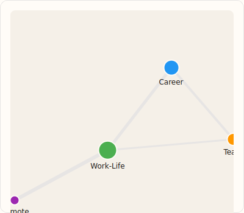

# Visualization Components

Data visualization: charts, graphs, word clouds, and PDF viewers.

## ChartWidget

Charts using PyQtGraph.


```python
from design_system import ChartWidget, ChartDataPoint

chart = ChartWidget(title="Code Frequency", subtitle="Top 10 codes")

# Bar chart using ChartDataPoint data class
chart.set_bar_data([
    ChartDataPoint(label="Theme A", value=15, color="#FFC107"),
    ChartDataPoint(label="Theme B", value=12, color="#4CAF50"),
    ChartDataPoint(label="Theme C", value=8, color="#2196F3"),
])

# Line chart
chart.set_line_data([
    ChartDataPoint(label="Jan", value=10),
    ChartDataPoint(label="Feb", value=15),
    ChartDataPoint(label="Mar", value=12),
])

# Scatter plot
chart.set_scatter_data([...])

chart.point_clicked.connect(lambda idx, data: print(f"Clicked: {data}"))
chart.clear()
```

### ChartDataPoint

```python
from design_system import ChartDataPoint

point = ChartDataPoint(
    label="Category",
    value=100,
    color="#FFC107"
)
```

### ChartWidget Methods

| Method | Description |
|--------|-------------|
| `set_bar_data(data)` | Set bar chart data |
| `set_line_data(data)` | Set line chart data |
| `set_scatter_data(data)` | Set scatter plot data |
| `clear()` | Clear chart |

### ChartWidget Signals

| Signal | Description |
|--------|-------------|
| `point_clicked(idx, data)` | Data point clicked |

---

## PieChart

Pie chart specialization.

```python
from design_system import PieChart, ChartDataPoint

pie = PieChart(title="Distribution")
pie.set_data([
    ChartDataPoint("Category A", 40, "#FFC107"),
    ChartDataPoint("Category B", 35, "#4CAF50"),
    ChartDataPoint("Category C", 25, "#2196F3"),
])
```

---

## SparkLine

Mini inline sparkline.

```python
from design_system import SparkLine

spark = SparkLine(data=[10, 15, 12, 18, 14, 20], color="#009688")
```

### SparkLine Properties

| Property | Type | Default | Description |
|----------|------|---------|-------------|
| `data` | list | `[]` | Data points |
| `color` | str | `None` | Line color |

---

## LegendItem

Chart legend item.

```python
from design_system import LegendItem

item = LegendItem(label="Category A", color="#FFC107")
```

---

## NetworkGraphWidget

Interactive network visualization.



```python
from design_system import NetworkGraphWidget, GraphNode, GraphEdge

graph = NetworkGraphWidget()

# Add nodes using GraphNode data class
graph.add_node(GraphNode(id="1", label="Code A", color="#FFC107", size=20))
graph.add_node(GraphNode(id="2", label="Code B", color="#4CAF50", size=15))

# Add edges using GraphEdge data class
graph.add_edge(GraphEdge(source="1", target="2", weight=5, label="co-occurs"))

# Layout algorithms: spring, circular, kamada-kawai
graph.layout("spring")

# Signals
graph.node_clicked.connect(lambda id, meta: print(f"Node: {id}"))
graph.node_double_clicked.connect(lambda id, meta: print(f"Edit: {id}"))
graph.edge_clicked.connect(lambda src, tgt: print(f"Edge: {src} -> {tgt}"))

graph.clear()
```

### GraphNode / GraphEdge

```python
from design_system import GraphNode, GraphEdge

node = GraphNode(
    id="unique-id",
    label="Node Label",
    color="#FFC107",
    size=20
)

edge = GraphEdge(
    source="node-1",
    target="node-2",
    weight=5,
    label="relationship"
)
```

### NetworkGraphWidget Signals

| Signal | Description |
|--------|-------------|
| `node_clicked(id, meta)` | Node clicked |
| `node_double_clicked(id, meta)` | Node double-clicked |
| `edge_clicked(source, target)` | Edge clicked |

---

## WordCloudWidget

Word cloud visualization.


```python
from design_system import WordCloudWidget

cloud = WordCloudWidget(
    max_words=100,
    min_font_size=10,
    max_font_size=60,
    color_scheme="primary"  # primary, success, error, warning, info
)

# From word frequencies
cloud.set_frequencies({
    "qualitative": 50,
    "research": 45,
    "coding": 40,
    "analysis": 35,
})

# Or from raw text
cloud.set_text("Full text content to analyze...")

cloud.generate()
cloud.word_clicked.connect(lambda word: print(f"Word: {word}"))
```

### WordCloudWidget Properties

| Property | Type | Default | Description |
|----------|------|---------|-------------|
| `max_words` | int | `100` | Maximum words |
| `min_font_size` | int | `10` | Minimum font size |
| `max_font_size` | int | `60` | Maximum font size |
| `color_scheme` | str | `"primary"` | Color scheme |

### WordCloudWidget Methods

| Method | Description |
|--------|-------------|
| `set_frequencies(dict)` | Set word frequencies |
| `set_text(text)` | Set raw text |
| `generate()` | Generate word cloud |

---

## WordCloudPreview

Thumbnail preview of word cloud.

```python
from design_system import WordCloudPreview

preview = WordCloudPreview()
preview.set_frequencies({"word": 10, "cloud": 8, "preview": 5})
```

---

## PDFPageViewer

PDF document viewer with text selection overlay.

```python
from design_system import PDFPageViewer, PDFSelection

viewer = PDFPageViewer(
    show_toolbar=True,      # Navigation and zoom controls
    show_thumbnails=True,   # Page thumbnail sidebar
    initial_zoom=1.0        # Starting zoom level
)

# Load document
viewer.load_document("/path/to/document.pdf")

# Navigation
viewer.go_to_page(5)        # 0-indexed
viewer.next_page()
viewer.previous_page()

# Zoom
viewer.set_zoom(1.5)        # 150%
viewer.zoom_in()            # +25%
viewer.zoom_out()           # -25%
viewer.fit_to_width()       # Auto-fit

# Signals
viewer.page_changed.connect(lambda page: print(f"Page: {page}"))
viewer.document_loaded.connect(lambda count: print(f"Pages: {count}"))
viewer.zoom_changed.connect(lambda zoom: print(f"Zoom: {zoom}"))

# Text selection (Ctrl+Click and drag)
viewer.text_selected.connect(lambda sel: handle_selection(sel))

def handle_selection(selection: PDFSelection):
    print(f"Page: {selection.page}")
    print(f"Text: {selection.text}")
    print(f"Rect: {selection.rect}")

# Properties
page = viewer.current_page   # Current page (0-indexed)
total = viewer.page_count    # Total pages
zoom = viewer.zoom           # Current zoom level

# Cleanup
viewer.close_document()
```

### PDFPageViewer Properties

| Property | Type | Default | Description |
|----------|------|---------|-------------|
| `show_toolbar` | bool | `True` | Show navigation toolbar |
| `show_thumbnails` | bool | `True` | Show page thumbnails |
| `initial_zoom` | float | `1.0` | Starting zoom level |

### PDFPageViewer Signals

| Signal | Description |
|--------|-------------|
| `page_changed(page)` | Page navigation |
| `document_loaded(count)` | Document loaded |
| `zoom_changed(zoom)` | Zoom level changed |
| `text_selected(selection)` | Text selected |

### PDFSelection Data Class

```python
from design_system import PDFSelection

selection = PDFSelection(
    page=0,
    text="Selected text",
    rect=(x0, y0, x1, y1)
)
```

> **Note: Dependencies**
>
> PDFPageViewer requires `pymupdf` (PyMuPDF) for PDF rendering.
