# QualCoder: Agent Context Design

## AI-First Interface Architecture for Qualitative Research

---

## Executive Summary

This document describes the **Agent Context** - an interface layer that exposes QualCoder's capabilities to external AI systems. Rather than embedding AI inside QualCoder, this architecture makes QualCoder a **tool provider** that any AI system can operate.

**Key Principle**: The researcher's AI assistant (Claude Code, Gemini CLI, etc.) becomes the primary interface, with QualCoder providing the domain-specific tools and state management.

---

## Table of Contents

1. [Architecture Overview](#1-architecture-overview)
2. [Design Philosophy](#2-design-philosophy)
3. [Agent Context Components](#3-agent-context-components)
4. [Protocol Adapters](#4-protocol-adapters)
5. [Capability Registry](#5-capability-registry)
6. [Event Streaming](#6-event-streaming)
7. [Session Management](#7-session-management)
8. [Security and Trust](#8-security-and-trust)
9. [Integration Patterns](#9-integration-patterns)
10. [Deployment Modes](#10-deployment-modes)
11. [Real-Time UI Observation](#11-real-time-ui-observation)

---

## 1. Architecture Overview

### 1.1 High-Level Architecture

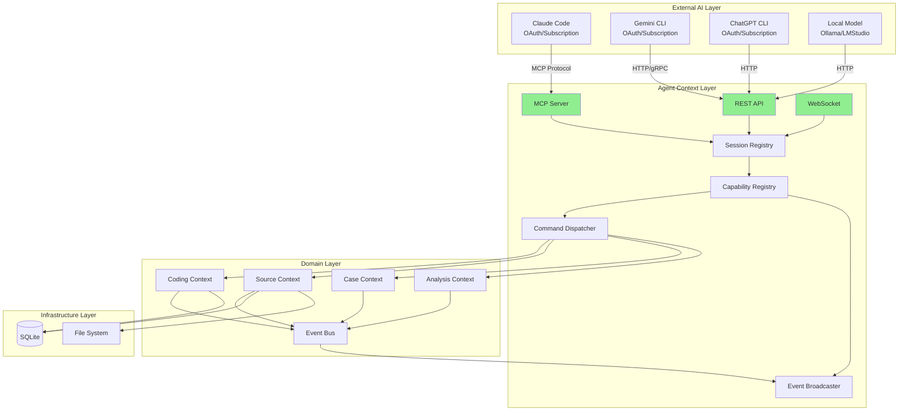
```mermaid
graph TB
    subgraph "External AI Layer"
        CLAUDE[Claude Code<br/>OAuth/Subscription]
        GEMINI[Gemini CLI<br/>OAuth/Subscription]
        CHATGPT[ChatGPT CLI<br/>OAuth/Subscription]
        LOCAL[Local Model<br/>Ollama/LMStudio]
    end

    subgraph "Agent Context Layer"
        MCP[MCP Server]
        REST[REST API]
        WS[WebSocket]

        MCP --> SR[Session Registry]
        REST --> SR
        WS --> SR

        SR --> CR[Capability Registry]
        CR --> CD[Command Dispatcher]
        CR --> EB[Event Broadcaster]
    end

    subgraph "Domain Layer"
        CODING[Coding Context]
        SOURCE[Source Context]
        CASE[Case Context]
        ANALYSIS[Analysis Context]

        CODING --> BUS[Event Bus]
        SOURCE --> BUS
        CASE --> BUS
        ANALYSIS --> BUS
    end

    subgraph "Infrastructure Layer"
        DB[(SQLite)]
        FS[File System]
    end

    CLAUDE -->|MCP Protocol| MCP
    GEMINI -->|HTTP/gRPC| REST
    CHATGPT -->|HTTP| REST
    LOCAL -->|HTTP| REST

    CD --> CODING
    CD --> SOURCE
    CD --> CASE
    CD --> ANALYSIS

    BUS --> EB

    CODING --> DB
    SOURCE --> DB
    SOURCE --> FS

    style MCP fill:#90EE90
    style REST fill:#90EE90
    style WS fill:#90EE90
```

### 1.2 Interaction Flow

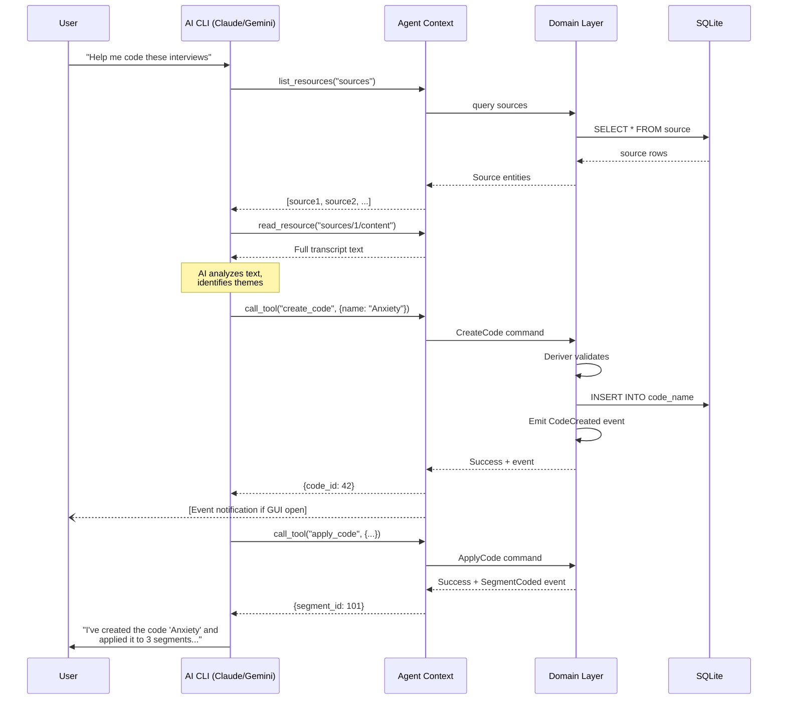
```mermaid
sequenceDiagram
    participant User
    participant AI as AI CLI (Claude/Gemini)
    participant AC as Agent Context
    participant Domain as Domain Layer
    participant DB as SQLite

    User->>AI: "Help me code these interviews"

    AI->>AC: list_resources("sources")
    AC->>Domain: query sources
    Domain->>DB: SELECT * FROM source
    DB-->>Domain: source rows
    Domain-->>AC: Source entities
    AC-->>AI: [source1, source2, ...]

    AI->>AC: read_resource("sources/1/content")
    AC-->>AI: Full transcript text

    Note over AI: AI analyzes text,<br/>identifies themes

    AI->>AC: call_tool("create_code", {name: "Anxiety"})
    AC->>Domain: CreateCode command
    Domain->>Domain: Deriver validates
    Domain->>DB: INSERT INTO code_name
    Domain->>Domain: Emit CodeCreated event
    Domain-->>AC: Success + event
    AC-->>AI: {code_id: 42}
    AC--)User: [Event notification if GUI open]

    AI->>AC: call_tool("apply_code", {...})
    AC->>Domain: ApplyCode command
    Domain-->>AC: Success + SegmentCoded event
    AC-->>AI: {segment_id: 101}

    AI->>User: "I've created the code 'Anxiety' and<br/>applied it to 3 segments..."
```

---

## 2. Design Philosophy

### 2.1 Core Principles

| Principle | Description | Implementation |
|-----------|-------------|----------------|
| **AI as Primary Interface** | Users interact through their preferred AI tool | QualCoder exposes capabilities, doesn't embed AI |
| **Protocol Agnostic** | Support multiple AI integration protocols | MCP, REST, WebSocket, gRPC adapters |
| **Subscription Friendly** | No API keys required if user has AI subscription | OAuth delegated to external AI tools |
| **Event-Driven** | AI receives real-time updates about system state | Domain events streamed to subscribers |
| **Trust Configurable** | Users control what AI can do autonomously | Per-tool permission levels |
| **Stateless Interface** | Agent Context doesn't hold business state | All state in Domain Layer |

### 2.2 Comparison: Traditional vs Agent-First

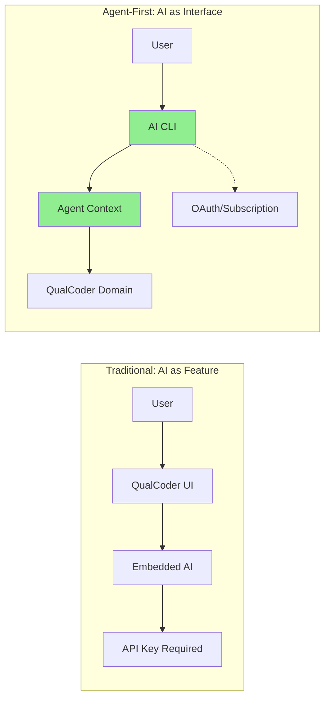
```mermaid
graph LR
    subgraph "Traditional: AI as Feature"
        U1[User] --> UI1[QualCoder UI]
        UI1 --> AI1[Embedded AI]
        AI1 --> API1[API Key Required]
    end

    subgraph "Agent-First: AI as Interface"
        U2[User] --> AI2[AI CLI]
        AI2 --> AC2[Agent Context]
        AC2 --> QC2[QualCoder Domain]
        AI2 -.-> OAUTH[OAuth/Subscription]
    end

    style AI2 fill:#90EE90
    style AC2 fill:#90EE90
```

### 2.3 Benefits

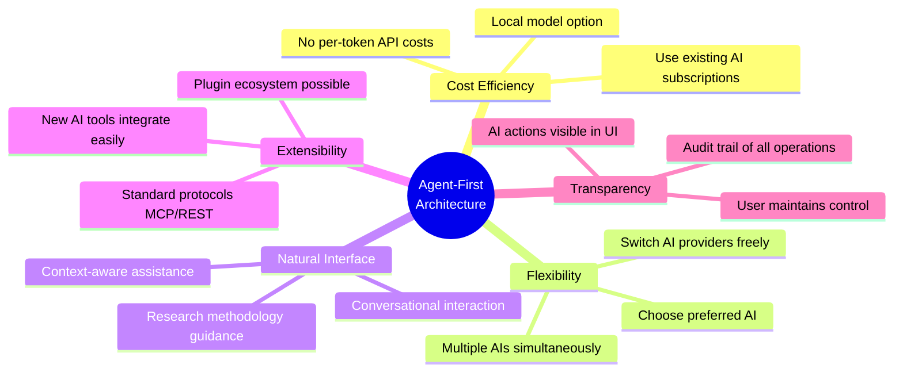
```mermaid
mindmap
  root((Agent-First<br/>Architecture))
    Cost Efficiency
      Use existing AI subscriptions
      No per-token API costs
      Local model option
    Flexibility
      Choose preferred AI
      Switch AI providers freely
      Multiple AIs simultaneously
    Natural Interface
      Conversational interaction
      Context-aware assistance
      Research methodology guidance
    Extensibility
      New AI tools integrate easily
      Standard protocols MCP/REST
      Plugin ecosystem possible
    Transparency
      AI actions visible in UI
      Audit trail of all operations
      User maintains control
```

---

## 3. Agent Context Components

### 3.1 Component Overview

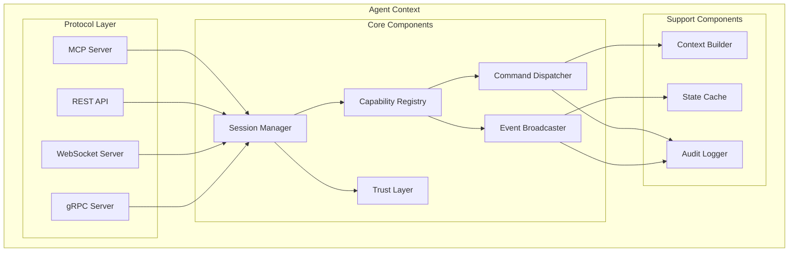
```mermaid
graph TB
    subgraph "Agent Context"
        subgraph "Protocol Layer"
            MCP[MCP Server]
            REST[REST API]
            WS[WebSocket Server]
            GRPC[gRPC Server]
        end

        subgraph "Core Components"
            SM[Session Manager]
            CR[Capability Registry]
            CD[Command Dispatcher]
            EB[Event Broadcaster]
            TL[Trust Layer]
        end

        subgraph "Support Components"
            CTX[Context Builder]
            CACHE[State Cache]
            LOG[Audit Logger]
        end
    end

    MCP --> SM
    REST --> SM
    WS --> SM
    GRPC --> SM

    SM --> CR
    SM --> TL
    CR --> CD
    CR --> EB
    CD --> CTX
    EB --> CACHE
    CD --> LOG
    EB --> LOG
```

### 3.2 Component Responsibilities

| Component | Responsibility | Key Operations |
|-----------|----------------|----------------|
| **Session Manager** | Track connected AI clients | create_session, destroy_session, get_session |
| **Capability Registry** | Define available tools/resources | register_tool, register_resource, list_capabilities |
| **Command Dispatcher** | Route tool calls to domain | dispatch_command, validate_command |
| **Event Broadcaster** | Stream events to subscribers | subscribe, unsubscribe, broadcast |
| **Trust Layer** | Enforce permission policies | check_permission, require_approval |
| **Context Builder** | Prepare context for AI consumption | build_project_briefing, build_state_summary |
| **State Cache** | Cache frequently accessed state | cache_codes, cache_sources, invalidate |
| **Audit Logger** | Record all AI operations | log_tool_call, log_event, get_audit_trail |

### 3.3 Component Interactions

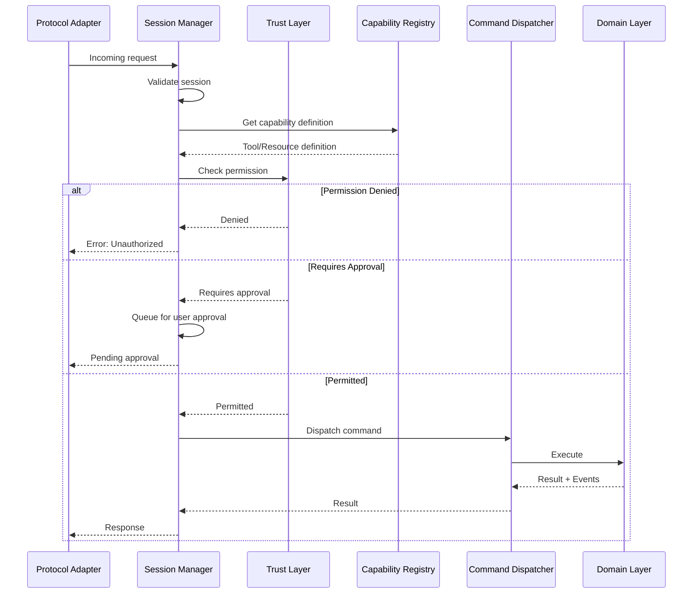
```mermaid
sequenceDiagram
    participant Proto as Protocol Adapter
    participant SM as Session Manager
    participant TL as Trust Layer
    participant CR as Capability Registry
    participant CD as Command Dispatcher
    participant Domain as Domain Layer

    Proto->>SM: Incoming request
    SM->>SM: Validate session
    SM->>CR: Get capability definition
    CR-->>SM: Tool/Resource definition
    SM->>TL: Check permission

    alt Permission Denied
        TL-->>SM: Denied
        SM-->>Proto: Error: Unauthorized
    else Requires Approval
        TL-->>SM: Requires approval
        SM->>SM: Queue for user approval
        SM-->>Proto: Pending approval
    else Permitted
        TL-->>SM: Permitted
        SM->>CD: Dispatch command
        CD->>Domain: Execute
        Domain-->>CD: Result + Events
        CD-->>SM: Result
        SM-->>Proto: Response
    end
```

---

## 4. Protocol Adapters

### 4.1 Supported Protocols

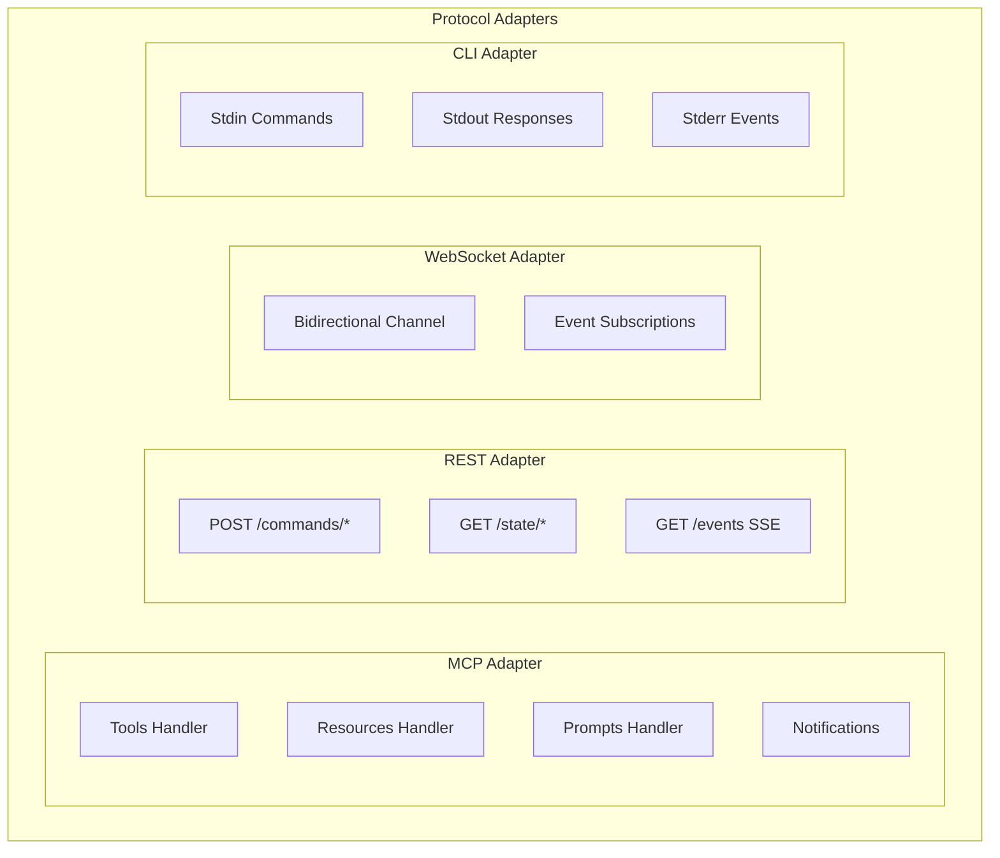
```mermaid
graph TB
    subgraph "Protocol Adapters"
        subgraph "MCP Adapter"
            MCP_TOOLS[Tools Handler]
            MCP_RES[Resources Handler]
            MCP_PROMPT[Prompts Handler]
            MCP_NOTIFY[Notifications]
        end

        subgraph "REST Adapter"
            REST_CMD[POST /commands/*]
            REST_STATE[GET /state/*]
            REST_EVENTS[GET /events SSE]
        end

        subgraph "WebSocket Adapter"
            WS_BIDIR[Bidirectional Channel]
            WS_SUB[Event Subscriptions]
        end

        subgraph "CLI Adapter"
            CLI_STDIN[Stdin Commands]
            CLI_STDOUT[Stdout Responses]
            CLI_STDERR[Stderr Events]
        end
    end
```

### 4.2 MCP Server Design (for Claude Code)

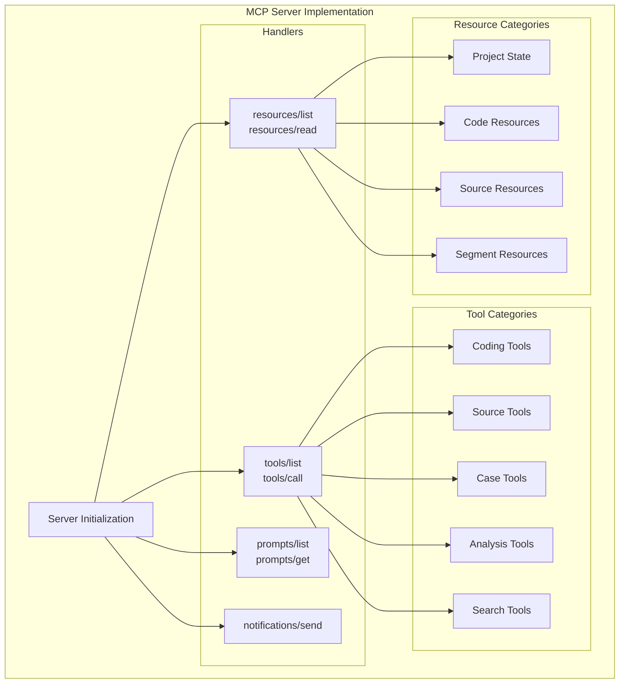
```mermaid
graph TB
    subgraph "MCP Server Implementation"
        INIT[Server Initialization]

        subgraph "Handlers"
            TOOLS[tools/list<br/>tools/call]
            RES[resources/list<br/>resources/read]
            PROMPTS[prompts/list<br/>prompts/get]
            NOTIFY[notifications/send]
        end

        subgraph "Tool Categories"
            T_CODING[Coding Tools]
            T_SOURCE[Source Tools]
            T_CASE[Case Tools]
            T_ANALYSIS[Analysis Tools]
            T_SEARCH[Search Tools]
        end

        subgraph "Resource Categories"
            R_PROJECT[Project State]
            R_CODES[Code Resources]
            R_SOURCES[Source Resources]
            R_SEGMENTS[Segment Resources]
        end
    end

    INIT --> TOOLS
    INIT --> RES
    INIT --> PROMPTS
    INIT --> NOTIFY

    TOOLS --> T_CODING
    TOOLS --> T_SOURCE
    TOOLS --> T_CASE
    TOOLS --> T_ANALYSIS
    TOOLS --> T_SEARCH

    RES --> R_PROJECT
    RES --> R_CODES
    RES --> R_SOURCES
    RES --> R_SEGMENTS
```

### 4.3 Protocol Comparison

| Aspect | MCP | REST | WebSocket | gRPC |
|--------|-----|------|-----------|------|
| **Primary Use** | Claude Code | Generic AI | Real-time apps | High performance |
| **Communication** | Stdio/HTTP | HTTP | Persistent | HTTP/2 |
| **Events** | Notifications | SSE | Native push | Streaming |
| **Schema** | JSON Schema | OpenAPI | Custom | Protobuf |
| **Auth** | Session-based | Token/OAuth | Token | mTLS |

### 4.4 REST API Design

```mermaid
graph LR
    subgraph "REST Endpoints"
        subgraph "Commands POST"
            C1[/commands/coding/apply_code]
            C2[/commands/coding/create_code]
            C3[/commands/coding/merge_codes]
            C4[/commands/source/import]
            C5[/commands/case/create]
            C6[/commands/analysis/generate_report]
        end

        subgraph "State GET"
            S1[/state/project]
            S2[/state/codes]
            S3[/state/codes/:id]
            S4[/state/sources]
            S5[/state/sources/:id/content]
            S6[/state/segments?filter=...]
            S7[/state/cases]
        end

        subgraph "Events"
            E1[/events/stream SSE]
            E2[/events/history]
        end

        subgraph "Session"
            SS1[/session/create]
            SS2[/session/destroy]
            SS3[/session/heartbeat]
        end
    end
```

---

## 5. Capability Registry

### 5.1 Tool Definitions

#### 5.1.1 Coding Tools

| Tool Name | Description | Parameters | Returns | Trust Level |
|-----------|-------------|------------|---------|-------------|
| `create_code` | Create a new code in codebook | name, color?, memo?, category_id? | code_id | Suggest |
| `rename_code` | Rename existing code | code_id, new_name | success | Suggest |
| `delete_code` | Delete a code | code_id | success | Require |
| `merge_codes` | Merge source into target code | source_code_id, target_code_id | success | Require |
| `apply_code` | Apply code to segment | code_id, source_id, start, end, memo? | segment_id | Notify |
| `remove_code` | Remove code from segment | segment_id | success | Notify |
| `create_category` | Create code category | name, parent_id?, memo? | category_id | Suggest |
| `move_code` | Move code to category | code_id, category_id | success | Notify |

#### 5.1.2 Source Tools

| Tool Name | Description | Parameters | Returns | Trust Level |
|-----------|-------------|------------|---------|-------------|
| `import_source` | Import file as source | file_path, name? | source_id | Suggest |
| `import_text` | Import text content directly | content, name | source_id | Suggest |
| `rename_source` | Rename source | source_id, new_name | success | Notify |
| `delete_source` | Delete source | source_id | success | Require |
| `update_memo` | Update source memo | source_id, memo | success | Auto |

#### 5.1.3 Case Tools

| Tool Name | Description | Parameters | Returns | Trust Level |
|-----------|-------------|------------|---------|-------------|
| `create_case` | Create research case | name, memo? | case_id | Suggest |
| `delete_case` | Delete case | case_id | success | Require |
| `add_source_to_case` | Add full source to case | case_id, source_id | success | Notify |
| `add_segment_to_case` | Add segment to case | case_id, source_id, start, end | success | Notify |
| `set_case_attribute` | Set attribute value | case_id, attribute_name, value | success | Notify |

#### 5.1.4 Analysis Tools

| Tool Name | Description | Parameters | Returns | Trust Level |
|-----------|-------------|------------|---------|-------------|
| `generate_frequency_report` | Code frequency analysis | filters? | job_id | Auto |
| `generate_cooccurrence_report` | Code co-occurrence matrix | filters? | job_id | Auto |
| `generate_coder_comparison` | Inter-rater reliability | coder_ids, filters? | job_id | Auto |
| `export_report` | Export report to file | report_id, format | file_path | Auto |

#### 5.1.5 Search Tools

| Tool Name | Description | Parameters | Returns | Trust Level |
|-----------|-------------|------------|---------|-------------|
| `search_text` | Full-text search in sources | query, filters? | matches[] | Auto |
| `search_semantic` | Semantic similarity search | query, k?, filters? | matches[] | Auto |
| `search_codes` | Search code names/memos | query | codes[] | Auto |
| `find_similar_segments` | Find similar coded segments | segment_id, k? | segments[] | Auto |

### 5.2 Resource Definitions

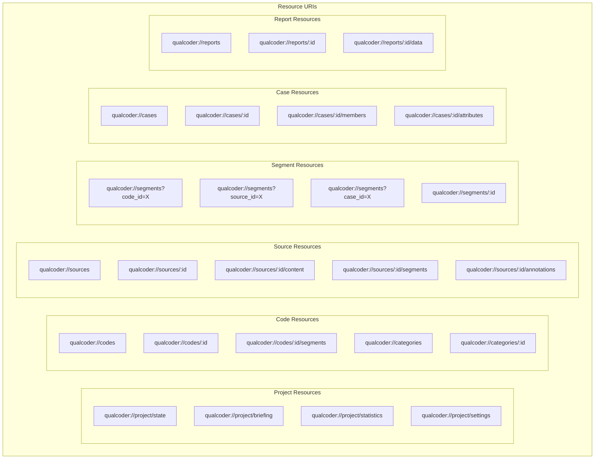
```mermaid
graph TB
    subgraph "Resource URIs"
        subgraph "Project Resources"
            P1[qualcoder://project/state]
            P2[qualcoder://project/briefing]
            P3[qualcoder://project/statistics]
            P4[qualcoder://project/settings]
        end

        subgraph "Code Resources"
            C1[qualcoder://codes]
            C2[qualcoder://codes/:id]
            C3[qualcoder://codes/:id/segments]
            C4[qualcoder://categories]
            C5[qualcoder://categories/:id]
        end

        subgraph "Source Resources"
            S1[qualcoder://sources]
            S2[qualcoder://sources/:id]
            S3[qualcoder://sources/:id/content]
            S4[qualcoder://sources/:id/segments]
            S5[qualcoder://sources/:id/annotations]
        end

        subgraph "Segment Resources"
            SEG1[qualcoder://segments?code_id=X]
            SEG2[qualcoder://segments?source_id=X]
            SEG3[qualcoder://segments?case_id=X]
            SEG4[qualcoder://segments/:id]
        end

        subgraph "Case Resources"
            CS1[qualcoder://cases]
            CS2[qualcoder://cases/:id]
            CS3[qualcoder://cases/:id/members]
            CS4[qualcoder://cases/:id/attributes]
        end

        subgraph "Report Resources"
            R1[qualcoder://reports]
            R2[qualcoder://reports/:id]
            R3[qualcoder://reports/:id/data]
        end
    end
```

### 5.3 Resource Schema Examples

#### Project Briefing Resource

```
URI: qualcoder://project/briefing

Returns:
{
  "project_name": "Healthcare Experience Study",
  "description": "Qualitative analysis of patient interviews...",
  "research_questions": [
    "How do patients experience chronic pain management?",
    "What role does family support play in recovery?"
  ],
  "methodology": "Grounded Theory",
  "coding_progress": {
    "total_sources": 15,
    "coded_sources": 8,
    "total_codes": 47,
    "total_segments": 312
  },
  "code_summary": {
    "top_codes": [
      {"name": "Pain Management", "count": 45},
      {"name": "Family Support", "count": 38},
      {"name": "Healthcare Access", "count": 31}
    ],
    "recent_codes": ["Coping Strategies", "Medication Concerns"]
  },
  "recent_activity": [
    {"action": "coded", "source": "Interview_P05", "timestamp": "..."},
    {"action": "created_code", "code": "Emotional Impact", "timestamp": "..."}
  ]
}
```

#### Codes List Resource

```
URI: qualcoder://codes

Returns:
{
  "codes": [
    {
      "code_id": 42,
      "name": "Pain Management",
      "color": "#FF6B6B",
      "memo": "Experiences and strategies for managing chronic pain",
      "category": {"id": 5, "name": "Health Experiences"},
      "segment_count": 45,
      "created_at": "2024-01-15T10:30:00Z",
      "owner": "researcher1"
    },
    ...
  ],
  "categories": [
    {
      "category_id": 5,
      "name": "Health Experiences",
      "parent_id": null,
      "code_count": 12
    },
    ...
  ]
}
```

### 5.4 Prompt Templates

Pre-built prompts for common research tasks that AI can use:

| Prompt Name | Description | Context Required |
|-------------|-------------|------------------|
| `grounded_theory_open_coding` | Guide for initial open coding | source content, existing codes |
| `thematic_analysis` | Thematic analysis approach | source content, research questions |
| `axial_coding` | Connect categories in grounded theory | codes, segments, categories |
| `selective_coding` | Identify core category | codes, relationships |
| `summarize_code` | Generate summary of coded content | code, all segments |
| `compare_cases` | Compare coding across cases | cases, segments |
| `identify_patterns` | Find patterns in coded data | codes, co-occurrences |
| `write_memo` | Generate analytical memo | code/category, segments |

---

## 6. Event Streaming

### 6.1 Event Flow Architecture

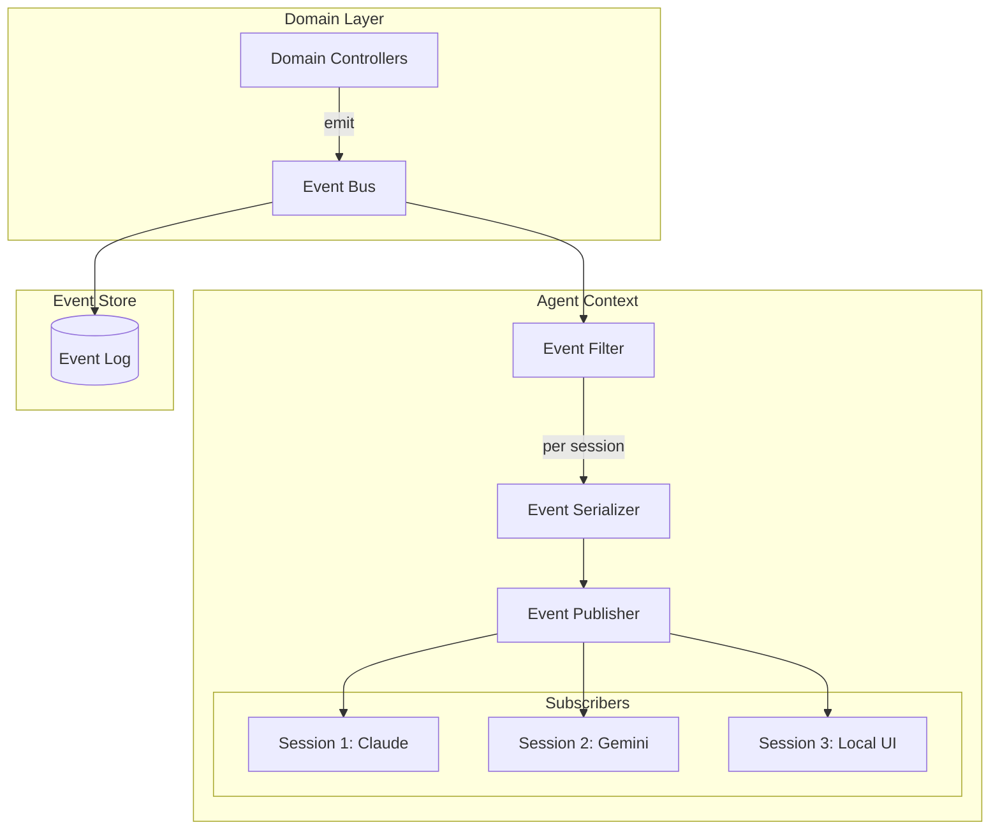
```mermaid
graph TB
    subgraph "Domain Layer"
        DC[Domain Controllers]
        DC --> |emit| EB[Event Bus]
    end

    subgraph "Agent Context"
        EB --> EF[Event Filter]
        EF --> |per session| ES[Event Serializer]
        ES --> EP[Event Publisher]

        subgraph "Subscribers"
            S1[Session 1: Claude]
            S2[Session 2: Gemini]
            S3[Session 3: Local UI]
        end

        EP --> S1
        EP --> S2
        EP --> S3
    end

    subgraph "Event Store"
        EB --> STORE[(Event Log)]
    end
```

### 6.2 Event Categories

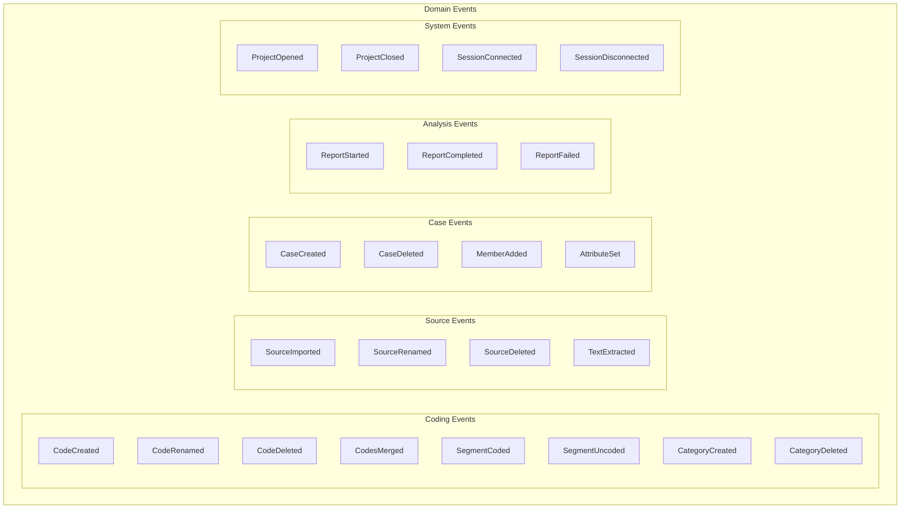
```mermaid
graph TB
    subgraph "Domain Events"
        subgraph "Coding Events"
            CE1[CodeCreated]
            CE2[CodeRenamed]
            CE3[CodeDeleted]
            CE4[CodesMerged]
            CE5[SegmentCoded]
            CE6[SegmentUncoded]
            CE7[CategoryCreated]
            CE8[CategoryDeleted]
        end

        subgraph "Source Events"
            SE1[SourceImported]
            SE2[SourceRenamed]
            SE3[SourceDeleted]
            SE4[TextExtracted]
        end

        subgraph "Case Events"
            CSE1[CaseCreated]
            CSE2[CaseDeleted]
            CSE3[MemberAdded]
            CSE4[AttributeSet]
        end

        subgraph "Analysis Events"
            AE1[ReportStarted]
            AE2[ReportCompleted]
            AE3[ReportFailed]
        end

        subgraph "System Events"
            SYS1[ProjectOpened]
            SYS2[ProjectClosed]
            SYS3[SessionConnected]
            SYS4[SessionDisconnected]
        end
    end
```

### 6.3 Event Subscription Model

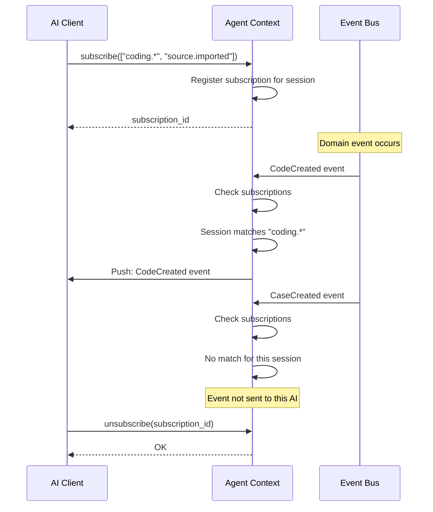
```mermaid
sequenceDiagram
    participant AI as AI Client
    participant AC as Agent Context
    participant EB as Event Bus

    AI->>AC: subscribe(["coding.*", "source.imported"])
    AC->>AC: Register subscription for session
    AC-->>AI: subscription_id

    Note over EB: Domain event occurs

    EB->>AC: CodeCreated event
    AC->>AC: Check subscriptions
    AC->>AC: Session matches "coding.*"
    AC->>AI: Push: CodeCreated event

    EB->>AC: CaseCreated event
    AC->>AC: Check subscriptions
    AC->>AC: No match for this session
    Note over AC: Event not sent to this AI

    AI->>AC: unsubscribe(subscription_id)
    AC-->>AI: OK
```

### 6.4 Event Schema

```
Event Structure:
{
  "event_id": "evt_abc123",
  "event_type": "coding.segment_coded",
  "timestamp": "2024-01-15T10:30:00.123Z",
  "aggregate_type": "Segment",
  "aggregate_id": "seg_456",
  "caused_by": {
    "session_id": "sess_789",
    "client_type": "claude_code",
    "user": "researcher1"
  },
  "payload": {
    "segment_id": "seg_456",
    "code_id": 42,
    "code_name": "Pain Management",
    "source_id": 1,
    "source_name": "Interview_P01.txt",
    "start_pos": 1250,
    "end_pos": 1380,
    "selected_text": "The pain was constant..."
  },
  "metadata": {
    "correlation_id": "corr_xyz",
    "sequence_number": 1547
  }
}
```

### 6.5 Event Delivery Guarantees

| Guarantee | Implementation |
|-----------|----------------|
| **At-least-once** | Events persisted before acknowledgment |
| **Ordering** | Per-aggregate ordering via sequence numbers |
| **Replay** | Event store supports replay from sequence |
| **Filtering** | Server-side filtering by subscription |
| **Backpressure** | Client acknowledgment, buffering limits |

---

## 7. Session Management

### 7.1 Session Lifecycle

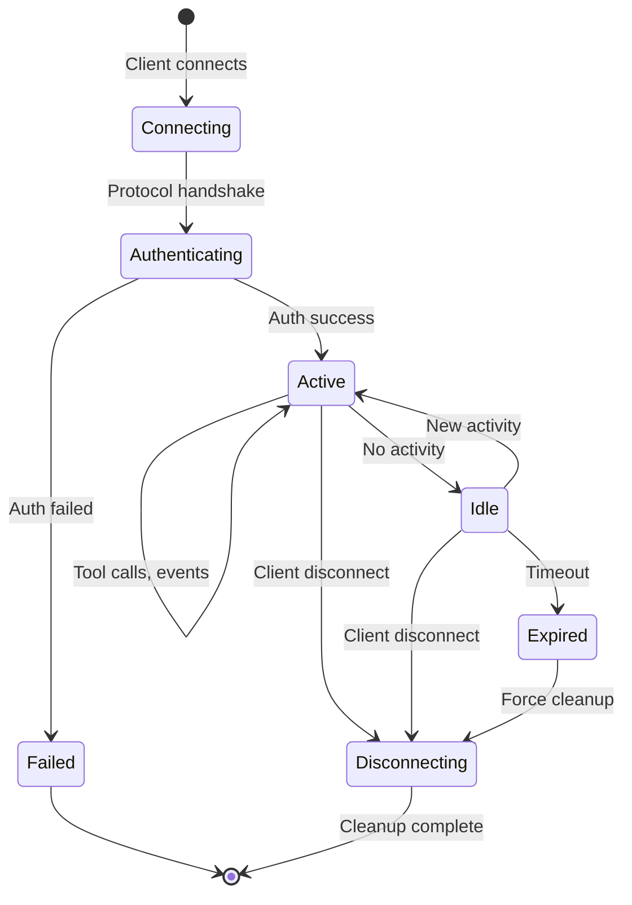
```mermaid
stateDiagram-v2
    [*] --> Connecting: Client connects

    Connecting --> Authenticating: Protocol handshake
    Authenticating --> Failed: Auth failed
    Authenticating --> Active: Auth success

    Failed --> [*]

    Active --> Active: Tool calls, events
    Active --> Idle: No activity
    Idle --> Active: New activity
    Idle --> Expired: Timeout

    Active --> Disconnecting: Client disconnect
    Idle --> Disconnecting: Client disconnect
    Expired --> Disconnecting: Force cleanup

    Disconnecting --> [*]: Cleanup complete
```

### 7.2 Session Data Model

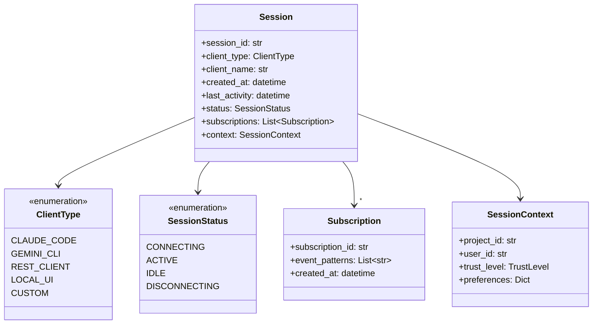
```mermaid
classDiagram
    class Session {
        +session_id: str
        +client_type: ClientType
        +client_name: str
        +created_at: datetime
        +last_activity: datetime
        +status: SessionStatus
        +subscriptions: List~Subscription~
        +context: SessionContext
    }

    class ClientType {
        <<enumeration>>
        CLAUDE_CODE
        GEMINI_CLI
        REST_CLIENT
        LOCAL_UI
        CUSTOM
    }

    class SessionStatus {
        <<enumeration>>
        CONNECTING
        ACTIVE
        IDLE
        DISCONNECTING
    }

    class Subscription {
        +subscription_id: str
        +event_patterns: List~str~
        +created_at: datetime
    }

    class SessionContext {
        +project_id: str
        +user_id: str
        +trust_level: TrustLevel
        +preferences: Dict
    }

    Session --> ClientType
    Session --> SessionStatus
    Session --> "*" Subscription
    Session --> SessionContext
```

### 7.3 Multi-Session Handling

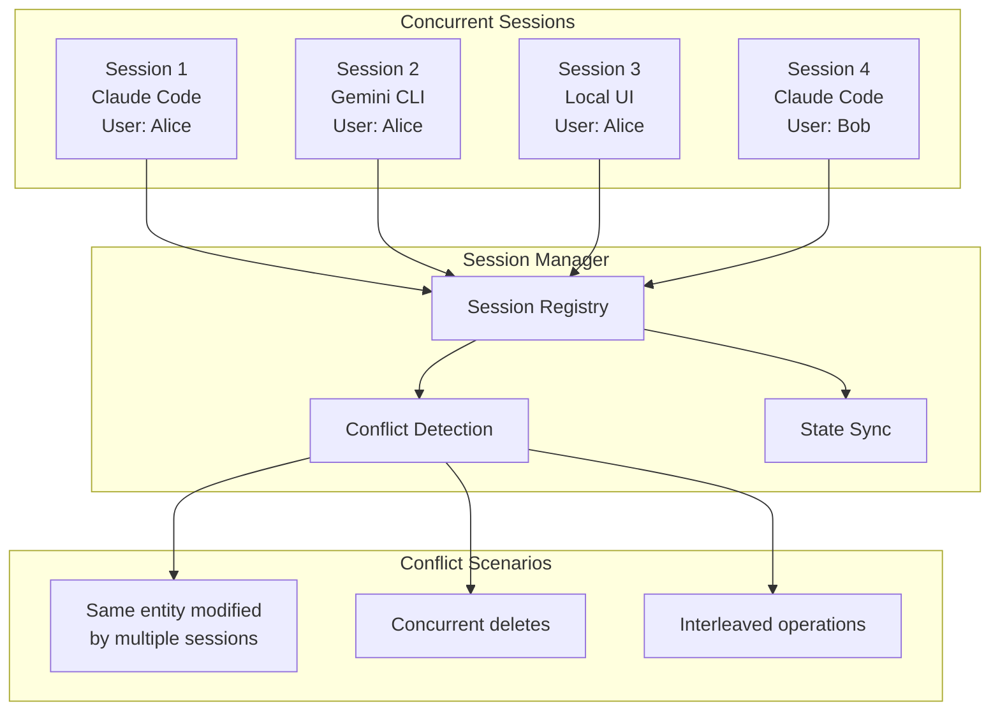
```mermaid
graph TB
    subgraph "Concurrent Sessions"
        S1[Session 1<br/>Claude Code<br/>User: Alice]
        S2[Session 2<br/>Gemini CLI<br/>User: Alice]
        S3[Session 3<br/>Local UI<br/>User: Alice]
        S4[Session 4<br/>Claude Code<br/>User: Bob]
    end

    subgraph "Session Manager"
        SM[Session Registry]
        LOCK[Conflict Detection]
        SYNC[State Sync]
    end

    subgraph "Conflict Scenarios"
        C1[Same entity modified<br/>by multiple sessions]
        C2[Concurrent deletes]
        C3[Interleaved operations]
    end

    S1 --> SM
    S2 --> SM
    S3 --> SM
    S4 --> SM

    SM --> LOCK
    SM --> SYNC

    LOCK --> C1
    LOCK --> C2
    LOCK --> C3
```

### 7.4 Conflict Resolution Strategy

| Scenario | Strategy | Implementation |
|----------|----------|----------------|
| Same code renamed by two sessions | Last-write-wins | Version number check |
| Code deleted while being applied | Reject late operation | Optimistic locking |
| Concurrent segment creation | Allow both | No conflict (different IDs) |
| Same segment modified | Last-write-wins with notification | Event to other sessions |

---

## 8. Security and Trust

### 8.1 Trust Level Model

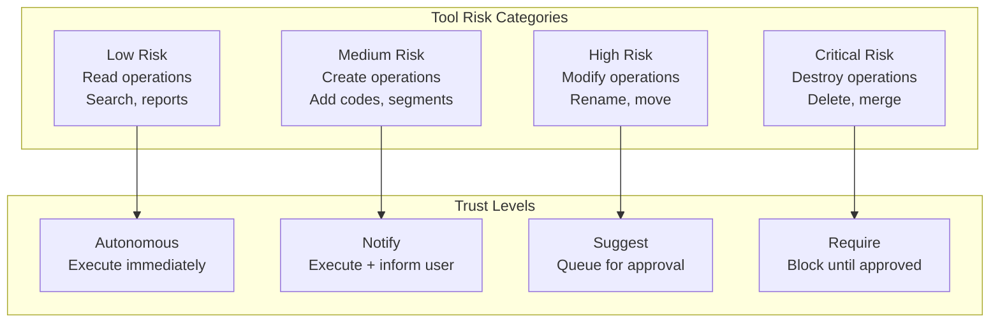
```mermaid
graph TB
    subgraph "Trust Levels"
        AUTO[Autonomous<br/>Execute immediately]
        NOTIFY[Notify<br/>Execute + inform user]
        SUGGEST[Suggest<br/>Queue for approval]
        REQUIRE[Require<br/>Block until approved]
    end

    subgraph "Tool Risk Categories"
        LOW[Low Risk<br/>Read operations<br/>Search, reports]
        MEDIUM[Medium Risk<br/>Create operations<br/>Add codes, segments]
        HIGH[High Risk<br/>Modify operations<br/>Rename, move]
        CRITICAL[Critical Risk<br/>Destroy operations<br/>Delete, merge]
    end

    LOW --> AUTO
    MEDIUM --> NOTIFY
    HIGH --> SUGGEST
    CRITICAL --> REQUIRE
```

### 8.2 Default Trust Configuration

| Tool Category | Default Trust | Can Override To |
|---------------|---------------|-----------------|
| Read/Query | Autonomous | - |
| Search | Autonomous | - |
| Report Generation | Autonomous | Notify |
| Create Code | Suggest | Notify, Autonomous |
| Apply Code | Notify | Suggest, Autonomous |
| Rename | Suggest | Notify |
| Delete | Require | Suggest |
| Merge | Require | Suggest |
| Bulk Operations | Require | - |

### 8.3 Approval Workflow

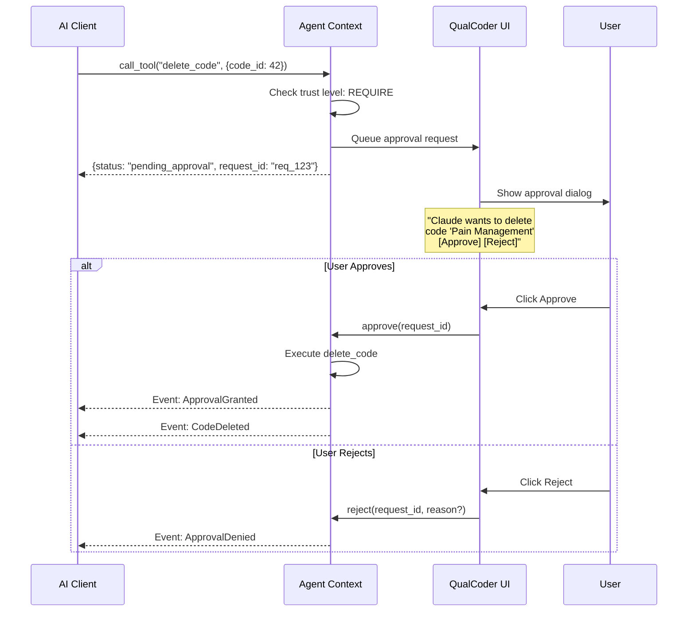
```mermaid
sequenceDiagram
    participant AI as AI Client
    participant AC as Agent Context
    participant UI as QualCoder UI
    participant User

    AI->>AC: call_tool("delete_code", {code_id: 42})
    AC->>AC: Check trust level: REQUIRE

    AC->>UI: Queue approval request
    AC-->>AI: {status: "pending_approval", request_id: "req_123"}

    UI->>User: Show approval dialog
    Note over UI: "Claude wants to delete<br/>code 'Pain Management'<br/>[Approve] [Reject]"

    alt User Approves
        User->>UI: Click Approve
        UI->>AC: approve(request_id)
        AC->>AC: Execute delete_code
        AC-->>AI: Event: ApprovalGranted
        AC-->>AI: Event: CodeDeleted
    else User Rejects
        User->>UI: Click Reject
        UI->>AC: reject(request_id, reason?)
        AC-->>AI: Event: ApprovalDenied
    end
```

### 8.4 Security Boundaries

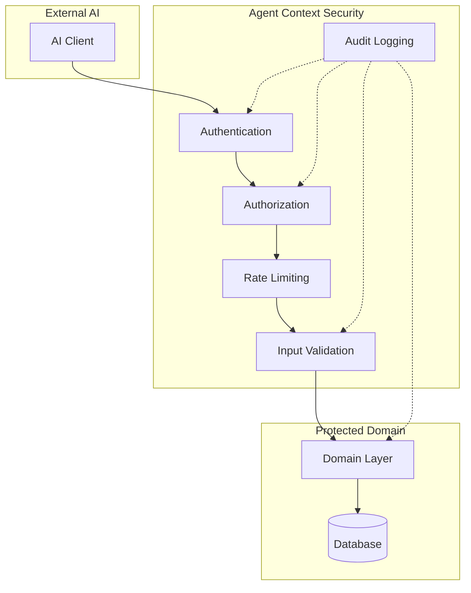
```mermaid
graph TB
    subgraph "External AI"
        AI[AI Client]
    end

    subgraph "Agent Context Security"
        AUTH[Authentication]
        AUTHZ[Authorization]
        RATE[Rate Limiting]
        AUDIT[Audit Logging]
        VALID[Input Validation]
    end

    subgraph "Protected Domain"
        DOMAIN[Domain Layer]
        DATA[(Database)]
    end

    AI --> AUTH
    AUTH --> AUTHZ
    AUTHZ --> RATE
    RATE --> VALID
    VALID --> DOMAIN
    DOMAIN --> DATA

    AUDIT -.-> AUTH
    AUDIT -.-> AUTHZ
    AUDIT -.-> VALID
    AUDIT -.-> DOMAIN
```

### 8.5 Rate Limiting

| Limit Type | Default | Purpose |
|------------|---------|---------|
| Requests/minute | 60 | Prevent runaway AI |
| Tool calls/minute | 30 | Limit mutations |
| Events/second | 100 | Backpressure |
| Pending approvals | 10 | Prevent queue overflow |

---

## 9. Integration Patterns

### 9.1 Claude Code Integration (MCP)

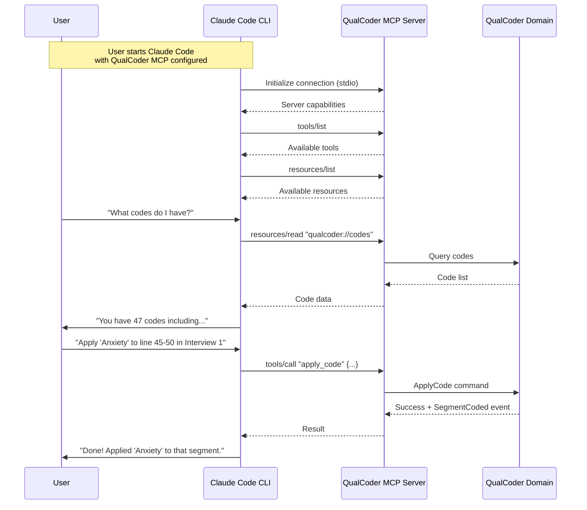
```mermaid
sequenceDiagram
    participant User
    participant Claude as Claude Code CLI
    participant MCP as QualCoder MCP Server
    participant QC as QualCoder Domain

    Note over User,Claude: User starts Claude Code<br/>with QualCoder MCP configured

    Claude->>MCP: Initialize connection (stdio)
    MCP-->>Claude: Server capabilities

    Claude->>MCP: tools/list
    MCP-->>Claude: Available tools

    Claude->>MCP: resources/list
    MCP-->>Claude: Available resources

    User->>Claude: "What codes do I have?"
    Claude->>MCP: resources/read "qualcoder://codes"
    MCP->>QC: Query codes
    QC-->>MCP: Code list
    MCP-->>Claude: Code data
    Claude->>User: "You have 47 codes including..."

    User->>Claude: "Apply 'Anxiety' to line 45-50 in Interview 1"
    Claude->>MCP: tools/call "apply_code" {...}
    MCP->>QC: ApplyCode command
    QC-->>MCP: Success + SegmentCoded event
    MCP-->>Claude: Result
    Claude->>User: "Done! Applied 'Anxiety' to that segment."
```

### 9.2 MCP Server Configuration

```
# claude_code_config.json (user's Claude Code config)

{
  "mcpServers": {
    "qualcoder": {
      "command": "python",
      "args": ["-m", "qualcoder.agent_context.mcp_server"],
      "env": {
        "QUALCODER_PROJECT": "/path/to/project.qda"
      }
    }
  }
}
```

### 9.3 Gemini CLI Integration (REST)

```mermaid
sequenceDiagram
    participant User
    participant Gemini as Gemini CLI
    participant REST as QualCoder REST API
    participant QC as QualCoder Domain

    Note over User,REST: QualCoder runs REST server<br/>Gemini configured with endpoint

    Gemini->>REST: POST /session/create
    REST-->>Gemini: {session_id, capabilities}

    User->>Gemini: "Show me uncoded sources"
    Gemini->>REST: GET /state/sources?coded=false
    REST->>QC: Query
    QC-->>REST: Sources
    REST-->>Gemini: Source list
    Gemini->>User: "3 sources haven't been coded..."

    User->>Gemini: "Start coding the first one"
    Gemini->>REST: GET /state/sources/1/content
    REST-->>Gemini: Content

    Note over Gemini: Analyzes content...

    Gemini->>REST: POST /commands/coding/create_code
    REST->>QC: CreateCode command
    QC-->>REST: Success
    REST-->>Gemini: {code_id: 42}

    Gemini->>REST: POST /commands/coding/apply_code
    REST-->>Gemini: Success
```

### 9.4 Local Model Integration (Ollama)

```mermaid
graph TB
    subgraph "User's Machine"
        subgraph "QualCoder"
            QC[QualCoder App]
            AC[Agent Context]
            EA[Embedded Agent]
        end

        subgraph "Local AI"
            OLLAMA[Ollama Server]
            MODEL[llama3.2 / codellama]
        end
    end

    QC --> AC
    AC --> EA
    EA -->|HTTP localhost:11434| OLLAMA
    OLLAMA --> MODEL

    Note1[No internet required]
    Note2[No API costs]
    Note3[Data stays local]
```

### 9.5 Hybrid Mode (Multiple AIs)

```mermaid
graph TB
    subgraph "AI Clients"
        C1[Claude Code<br/>Primary coding]
        C2[Local Ollama<br/>Quick queries]
        C3[Gemini<br/>Analysis]
    end

    subgraph "Agent Context"
        SM[Session Manager]

        S1[Session 1]
        S2[Session 2]
        S3[Session 3]
    end

    subgraph "QualCoder Domain"
        DOMAIN[Shared State]
    end

    C1 --> S1
    C2 --> S2
    C3 --> S3

    S1 --> SM
    S2 --> SM
    S3 --> SM

    SM --> DOMAIN
```

---

## 10. Deployment Modes

### 10.1 Mode Overview

```mermaid
graph TB
    subgraph "Mode 1: Desktop with GUI"
        M1_GUI[PyQt6 GUI]
        M1_AC[Agent Context]
        M1_DOMAIN[Domain]
        M1_DB[(SQLite)]

        M1_GUI --> M1_DOMAIN
        M1_AC --> M1_DOMAIN
        M1_DOMAIN --> M1_DB
    end

    subgraph "Mode 2: Headless Server"
        M2_AC[Agent Context<br/>REST/MCP/WS]
        M2_DOMAIN[Domain]
        M2_DB[(SQLite)]

        M2_AC --> M2_DOMAIN
        M2_DOMAIN --> M2_DB
    end

    subgraph "Mode 3: Hybrid"
        M3_GUI[PyQt6 GUI<br/>Optional viewer]
        M3_AC[Agent Context]
        M3_DOMAIN[Domain]
        M3_DB[(SQLite)]

        M3_GUI -.-> M3_DOMAIN
        M3_AC --> M3_DOMAIN
        M3_DOMAIN --> M3_DB
    end
```

### 10.2 Desktop Mode (GUI Primary)

```
┌─────────────────────────────────────────┐
│            QualCoder Desktop            │
├─────────────────────────────────────────┤
│  ┌─────────────────────────────────┐    │
│  │         PyQt6 GUI               │    │
│  │   (Primary interaction mode)    │    │
│  └─────────────────────────────────┘    │
│                  │                      │
│                  ▼                      │
│  ┌─────────────────────────────────┐    │
│  │       Agent Context             │    │
│  │  (Optional AI assistance)       │    │
│  │  • MCP server on localhost      │    │
│  │  • User can connect Claude Code │    │
│  └─────────────────────────────────┘    │
│                  │                      │
│                  ▼                      │
│  ┌─────────────────────────────────┐    │
│  │       Domain Layer              │    │
│  └─────────────────────────────────┘    │
└─────────────────────────────────────────┘

Use case: Traditional researcher who sometimes
wants AI help but primarily uses GUI
```

### 10.3 Headless Mode (AI Primary)

```
┌─────────────────────────────────────────┐
│         QualCoder Server                │
├─────────────────────────────────────────┤
│  ┌─────────────────────────────────┐    │
│  │       Agent Context             │    │
│  │   (Primary interaction mode)    │    │
│  │  • MCP server (stdio/HTTP)      │    │
│  │  • REST API                     │    │
│  │  • WebSocket for events         │    │
│  └─────────────────────────────────┘    │
│                  │                      │
│                  ▼                      │
│  ┌─────────────────────────────────┐    │
│  │       Domain Layer              │    │
│  └─────────────────────────────────┘    │
└─────────────────────────────────────────┘

Started via:
$ qualcoder-server --project /path/to/project.qda

Use case: Researcher works entirely through
Claude Code or other AI interface
```

### 10.4 Hybrid Mode (GUI as Observer)

```
┌─────────────────────────────────────────┐
│        QualCoder Hybrid                 │
├─────────────────────────────────────────┤
│  ┌─────────────────────────────────┐    │
│  │         PyQt6 GUI               │    │
│  │   (Observer/approval mode)      │    │
│  │  • Shows AI actions in real-time│    │
│  │  • Approval dialogs             │    │
│  │  • Can intervene/override       │    │
│  └─────────────────────────────────┘    │
│                  │                      │
│                  ▼                      │
│  ┌─────────────────────────────────┐    │
│  │       Agent Context             │    │
│  │   (Primary interaction mode)    │    │
│  └─────────────────────────────────┘    │
│                  │                      │
│                  ▼                      │
│  ┌─────────────────────────────────┐    │
│  │       Domain Layer              │    │
│  └─────────────────────────────────┘    │
└─────────────────────────────────────────┘

Use case: Researcher uses AI but wants to
watch and approve actions, maintaining control
```

### 10.5 Startup Sequences

```mermaid
sequenceDiagram
    participant User
    participant QC as QualCoder
    participant AC as Agent Context
    participant AI as AI CLI

    rect rgb(200, 230, 200)
        Note over User,AI: Desktop Mode Startup
        User->>QC: Launch QualCoder
        QC->>QC: Start GUI
        QC->>AC: Start Agent Context (background)
        AC->>AC: Listen on localhost:PORT
        Note over User: User works with GUI,<br/>optionally connects AI later
    end

    rect rgb(200, 200, 230)
        Note over User,AI: Headless Mode Startup
        User->>QC: $ qualcoder-server --project X
        QC->>AC: Start Agent Context (foreground)
        AC->>AC: Listen on configured interfaces
        User->>AI: Start AI CLI with QualCoder config
        AI->>AC: Connect
        Note over User: User works entirely through AI
    end

    rect rgb(230, 200, 200)
        Note over User,AI: Hybrid Mode Startup
        User->>QC: Launch QualCoder --ai-primary
        QC->>AC: Start Agent Context
        QC->>QC: Start GUI in observer mode
        User->>AI: Start AI CLI
        AI->>AC: Connect
        Note over User: AI is primary, GUI shows activity
    end
```

---

## 11. Real-Time UI Observation

This section describes how the PyQt6 GUI stays synchronized with AI agent activity, enabling users to observe, intervene, and approve AI actions in real-time.

### 11.1 Core Principle: UI as Event Subscriber

The PyQt6 UI is architecturally identical to external AI clients - it's just another subscriber to the domain event bus. This ensures perfect consistency between what AI sees and what the user sees.

```mermaid
graph TB
    subgraph "Domain Layer"
        CMD[Command Execution]
        CMD --> EVT[Domain Event]
        EVT --> BUS[Event Bus]
    end

    subgraph "Subscribers - All Equal"
        BUS --> AI[AI Client<br/>Claude/Gemini]
        BUS --> UI[PyQt6 UI<br/>Local Observer]
        BUS --> LOG[Audit Logger]
        BUS --> CACHE[State Cache]
    end

    style AI fill:#90EE90
    style UI fill:#90EE90
```

### 11.2 Signal Bridge Architecture

The Signal Bridge translates domain events into PyQt6 signals for thread-safe UI updates.

```mermaid
graph TB
    subgraph "Domain Layer"
        EB[Event Bus]
    end

    subgraph "Signal Bridge"
        RECV[Event Receiver<br/>Background Thread]
        CONV[Signal Converter]
        EMIT[Qt Signal Emitter]

        EB --> RECV
        RECV --> CONV
        CONV --> EMIT
    end

    subgraph "PyQt6 UI Thread"
        subgraph "Signal Slots"
            S1[on_code_created]
            S2[on_segment_coded]
            S3[on_source_imported]
            S4[on_approval_requested]
        end

        subgraph "UI Updates"
            U1[Update Code Tree]
            U2[Highlight Segment]
            U3[Refresh Source List]
            U4[Show Approval Dialog]
        end
    end

    EMIT --> S1
    EMIT --> S2
    EMIT --> S3
    EMIT --> S4

    S1 --> U1
    S2 --> U2
    S3 --> U3
    S4 --> U4
```

### 11.3 Event-to-Signal Mapping

| Domain Event | Qt Signal | UI Handler | Visual Effect |
|--------------|-----------|------------|---------------|
| `CodeCreated` | `code_created(code_data)` | `on_code_created()` | Add to code tree with AI badge |
| `CodeDeleted` | `code_deleted(code_id)` | `on_code_deleted()` | Remove from code tree |
| `SegmentCoded` | `segment_coded(segment_data)` | `on_segment_coded()` | Highlight text, update counts |
| `SegmentUncoded` | `segment_uncoded(segment_id)` | `on_segment_uncoded()` | Remove highlight |
| `SourceImported` | `source_imported(source_data)` | `on_source_imported()` | Add to source list |
| `ApprovalRequested` | `approval_requested(request)` | `on_approval_requested()` | Show approval dialog |
| `SessionConnected` | `agent_connected(session)` | `on_agent_connected()` | Update status bar |
| `SessionDisconnected` | `agent_disconnected(session)` | `on_agent_disconnected()` | Update status bar |

### 11.4 Main Window Layout with Agent Observation

```
┌─────────────────────────────────────────────────────────────────────────────┐
│  QualCoder - Healthcare Study                    [Agent: ● Claude Connected]│
├─────────────────────────────────────────────────────────────────────────────┤
│  File  Edit  View  Coding  Cases  Reports  AI  Help                         │
├─────────────────────────────────────────────────────────────────────────────┤
│                                                                             │
│  ┌─────────────────────┐  ┌─────────────────────────────────────────────┐  │
│  │     Code Tree       │  │              Source View                    │  │
│  │                     │  │                                             │  │
│  │  ▼ Health Themes    │  │  Interview_P01.txt                         │  │
│  │    ├─ Pain Mgmt  ●  │  │  ─────────────────────────────────────────  │  │
│  │    ├─ Anxiety   ●AI │  │                                             │  │
│  │    └─ Coping        │  │  "When I first got the diagnosis, I felt   │  │
│  │  ▼ Support          │  │   completely overwhelmed. [The anxiety was │  │
│  │    └─ Family        │  │   constant]₍Anxiety₎, keeping me up at     │  │
│  │                     │  │   night and making it hard to focus..."    │  │
│  │  ─────────────────  │  │                    ↑                        │  │
│  │  Codes: 47          │  │         [AI just highlighted this]         │  │
│  │  AI-created: 12     │  │                                             │  │
│  └─────────────────────┘  └─────────────────────────────────────────────┘  │
│                                                                             │
│  ┌─────────────────────────────────────────────────────────────────────┐   │
│  │  Agent Activity                               [Filter ▼] [⏸ Pause]  │   │
│  │  ───────────────────────────────────────────────────────────────────│   │
│  │  ● 10:32:15  Claude  Created code "Anxiety" (Health Themes)         │   │
│  │  ● 10:32:18  Claude  Applied "Anxiety" to Interview_P01 (pos 127)   │   │
│  │  ● 10:32:21  Claude  Applied "Anxiety" to Interview_P01 (pos 892)   │   │
│  │  ◐ 10:32:24  Claude  [PENDING] Create code "Sleep Disruption"       │   │
│  │                                    [✓ Approve] [✗ Reject] [✎ Edit]  │   │
│  │  ○ 10:32:25  Claude  [QUEUED] Apply "Sleep Disruption" to 3 segments│   │
│  └─────────────────────────────────────────────────────────────────────┘   │
│                                                                             │
├─────────────────────────────────────────────────────────────────────────────┤
│  Claude: 3 actions/min │ Pending: 1 │ Trust: Suggest │ [⚙ Settings]        │
└─────────────────────────────────────────────────────────────────────────────┘
```

### 11.5 Agent Activity Panel Design

The Agent Activity Panel is a dockable widget showing real-time AI operations.

```mermaid
classDiagram
    class AgentActivityPanel {
        +activity_list: QListWidget
        +filter_combo: QComboBox
        +pause_button: QPushButton
        +settings_button: QPushButton
        +is_paused: bool
        +max_items: int
        +add_activity(activity: ActivityItem)
        +filter_by_type(event_type: str)
        +pause_resume()
        +clear_history()
    }

    class ActivityItem {
        +timestamp: datetime
        +session_id: str
        +client_name: str
        +event_type: str
        +description: str
        +status: ActivityStatus
        +payload: dict
        +request_id: Optional~str~
    }

    class ActivityStatus {
        <<enumeration>>
        COMPLETED
        PENDING_APPROVAL
        QUEUED
        REJECTED
        FAILED
    }

    class ActivityItemWidget {
        +icon: QLabel
        +timestamp_label: QLabel
        +client_label: QLabel
        +description_label: QLabel
        +action_buttons: QWidget
        +approve_btn: QPushButton
        +reject_btn: QPushButton
        +edit_btn: QPushButton
    }

    AgentActivityPanel --> "*" ActivityItem
    ActivityItem --> ActivityStatus
    AgentActivityPanel --> "*" ActivityItemWidget
```

#### Activity Item Visual States

```mermaid
graph LR
    subgraph "Activity Status Icons"
        C[● Completed<br/>Green]
        P[◐ Pending<br/>Yellow/Pulse]
        Q[○ Queued<br/>Gray]
        R[✗ Rejected<br/>Red]
        F[⚠ Failed<br/>Orange]
    end
```

| Status | Icon | Color | Animation | User Action |
|--------|------|-------|-----------|-------------|
| Completed | ● | Green | None | Click to see details |
| Pending Approval | ◐ | Yellow | Pulse | Approve/Reject/Edit buttons |
| Queued | ○ | Gray | None | Depends on pending item |
| Rejected | ✗ | Red | None | Can retry if desired |
| Failed | ⚠ | Orange | None | Click to see error |

### 11.6 Source View Live Updates

When an AI applies a code to a segment, the Source View updates in real-time.

```mermaid
sequenceDiagram
    participant AI as AI Client
    participant AC as Agent Context
    participant Domain as Domain Layer
    participant Bridge as Signal Bridge
    participant SV as Source View Widget

    AI->>AC: apply_code(code_id, source_id, start, end)
    AC->>Domain: ApplyCode command
    Domain->>Domain: Create segment
    Domain->>Domain: Emit SegmentCoded event

    Domain-->>Bridge: SegmentCoded event
    Bridge->>Bridge: Convert to Qt signal
    Bridge->>SV: segment_coded.emit(segment_data)

    SV->>SV: Check if source is currently displayed
    alt Source is displayed
        SV->>SV: highlight_range(start, end, code_color)
        SV->>SV: add_margin_marker(code_name)
        SV->>SV: scroll_to_visible(start)
        SV->>SV: flash_highlight(duration=500ms)
    else Source not displayed
        SV->>SV: queue_update(source_id, segment)
    end

    Note over SV: User sees text highlight<br/>appear with brief flash
```

#### Highlight Animation Sequence

```
Time 0ms:    Normal text
Time 50ms:   Highlight appears (code color, 40% opacity)
Time 100ms:  Flash bright (code color, 80% opacity)
Time 300ms:  Settle to normal (code color, 40% opacity)
Time 500ms:  Animation complete, stable highlight
```

### 11.7 Code Tree Real-Time Updates

The Code Tree reflects AI-created codes with visual distinction.

```mermaid
graph TB
    subgraph "Code Tree Visual Elements"
        subgraph "Human-Created Code"
            HC[Pain Management]
            HC_ICON[● Standard icon]
            HC_COUNT[(45)]
        end

        subgraph "AI-Created Code"
            AC[Anxiety]
            AC_ICON[●AI Badge icon]
            AC_COUNT[(12)]
            AC_NEW[NEW indicator]
        end

        subgraph "Category"
            CAT[▼ Health Themes]
        end
    end

    CAT --> HC
    CAT --> AC
```

#### Code Tree Update Behavior

| Event | Tree Update | Animation |
|-------|-------------|-----------|
| AI creates code | Insert node with AI badge | Slide-in + highlight |
| AI deletes code | Remove node | Fade-out |
| AI renames code | Update label | Brief highlight |
| AI applies code | Increment count badge | Count pulse |
| AI moves code | Relocate in tree | Slide animation |

### 11.8 Approval Workflow UX

#### Inline Approval (Activity Panel)

```
┌─────────────────────────────────────────────────────────────────────┐
│  ◐ 10:32:24  Claude  [PENDING] Create code "Sleep Disruption"       │
│              Category: Health Themes                                 │
│              Memo: "Instances where participants describe sleep..."  │
│                                                                      │
│              [✓ Approve]  [✗ Reject]  [✎ Edit Before Approve]       │
└─────────────────────────────────────────────────────────────────────┘
```

#### Modal Approval Dialog (High-Risk Actions)

```mermaid
graph TB
    subgraph "Approval Dialog"
        TITLE[Claude wants to delete code 'Outdated Theme']

        subgraph "Impact Analysis"
            I1[This will remove 23 coded segments]
            I2[Segments will become uncoded]
            I3[This action cannot be undone]
        end

        subgraph "Actions"
            A1[Cancel]
            A2[Reject with Reason]
            A3[Approve]
        end
    end

    TITLE --> I1
    I1 --> I2
    I2 --> I3
    I3 --> A1
    I3 --> A2
    I3 --> A3
```

#### Approval Flow State Machine

```mermaid
stateDiagram-v2
    [*] --> Requested: AI requests action

    Requested --> DialogShown: UI displays approval
    DialogShown --> Approved: User clicks Approve
    DialogShown --> Rejected: User clicks Reject
    DialogShown --> Editing: User clicks Edit
    DialogShown --> Timeout: No response (5 min)

    Editing --> Approved: User saves & approves
    Editing --> Cancelled: User cancels edit

    Approved --> Executing: Agent Context executes
    Executing --> Completed: Success
    Executing --> Failed: Error

    Completed --> [*]
    Failed --> [*]
    Rejected --> [*]
    Cancelled --> [*]
    Timeout --> Rejected: Auto-reject
```

### 11.9 Control Panel Design

The Control Panel provides user control over AI behavior.

```
┌─────────────────────────────────────────────────────────────────────┐
│                        Agent Control Panel                          │
├─────────────────────────────────────────────────────────────────────┤
│                                                                     │
│  Connected Agents                                                   │
│  ┌─────────────────────────────────────────────────────────────┐   │
│  │  ● Claude Code    Active    3/min    [Pause] [Disconnect]   │   │
│  │  ○ Gemini CLI     Idle      0/min    [Pause] [Disconnect]   │   │
│  └─────────────────────────────────────────────────────────────┘   │
│                                                                     │
│  Trust Level                              [?]                       │
│  ┌─────────────────────────────────────────────────────────────┐   │
│  │  ○ Autonomous - AI acts freely (read-only still safe)       │   │
│  │  ○ Notify - AI acts, you're notified                        │   │
│  │  ● Suggest - AI proposes, you approve (Recommended)         │   │
│  │  ○ Require - All actions need approval                      │   │
│  └─────────────────────────────────────────────────────────────┘   │
│                                                                     │
│  Per-Tool Overrides                       [Expand ▼]               │
│  ┌─────────────────────────────────────────────────────────────┐   │
│  │  create_code:    [Suggest ▼]                                │   │
│  │  apply_code:     [Notify ▼]                                 │   │
│  │  delete_code:    [Require ▼] (locked)                       │   │
│  │  merge_codes:    [Require ▼] (locked)                       │   │
│  └─────────────────────────────────────────────────────────────┘   │
│                                                                     │
│  Rate Limiting                                                      │
│  ┌─────────────────────────────────────────────────────────────┐   │
│  │  Actions per minute:  [30____] (current: 3)                 │   │
│  │  Max pending approvals: [10____] (current: 1)               │   │
│  └─────────────────────────────────────────────────────────────┘   │
│                                                                     │
│  [Pause All Agents]  [Resume All]  [Disconnect All]                │
│                                                                     │
└─────────────────────────────────────────────────────────────────────┘
```

### 11.10 Visual Indicators: AI vs Human

Clear visual distinction between AI-created and human-created items.

```mermaid
graph TB
    subgraph "Visual Indicator System"
        subgraph "Badges"
            B1[AI - Small badge on icon]
            B2[Human - No badge/default]
        end

        subgraph "Colors"
            C1[AI actions - Subtle blue tint]
            C2[Human actions - Standard colors]
        end

        subgraph "Icons"
            I1[🤖 Robot icon for AI session]
            I2[👤 Person icon for human]
        end

        subgraph "Tooltips"
            T1[Created by Claude at 10:32:15]
            T2[Created by researcher1 at 09:15:00]
        end
    end
```

#### Indicator Placement

| Element | AI Indicator | Human Indicator |
|---------|--------------|-----------------|
| Code in tree | `●AI` badge suffix | No badge |
| Segment highlight | Blue-tinted border | Standard border |
| Activity feed | Robot icon + client name | Person icon + "You" |
| Memo | "AI-generated" prefix | No prefix |
| Tooltip | "Created by {AI name}" | "Created by {username}" |

### 11.11 Interaction Modes

Users can choose how they want to work with AI.

```mermaid
graph TB
    subgraph "Mode: Watch"
        W1[See all AI actions]
        W2[No intervention]
        W3[AI fully autonomous]
    end

    subgraph "Mode: Collaborate"
        C1[Work alongside AI]
        C2[Both make changes]
        C3[See each other's work]
    end

    subgraph "Mode: Supervise"
        S1[AI proposes everything]
        S2[User approves each action]
        S3[Full control retained]
    end

    subgraph "Mode: Review"
        R1[AI works in background]
        R2[User reviews batch later]
        R3[Accept/reject in bulk]
    end
```

#### Mode Configuration

| Mode | Trust Level | Activity Panel | Approval Flow |
|------|-------------|----------------|---------------|
| Watch | Autonomous | Read-only log | None |
| Collaborate | Notify | Interactive | Notifications only |
| Supervise | Suggest/Require | Interactive | Per-action approval |
| Review | Autonomous | Batch view | Batch approval |

### 11.12 Notification System

Non-intrusive notifications for AI activity when user is focused elsewhere.

```mermaid
graph TB
    subgraph "Notification Types"
        N1[Toast - Brief, auto-dismiss]
        N2[Badge - Count on panel tab]
        N3[Sound - Optional audio cue]
        N4[System - OS notification]
    end

    subgraph "Notification Triggers"
        T1[Action completed]
        T2[Approval needed]
        T3[Error occurred]
        T4[AI connected/disconnected]
    end

    T1 --> N1
    T1 --> N2
    T2 --> N1
    T2 --> N2
    T2 --> N3
    T2 --> N4
    T3 --> N1
    T3 --> N3
    T4 --> N1
```

#### Toast Notification Examples

```
┌─────────────────────────────────────┐
│ 🤖 Claude applied "Anxiety" to     │
│    Interview_P01 (3 segments)       │
│                        [View] [×]   │
└─────────────────────────────────────┘

┌─────────────────────────────────────┐
│ ⚠️ Claude needs approval to        │
│    delete code "Outdated Theme"     │
│                      [Review] [×]   │
└─────────────────────────────────────┘
```

### 11.13 Undo/Redo for AI Actions

Users can undo AI actions just like their own.

```mermaid
sequenceDiagram
    participant User
    participant UI as QualCoder UI
    participant AC as Agent Context
    participant Domain as Domain Layer

    Note over User,Domain: AI creates a code

    User->>UI: Press Ctrl+Z (Undo)
    UI->>UI: Check undo stack
    UI->>UI: Find last action (AI's CodeCreated)
    UI->>AC: Undo request (action_id)
    AC->>Domain: DeleteCode command (compensating)
    Domain-->>AC: CodeDeleted event
    AC-->>UI: Undo complete

    UI->>UI: Update code tree (remove code)
    UI->>UI: Add to redo stack

    Note over User: User sees AI's code removed,<br/>can redo if desired
```

#### Undo Stack Behavior

| Scenario | Undo Behavior |
|----------|---------------|
| AI creates code | Delete the code |
| AI applies code to segment | Remove the segment coding |
| AI merges codes | Cannot undo (destructive) |
| AI deletes code | Cannot undo (requires backup) |

### 11.14 Session Handoff

When user switches from AI to manual (or vice versa).

```mermaid
sequenceDiagram
    participant User
    participant UI as QualCoder UI
    participant AI as Claude Code

    Note over User,AI: User working in UI

    User->>UI: Working manually on Interview_P02

    AI->>UI: Wants to work on Interview_P02
    UI->>UI: Detect conflict (same source)
    UI->>User: "Claude wants to code Interview_P02.<br/>Allow? [Yes, I'll watch] [No, I'm working]"

    alt User allows
        User->>UI: Click "Yes, I'll watch"
        UI->>AI: Source unlocked for AI
        UI->>UI: Switch to observer mode for this source
    else User declines
        User->>UI: Click "No, I'm working"
        UI->>AI: Source busy, work on another
        AI->>AI: Choose different source
    end
```

### 11.15 Performance Considerations

Ensuring smooth UI performance during high AI activity.

| Concern | Solution |
|---------|----------|
| High event rate | Batch UI updates (16ms frame budget) |
| Large activity log | Virtual scrolling, limit to 1000 items |
| Many highlights | Lazy rendering, viewport-only updates |
| Approval queue | Max 10 pending, queue rest invisibly |
| Memory usage | Prune old activity items periodically |

```mermaid
graph TB
    subgraph "Event Throttling"
        E1[Domain Events<br/>100/sec possible]
        E2[Batch Buffer<br/>Collect for 16ms]
        E3[UI Update<br/>Single repaint]
    end

    E1 --> E2
    E2 --> E3
```

### 11.16 Accessibility

Ensuring AI observation features are accessible.

| Feature | Accessibility Support |
|---------|----------------------|
| Activity feed | Screen reader announces new items |
| Approval dialogs | Keyboard navigable, focus trapped |
| Visual indicators | Color + icon (not color alone) |
| Toast notifications | ARIA live regions |
| Status changes | Audio cues (optional) |

---

## Appendix A: MCP Tool Schemas

### create_code Tool

```json
{
  "name": "create_code",
  "description": "Create a new code in the project codebook. Use this to define a new theme, concept, or category for coding qualitative data.",
  "inputSchema": {
    "type": "object",
    "properties": {
      "name": {
        "type": "string",
        "description": "Name of the code (must be unique)",
        "minLength": 1,
        "maxLength": 100
      },
      "color": {
        "type": "string",
        "description": "Hex color for the code (e.g., '#FF6B6B')",
        "pattern": "^#[0-9A-Fa-f]{6}$"
      },
      "memo": {
        "type": "string",
        "description": "Description or definition of what this code represents"
      },
      "category_id": {
        "type": "integer",
        "description": "ID of parent category (optional)"
      }
    },
    "required": ["name"]
  }
}
```

### apply_code Tool

```json
{
  "name": "apply_code",
  "description": "Apply an existing code to a segment of text in a source document. This creates a coded segment that associates the selected text with the code's meaning.",
  "inputSchema": {
    "type": "object",
    "properties": {
      "code_id": {
        "type": "integer",
        "description": "ID of the code to apply"
      },
      "source_id": {
        "type": "integer",
        "description": "ID of the source document"
      },
      "start_position": {
        "type": "integer",
        "description": "Character position where the segment starts",
        "minimum": 0
      },
      "end_position": {
        "type": "integer",
        "description": "Character position where the segment ends",
        "minimum": 0
      },
      "memo": {
        "type": "string",
        "description": "Optional note about why this code was applied here"
      },
      "importance": {
        "type": "integer",
        "description": "Importance level (0-2, where 2 is most important)",
        "minimum": 0,
        "maximum": 2,
        "default": 0
      }
    },
    "required": ["code_id", "source_id", "start_position", "end_position"]
  }
}
```

---

## Appendix B: Event Type Reference

| Event Type | Payload Fields | Triggered By |
|------------|----------------|--------------|
| `coding.code_created` | code_id, name, color, memo, category_id | create_code tool |
| `coding.code_renamed` | code_id, old_name, new_name | rename_code tool |
| `coding.code_deleted` | code_id, name, segment_count | delete_code tool |
| `coding.codes_merged` | source_code_id, target_code_id, segments_moved | merge_codes tool |
| `coding.segment_coded` | segment_id, code_id, source_id, start, end, text | apply_code tool |
| `coding.segment_uncoded` | segment_id, code_id, source_id | remove_code tool |
| `coding.category_created` | category_id, name, parent_id | create_category tool |
| `source.imported` | source_id, name, type, size | import_source tool |
| `source.deleted` | source_id, name | delete_source tool |
| `case.created` | case_id, name | create_case tool |
| `case.member_added` | case_id, source_id, segment_range | add_to_case tools |
| `analysis.report_started` | job_id, report_type, filters | generate_report tools |
| `analysis.report_completed` | job_id, report_type, result_uri | (async completion) |
| `session.connected` | session_id, client_type | Client connection |
| `session.disconnected` | session_id, reason | Client disconnect |

---

## Appendix C: Configuration Reference

### Agent Context Configuration

```yaml
# qualcoder_agent.yaml

agent_context:
  # Protocol settings
  protocols:
    mcp:
      enabled: true
      transport: stdio  # or http
      port: 3000       # if http
    rest:
      enabled: true
      host: localhost
      port: 8080
    websocket:
      enabled: true
      port: 8081

  # Session settings
  sessions:
    timeout_minutes: 30
    max_concurrent: 5
    heartbeat_interval_seconds: 30

  # Trust settings
  trust:
    default_level: suggest  # auto, notify, suggest, require
    overrides:
      apply_code: notify
      delete_code: require
      search_*: auto

  # Rate limiting
  rate_limits:
    requests_per_minute: 60
    mutations_per_minute: 30

  # Event streaming
  events:
    buffer_size: 1000
    batch_interval_ms: 100
    default_subscriptions:
      - "coding.*"
      - "source.*"
      - "analysis.*"

  # Logging
  audit:
    enabled: true
    log_path: ~/.qualcoder/agent_audit.log
    include_payload: true
```

---

## Appendix D: UI Signal Reference

### Qt Signals for Agent Events

| Signal | Parameters | Emitted When |
|--------|------------|--------------|
| `agent_connected` | `session_id, client_type, client_name` | AI client connects |
| `agent_disconnected` | `session_id, reason` | AI client disconnects |
| `code_created` | `code_id, name, color, category_id, session_id` | Code created (AI or human) |
| `code_deleted` | `code_id, session_id` | Code deleted |
| `code_renamed` | `code_id, old_name, new_name, session_id` | Code renamed |
| `segment_coded` | `segment_id, code_id, source_id, start, end, session_id` | Segment coded |
| `segment_uncoded` | `segment_id, session_id` | Segment uncoded |
| `approval_requested` | `request_id, action_type, description, payload` | AI needs approval |
| `approval_resolved` | `request_id, approved, reason` | Approval granted/denied |
| `activity_logged` | `activity_item` | Any AI action for activity feed |

### Signal Connection Example

```python
# In MainWindow.__init__
self.signal_bridge.agent_connected.connect(self.on_agent_connected)
self.signal_bridge.segment_coded.connect(self.source_view.on_segment_coded)
self.signal_bridge.approval_requested.connect(self.activity_panel.on_approval_requested)

# Handler example
def on_segment_coded(self, segment_id, code_id, source_id, start, end, session_id):
    if source_id == self.current_source_id:
        self.source_view.highlight_segment(start, end, self.get_code_color(code_id))
        self.source_view.flash_highlight(start, end)
    self.code_tree.increment_count(code_id)
    if session_id != "local":  # AI action
        self.activity_panel.add_activity(...)
```

---

*Document Version: 1.1*
*Last Updated: 2026-01-29*
*Changes: Added Section 11 (Real-Time UI Observation) and Appendix D*
*Companion to: FUNCTIONAL_DDD_DESIGN.md*
