# QualCoder: Functional Domain-Driven Design Architecture

## Executive Summary

This document presents a comprehensive Functional Domain-Driven Design (fDDD) architecture for QualCoder, a qualitative data analysis application. The design emphasizes:

- **Pure functions** over stateful objects
- **Immutable data structures** for predictable behavior
- **Explicit effects** through a Functional Core / Imperative Shell architecture
- **Type-driven development** using Python's type system with runtime validation
- **Event-driven communication** between bounded contexts

---

## Table of Contents

1. [Design Philosophy](#1-design-philosophy)
2. [Strategic Design: Bounded Contexts](#2-strategic-design-bounded-contexts)
3. [Context Map](#3-context-map)
4. [Tactical Patterns: Functional Approach](#4-tactical-patterns-functional-approach)
5. [Bounded Context Deep Dives](#5-bounded-context-deep-dives)
6. [Event Catalog](#6-event-catalog)
7. [Cross-Cutting Concerns](#7-cross-cutting-concerns)
8. [Data Flow Architecture](#8-data-flow-architecture)
9. [Migration Strategy](#9-migration-strategy)

---

## 1. Design Philosophy

### 1.1 Functional DDD Principles

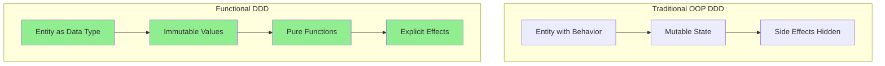
```mermaid
graph TB
    subgraph "Traditional OOP DDD"
        A[Entity with Behavior] --> B[Mutable State]
        B --> C[Side Effects Hidden]
    end

    subgraph "Functional DDD"
        D[Entity as Data Type] --> E[Immutable Values]
        E --> F[Pure Functions]
        F --> G[Explicit Effects]
    end

    style D fill:#90EE90
    style E fill:#90EE90
    style F fill:#90EE90
    style G fill:#90EE90
```

### 1.2 Core Tenets

| Principle | Description | QualCoder Application |
|-----------|-------------|----------------------|
| **Data as Types** | Entities are type definitions with validation | `Code`, `Segment`, `Case` as frozen dataclasses |
| **Behavior as Functions** | Operations are pure functions over data | `apply_code()`, `merge_codes()` as standalone functions |
| **Invariants as Predicates** | Business rules as boolean-returning functions | `is_code_name_unique()`, `is_hierarchy_acyclic()` |
| **Derivers as Decision Makers** | Complex logic returns discriminated unions | `derive_coding_event()` returns `Success | Failure` |
| **Controllers as Coordinators** | Async/IO operations in imperative shell | `CodingController` handles DB and UI coordination |

### 1.3 Architecture Layers

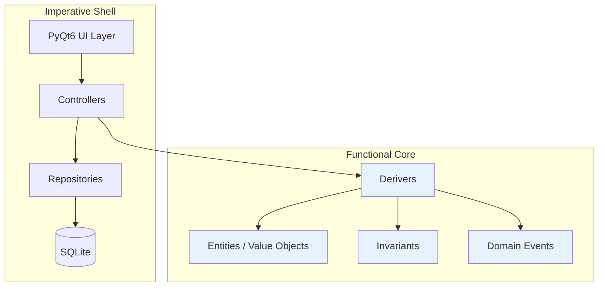
```mermaid
graph TB
    subgraph "Imperative Shell"
        UI[PyQt6 UI Layer]
        CTRL[Controllers]
        REPO[Repositories]
        DB[(SQLite)]
    end

    subgraph "Functional Core"
        ENT[Entities / Value Objects]
        INV[Invariants]
        DER[Derivers]
        EVT[Domain Events]
    end

    UI --> CTRL
    CTRL --> DER
    CTRL --> REPO
    DER --> INV
    DER --> ENT
    DER --> EVT
    REPO --> DB

    style ENT fill:#E6F3FF
    style INV fill:#E6F3FF
    style DER fill:#E6F3FF
    style EVT fill:#E6F3FF
```

**Functional Core**: Pure, testable, no side effects
**Imperative Shell**: Handles I/O, database, UI interactions

---

## 2. Strategic Design: Bounded Contexts

### 2.1 Context Overview

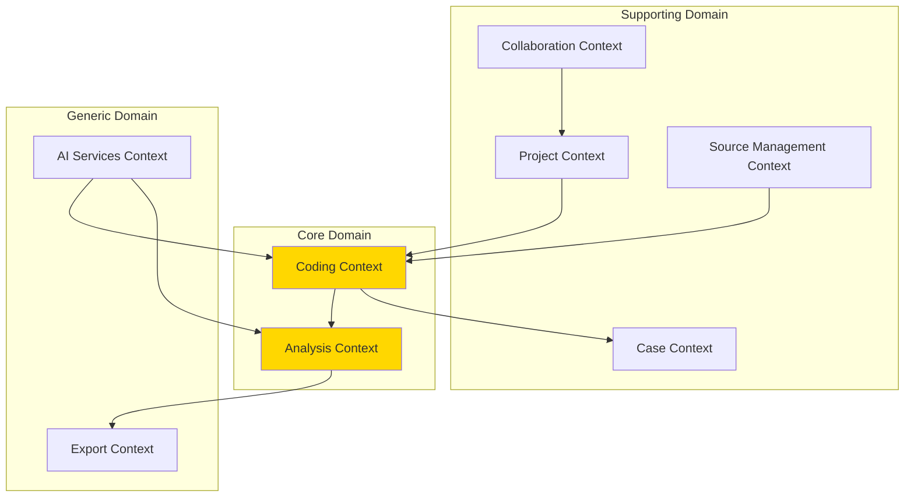
```mermaid
graph TB
    subgraph "Core Domain"
        CODING[Coding Context]
        ANALYSIS[Analysis Context]
    end

    subgraph "Supporting Domain"
        PROJECT[Project Context]
        SOURCE[Source Management Context]
        CASE[Case Context]
        COLLAB[Collaboration Context]
    end

    subgraph "Generic Domain"
        AI[AI Services Context]
        EXPORT[Export Context]
    end

    PROJECT --> CODING
    SOURCE --> CODING
    CODING --> ANALYSIS
    CODING --> CASE
    COLLAB --> PROJECT
    AI --> CODING
    AI --> ANALYSIS
    ANALYSIS --> EXPORT

    style CODING fill:#FFD700
    style ANALYSIS fill:#FFD700
```

### 2.2 Context Responsibilities

| Context | Type | Responsibility | Key Aggregates |
|---------|------|----------------|----------------|
| **Coding** | Core | Apply semantic codes to data segments | Code, Segment |
| **Analysis** | Core | Generate insights from coded data | Report, Matrix |
| **Project** | Supporting | Lifecycle management of research projects | Project |
| **Source Management** | Supporting | Import, store, and manage research data | Source |
| **Case** | Supporting | Group segments into research units | Case |
| **Collaboration** | Supporting | Multi-coder workflows and merging | Coder, MergeOperation |
| **AI Services** | Generic | LLM integration and semantic search | AISession, VectorStore |
| **Export** | Generic | Output generation (REFI-QDA, XLSX) | ExportJob |

---

## 3. Context Map

### 3.1 Integration Patterns

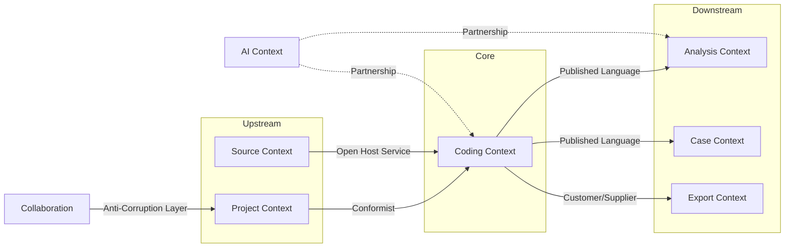
```mermaid
graph LR
    subgraph "Upstream"
        PROJECT[Project Context]
        SOURCE[Source Context]
    end

    subgraph "Core"
        CODING[Coding Context]
    end

    subgraph "Downstream"
        ANALYSIS[Analysis Context]
        CASE[Case Context]
        EXPORT[Export Context]
    end

    PROJECT -->|"Conformist"| CODING
    SOURCE -->|"Open Host Service"| CODING
    CODING -->|"Published Language"| ANALYSIS
    CODING -->|"Published Language"| CASE
    CODING -->|"Customer/Supplier"| EXPORT

    AI[AI Context] -.->|"Partnership"| CODING
    AI -.->|"Partnership"| ANALYSIS
    COLLAB[Collaboration] -->|"Anti-Corruption Layer"| PROJECT
```

### 3.2 Integration Relationships

| Upstream | Downstream | Pattern | Description |
|----------|------------|---------|-------------|
| Project | Coding | Conformist | Coding accepts Project's model |
| Source | Coding | Open Host Service | Source exposes standard API for segment references |
| Coding | Analysis | Published Language | Events define the contract |
| Coding | Case | Published Language | Segment references are immutable |
| Collaboration | Project | Anti-Corruption Layer | Merge logic translates external formats |
| AI | Coding/Analysis | Partnership | Bidirectional collaboration on embeddings |

---

## 4. Tactical Patterns: Functional Approach

### 4.1 Entity Pattern

Entities are **immutable data containers** with identity, defined using frozen dataclasses with runtime validation via Pydantic.

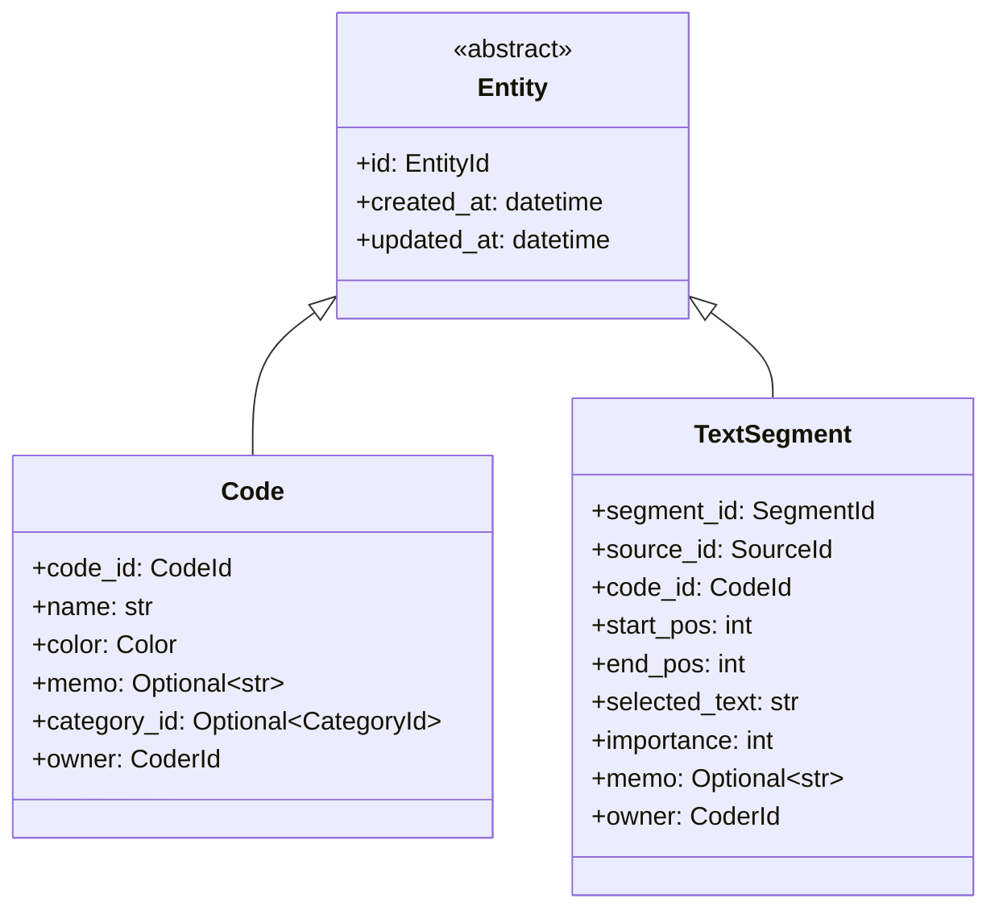
```mermaid
classDiagram
    class Entity {
        <<abstract>>
        +id: EntityId
        +created_at: datetime
        +updated_at: datetime
    }

    class Code {
        +code_id: CodeId
        +name: str
        +color: Color
        +memo: Optional~str~
        +category_id: Optional~CategoryId~
        +owner: CoderId
    }

    class TextSegment {
        +segment_id: SegmentId
        +source_id: SourceId
        +code_id: CodeId
        +start_pos: int
        +end_pos: int
        +selected_text: str
        +importance: int
        +memo: Optional~str~
        +owner: CoderId
    }

    Entity <|-- Code
    Entity <|-- TextSegment
```

### 4.2 Value Object Pattern

Value Objects are **immutable** and compared by value, not identity.

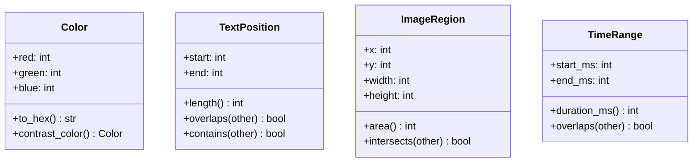
```mermaid
classDiagram
    class Color {
        +red: int
        +green: int
        +blue: int
        +to_hex() str
        +contrast_color() Color
    }

    class TextPosition {
        +start: int
        +end: int
        +length() int
        +overlaps(other) bool
        +contains(other) bool
    }

    class ImageRegion {
        +x: int
        +y: int
        +width: int
        +height: int
        +area() int
        +intersects(other) bool
    }

    class TimeRange {
        +start_ms: int
        +end_ms: int
        +duration_ms() int
        +overlaps(other) bool
    }
```

### 4.3 Invariant Pattern

Invariants are **pure predicate functions** that validate business rules.

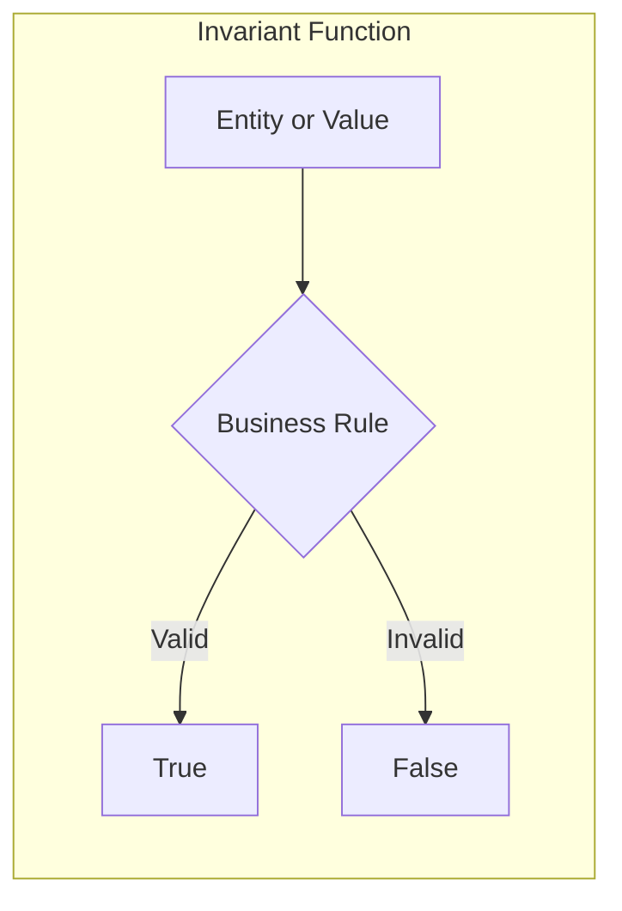
```mermaid
flowchart LR
    subgraph "Invariant Function"
        INPUT[Entity or Value] --> CHECK{Business Rule}
        CHECK -->|Valid| TRUE[True]
        CHECK -->|Invalid| FALSE[False]
    end
```

**Invariant Catalog for Coding Context:**

| Invariant | Input | Rule |
|-----------|-------|------|
| `is_code_name_unique` | Code, existing_codes | No duplicate names in project |
| `is_hierarchy_acyclic` | Category, all_categories | No circular parent references |
| `is_segment_within_bounds` | TextSegment, Source | Position within source length |
| `is_valid_overlap` | Segment, existing_segments | Overlaps are tracked, not prevented |
| `can_code_be_deleted` | Code, segments | No segments reference this code |
| `is_color_valid` | Color | RGB values 0-255 |

### 4.4 Deriver Pattern

Derivers are **pure functions** that:
1. Accept entities and context as input
2. Compose multiple invariants
3. Return a **discriminated union** (Result type) of success or failure

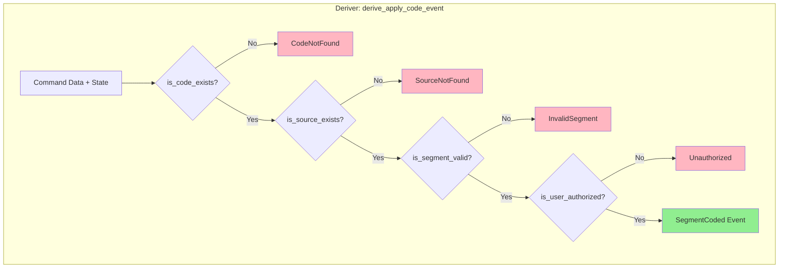
```mermaid
flowchart TB
    subgraph "Deriver: derive_apply_code_event"
        INPUT[Command Data + State]

        INV1{is_code_exists?}
        INV2{is_source_exists?}
        INV3{is_segment_valid?}
        INV4{is_user_authorized?}

        INPUT --> INV1
        INV1 -->|No| FAIL1[CodeNotFound]
        INV1 -->|Yes| INV2
        INV2 -->|No| FAIL2[SourceNotFound]
        INV2 -->|Yes| INV3
        INV3 -->|No| FAIL3[InvalidSegment]
        INV3 -->|Yes| INV4
        INV4 -->|No| FAIL4[Unauthorized]
        INV4 -->|Yes| SUCCESS[SegmentCoded Event]
    end

    style SUCCESS fill:#90EE90
    style FAIL1 fill:#FFB6C1
    style FAIL2 fill:#FFB6C1
    style FAIL3 fill:#FFB6C1
    style FAIL4 fill:#FFB6C1
```

**Result Type Pattern:**

```
Result[T, E] = Success[T] | Failure[E]

where:
  T = Domain Event (success case)
  E = Failure Reason (discriminated union of error types)
```

### 4.5 Controller Pattern

Controllers live in the **Imperative Shell** and coordinate:
- Reading state from repositories
- Calling derivers with state
- Persisting changes based on events
- Publishing events to the event bus

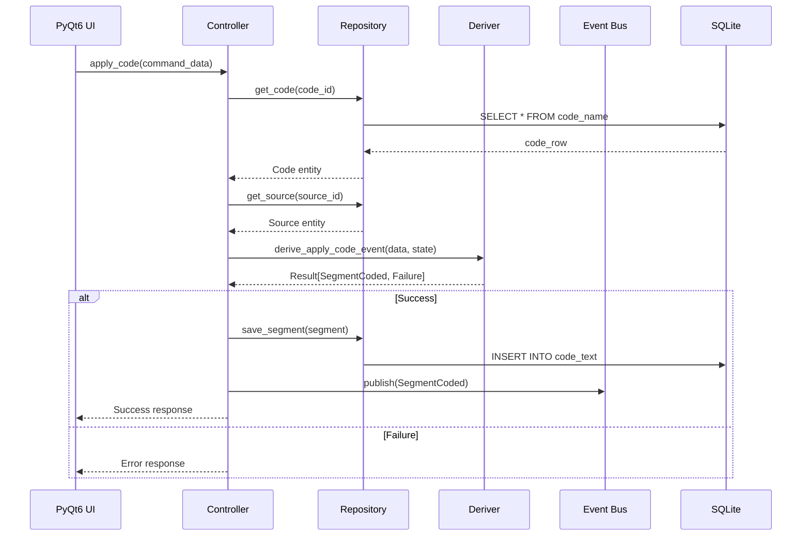
```mermaid
sequenceDiagram
    participant UI as PyQt6 UI
    participant CTRL as Controller
    participant REPO as Repository
    participant DER as Deriver
    participant BUS as Event Bus
    participant DB as SQLite

    UI->>CTRL: apply_code(command_data)
    CTRL->>REPO: get_code(code_id)
    REPO->>DB: SELECT * FROM code_name
    DB-->>REPO: code_row
    REPO-->>CTRL: Code entity
    CTRL->>REPO: get_source(source_id)
    REPO-->>CTRL: Source entity
    CTRL->>DER: derive_apply_code_event(data, state)
    DER-->>CTRL: Result[SegmentCoded, Failure]

    alt Success
        CTRL->>REPO: save_segment(segment)
        REPO->>DB: INSERT INTO code_text
        CTRL->>BUS: publish(SegmentCoded)
        CTRL-->>UI: Success response
    else Failure
        CTRL-->>UI: Error response
    end
```

### 4.6 Policy Pattern

Policies are **reactive event handlers** that trigger cross-aggregate or cross-context actions.

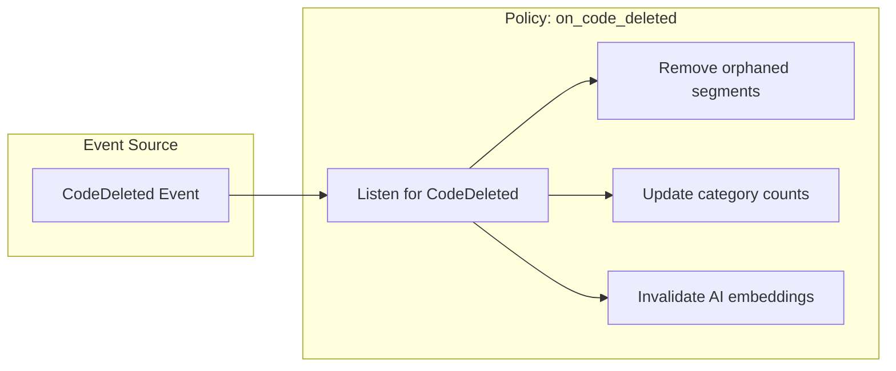
```mermaid
flowchart LR
    subgraph "Event Source"
        EVT1[CodeDeleted Event]
    end

    subgraph "Policy: on_code_deleted"
        LISTEN[Listen for CodeDeleted]
        ACTION1[Remove orphaned segments]
        ACTION2[Update category counts]
        ACTION3[Invalidate AI embeddings]
    end

    EVT1 --> LISTEN
    LISTEN --> ACTION1
    LISTEN --> ACTION2
    LISTEN --> ACTION3
```

---

## 5. Bounded Context Deep Dives

### 5.1 Coding Context (Core Domain)

The heart of QualCoder - applying semantic codes to research data.

#### 5.1.1 Aggregate Structure

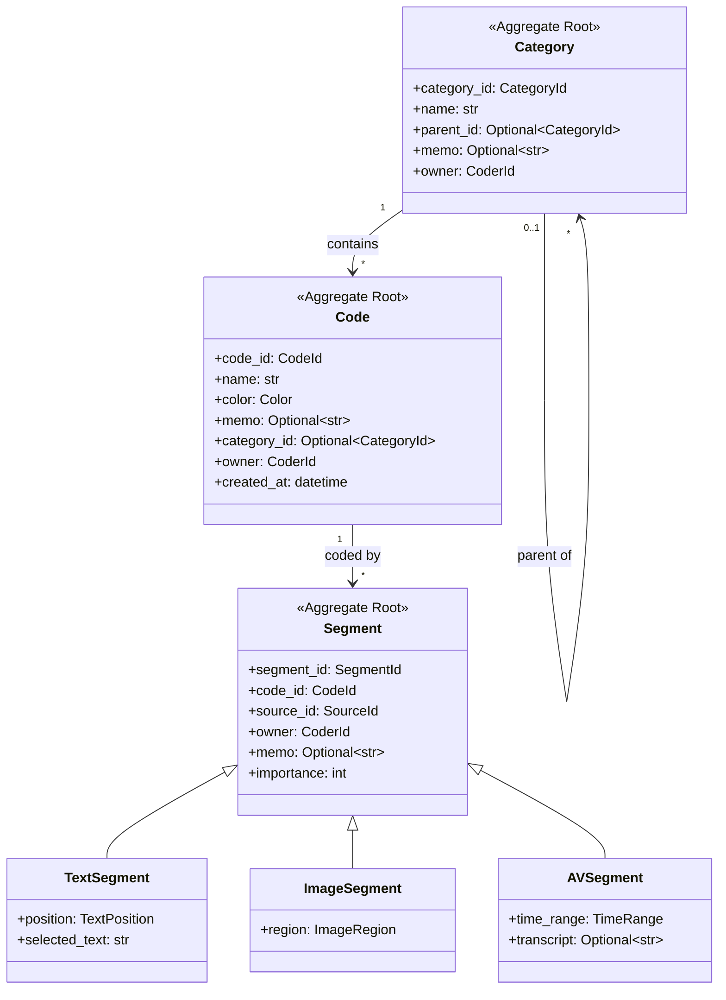
```mermaid
classDiagram
    class Code {
        <<Aggregate Root>>
        +code_id: CodeId
        +name: str
        +color: Color
        +memo: Optional~str~
        +category_id: Optional~CategoryId~
        +owner: CoderId
        +created_at: datetime
    }

    class Category {
        <<Aggregate Root>>
        +category_id: CategoryId
        +name: str
        +parent_id: Optional~CategoryId~
        +memo: Optional~str~
        +owner: CoderId
    }

    class Segment {
        <<Aggregate Root>>
        +segment_id: SegmentId
        +code_id: CodeId
        +source_id: SourceId
        +owner: CoderId
        +memo: Optional~str~
        +importance: int
    }

    class TextSegment {
        +position: TextPosition
        +selected_text: str
    }

    class ImageSegment {
        +region: ImageRegion
    }

    class AVSegment {
        +time_range: TimeRange
        +transcript: Optional~str~
    }

    Segment <|-- TextSegment
    Segment <|-- ImageSegment
    Segment <|-- AVSegment

    Code "1" --> "*" Segment : coded by
    Category "1" --> "*" Code : contains
    Category "0..1" --> "*" Category : parent of
```

#### 5.1.2 Commands and Events


```mermaid
flowchart TB
    subgraph "Commands"
        C1[CreateCode]
        C2[RenameCode]
        C3[ChangeCodeColor]
        C4[DeleteCode]
        C5[MergeCodes]
        C6[ApplyCodeToSegment]
        C7[RemoveCodeFromSegment]
        C8[MoveCodeToCategory]
        C9[CreateCategory]
        C10[DeleteCategory]
    end

    subgraph "Success Events"
        E1[CodeCreated]
        E2[CodeRenamed]
        E3[CodeColorChanged]
        E4[CodeDeleted]
        E5[CodesMerged]
        E6[SegmentCoded]
        E7[SegmentUncoded]
        E8[CodeMovedToCategory]
        E9[CategoryCreated]
        E10[CategoryDeleted]
    end

    subgraph "Failure Events"
        F1[CodeNotCreated/NameExists]
        F2[CodeNotRenamed/NameExists]
        F3[CodeNotDeleted/HasSegments]
        F4[SegmentNotCoded/InvalidPosition]
        F5[CategoryNotDeleted/HasChildren]
    end

    C1 --> E1
    C1 --> F1
    C2 --> E2
    C2 --> F2
    C4 --> E4
    C4 --> F3
    C6 --> E6
    C6 --> F4
    C10 --> E10
    C10 --> F5
```

#### 5.1.3 Invariants

| Invariant | Parameters | Business Rule |
|-----------|------------|---------------|
| `is_code_name_unique` | name, project_codes | No two codes share the same name |
| `is_category_name_unique` | name, project_categories | No two categories share the same name |
| `is_hierarchy_acyclic` | category, parent_id, all_categories | Moving category doesn't create cycle |
| `is_segment_position_valid` | position, source | Start < end, both within source bounds |
| `is_code_deletable` | code_id, segments | No segments reference this code |
| `is_category_deletable` | category_id, codes, subcategories | No codes or children reference category |
| `are_codes_mergeable` | source_code, target_code | Both exist, different codes |

#### 5.1.4 Deriver Flows

**Apply Code to Text Segment:**

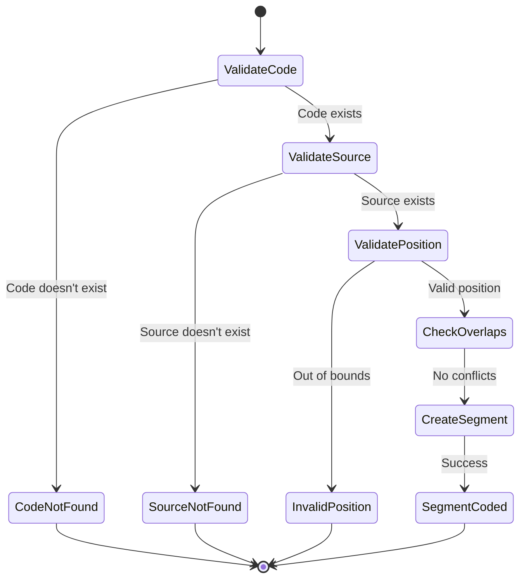
```mermaid
stateDiagram-v2
    [*] --> ValidateCode
    ValidateCode --> CodeNotFound: Code doesn't exist
    ValidateCode --> ValidateSource: Code exists

    ValidateSource --> SourceNotFound: Source doesn't exist
    ValidateSource --> ValidatePosition: Source exists

    ValidatePosition --> InvalidPosition: Out of bounds
    ValidatePosition --> CheckOverlaps: Valid position

    CheckOverlaps --> CreateSegment: No conflicts

    CreateSegment --> SegmentCoded: Success

    CodeNotFound --> [*]
    SourceNotFound --> [*]
    InvalidPosition --> [*]
    SegmentCoded --> [*]
```

**Merge Codes:**

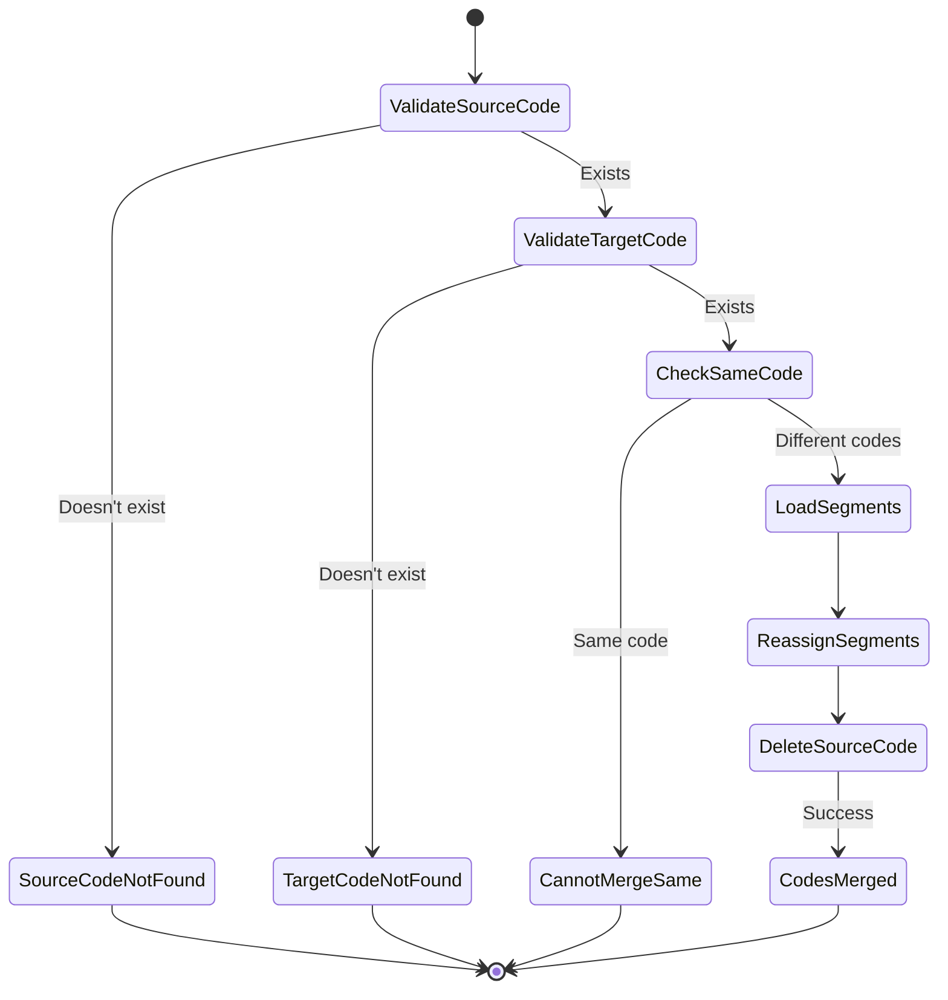
```mermaid
stateDiagram-v2
    [*] --> ValidateSourceCode
    ValidateSourceCode --> SourceCodeNotFound: Doesn't exist
    ValidateSourceCode --> ValidateTargetCode: Exists

    ValidateTargetCode --> TargetCodeNotFound: Doesn't exist
    ValidateTargetCode --> CheckSameCode: Exists

    CheckSameCode --> CannotMergeSame: Same code
    CheckSameCode --> LoadSegments: Different codes

    LoadSegments --> ReassignSegments
    ReassignSegments --> DeleteSourceCode
    DeleteSourceCode --> CodesMerged: Success

    SourceCodeNotFound --> [*]
    TargetCodeNotFound --> [*]
    CannotMergeSame --> [*]
    CodesMerged --> [*]
```

---

### 5.2 Source Management Context

Manages research data files and their content.

#### 5.2.1 Aggregate Structure

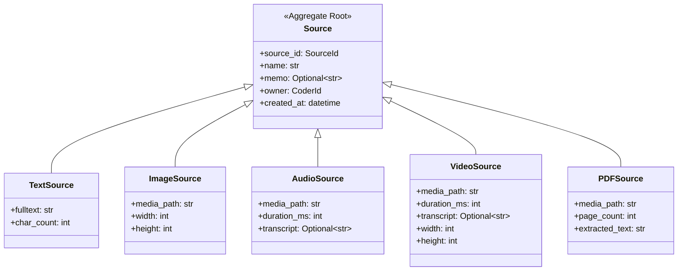
```mermaid
classDiagram
    class Source {
        <<Aggregate Root>>
        +source_id: SourceId
        +name: str
        +memo: Optional~str~
        +owner: CoderId
        +created_at: datetime
    }

    class TextSource {
        +fulltext: str
        +char_count: int
    }

    class ImageSource {
        +media_path: str
        +width: int
        +height: int
    }

    class AudioSource {
        +media_path: str
        +duration_ms: int
        +transcript: Optional~str~
    }

    class VideoSource {
        +media_path: str
        +duration_ms: int
        +transcript: Optional~str~
        +width: int
        +height: int
    }

    class PDFSource {
        +media_path: str
        +page_count: int
        +extracted_text: str
    }

    Source <|-- TextSource
    Source <|-- ImageSource
    Source <|-- AudioSource
    Source <|-- VideoSource
    Source <|-- PDFSource
```

#### 5.2.2 Commands and Events

| Command | Success Event | Failure Events |
|---------|---------------|----------------|
| ImportSource | SourceImported | ImportFailed/InvalidFormat, ImportFailed/FileTooLarge |
| RenameSource | SourceRenamed | SourceNotRenamed/NameExists |
| DeleteSource | SourceDeleted | SourceNotDeleted/HasSegments |
| ExtractText | TextExtracted | ExtractionFailed |
| UpdateTranscript | TranscriptUpdated | - |

---

### 5.3 Case Context

Groups coded segments into research units (participants, events, etc.).

#### 5.3.1 Aggregate Structure

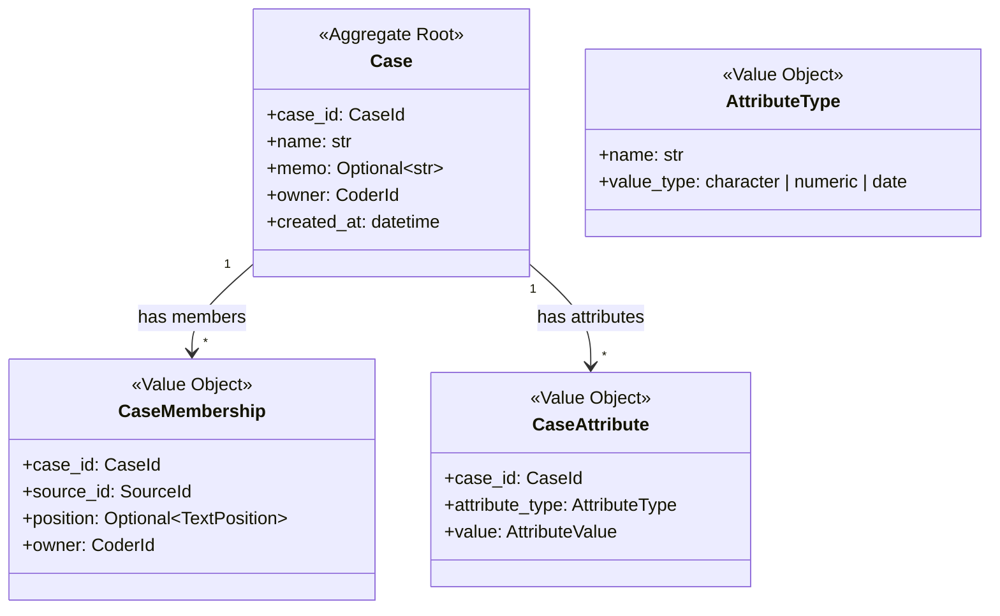
```mermaid
classDiagram
    class Case {
        <<Aggregate Root>>
        +case_id: CaseId
        +name: str
        +memo: Optional~str~
        +owner: CoderId
        +created_at: datetime
    }

    class CaseMembership {
        <<Value Object>>
        +case_id: CaseId
        +source_id: SourceId
        +position: Optional~TextPosition~
        +owner: CoderId
    }

    class CaseAttribute {
        <<Value Object>>
        +case_id: CaseId
        +attribute_type: AttributeType
        +value: AttributeValue
    }

    class AttributeType {
        <<Value Object>>
        +name: str
        +value_type: character | numeric | date
    }

    Case "1" --> "*" CaseMembership : has members
    Case "1" --> "*" CaseAttribute : has attributes
```

#### 5.3.2 Commands and Events

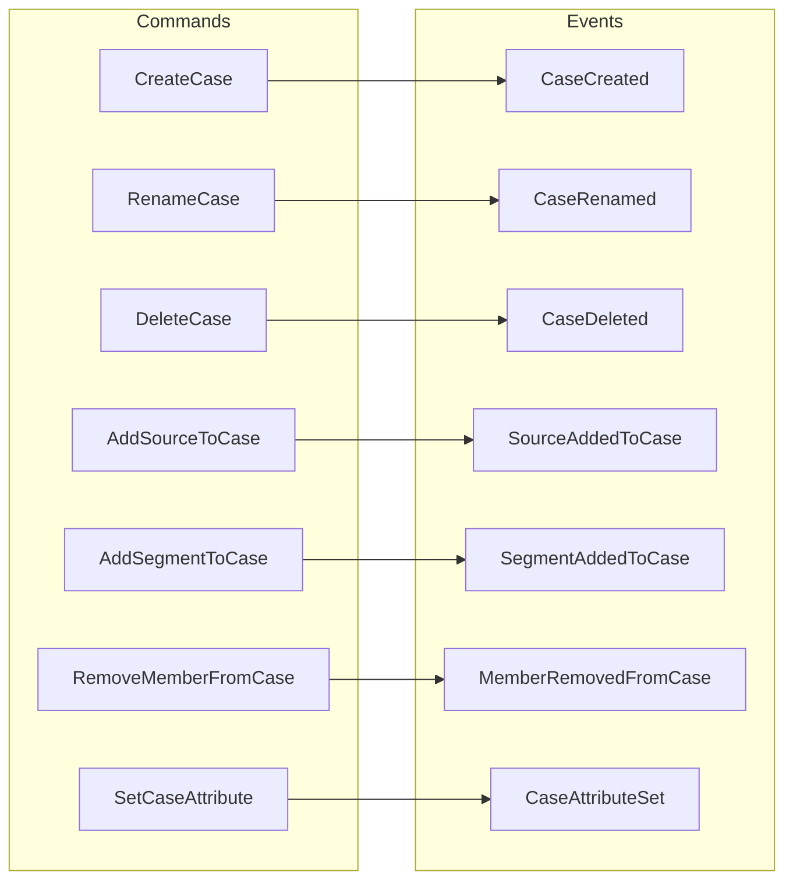
```mermaid
flowchart LR
    subgraph Commands
        C1[CreateCase]
        C2[RenameCase]
        C3[DeleteCase]
        C4[AddSourceToCase]
        C5[AddSegmentToCase]
        C6[RemoveMemberFromCase]
        C7[SetCaseAttribute]
    end

    subgraph Events
        E1[CaseCreated]
        E2[CaseRenamed]
        E3[CaseDeleted]
        E4[SourceAddedToCase]
        E5[SegmentAddedToCase]
        E6[MemberRemovedFromCase]
        E7[CaseAttributeSet]
    end

    C1 --> E1
    C2 --> E2
    C3 --> E3
    C4 --> E4
    C5 --> E5
    C6 --> E6
    C7 --> E7
```

---

### 5.4 Analysis Context

Generates insights and reports from coded data.

#### 5.4.1 Aggregate Structure

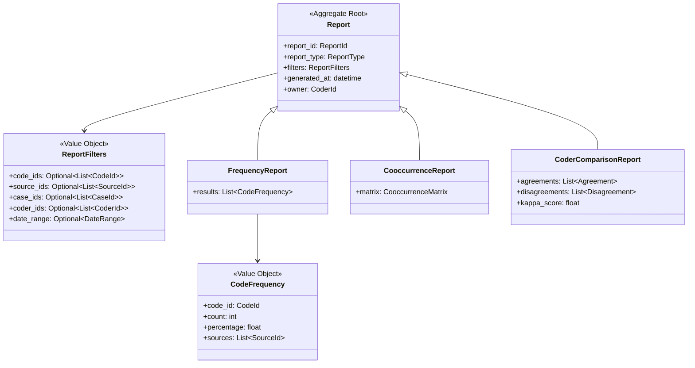
```mermaid
classDiagram
    class Report {
        <<Aggregate Root>>
        +report_id: ReportId
        +report_type: ReportType
        +filters: ReportFilters
        +generated_at: datetime
        +owner: CoderId
    }

    class ReportFilters {
        <<Value Object>>
        +code_ids: Optional~List~CodeId~~
        +source_ids: Optional~List~SourceId~~
        +case_ids: Optional~List~CaseId~~
        +coder_ids: Optional~List~CoderId~~
        +date_range: Optional~DateRange~
    }

    class FrequencyReport {
        +results: List~CodeFrequency~
    }

    class CooccurrenceReport {
        +matrix: CooccurrenceMatrix
    }

    class CoderComparisonReport {
        +agreements: List~Agreement~
        +disagreements: List~Disagreement~
        +kappa_score: float
    }

    class CodeFrequency {
        <<Value Object>>
        +code_id: CodeId
        +count: int
        +percentage: float
        +sources: List~SourceId~
    }

    Report <|-- FrequencyReport
    Report <|-- CooccurrenceReport
    Report <|-- CoderComparisonReport
    Report --> ReportFilters
    FrequencyReport --> CodeFrequency
```

#### 5.4.2 Report Generation Flow

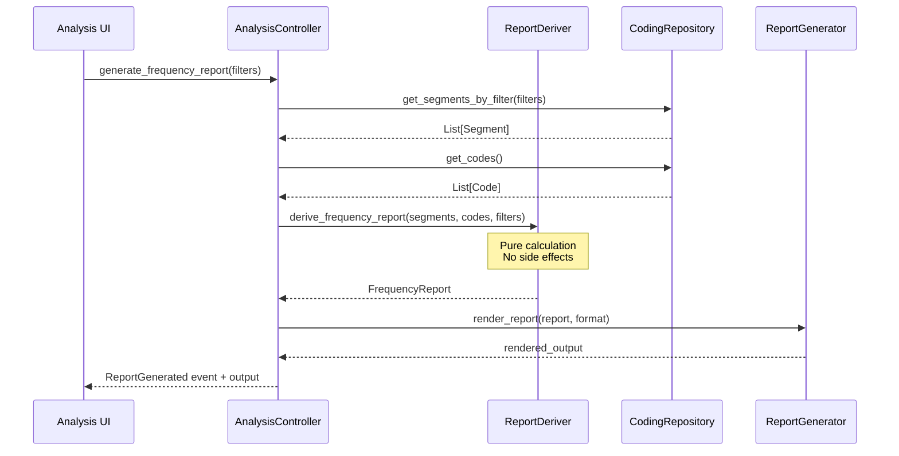
```mermaid
sequenceDiagram
    participant UI as Analysis UI
    participant CTRL as AnalysisController
    participant DER as ReportDeriver
    participant REPO as CodingRepository
    participant GEN as ReportGenerator

    UI->>CTRL: generate_frequency_report(filters)
    CTRL->>REPO: get_segments_by_filter(filters)
    REPO-->>CTRL: List[Segment]
    CTRL->>REPO: get_codes()
    REPO-->>CTRL: List[Code]

    CTRL->>DER: derive_frequency_report(segments, codes, filters)
    Note over DER: Pure calculation<br/>No side effects
    DER-->>CTRL: FrequencyReport

    CTRL->>GEN: render_report(report, format)
    GEN-->>CTRL: rendered_output
    CTRL-->>UI: ReportGenerated event + output
```

---

### 5.5 Project Context

Manages research project lifecycle.

#### 5.5.1 Aggregate Structure

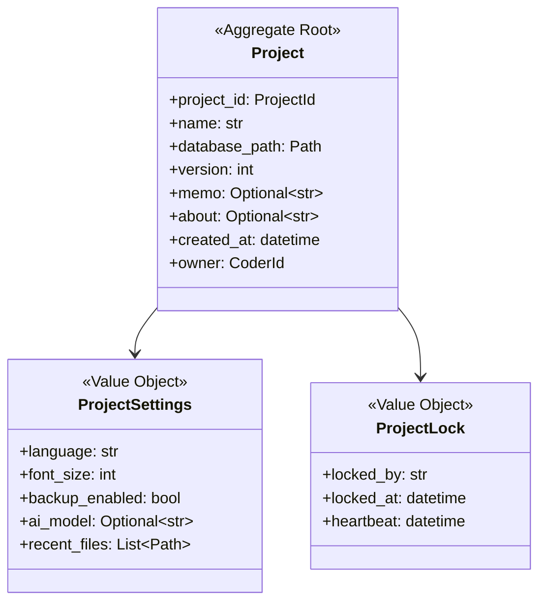
```mermaid
classDiagram
    class Project {
        <<Aggregate Root>>
        +project_id: ProjectId
        +name: str
        +database_path: Path
        +version: int
        +memo: Optional~str~
        +about: Optional~str~
        +created_at: datetime
        +owner: CoderId
    }

    class ProjectSettings {
        <<Value Object>>
        +language: str
        +font_size: int
        +backup_enabled: bool
        +ai_model: Optional~str~
        +recent_files: List~Path~
    }

    class ProjectLock {
        <<Value Object>>
        +locked_by: str
        +locked_at: datetime
        +heartbeat: datetime
    }

    Project --> ProjectSettings
    Project --> ProjectLock
```

#### 5.5.2 Project Lifecycle

```mermaid
stateDiagram-v2
    [*] --> Closed

    Closed --> Creating: create_project
    Creating --> Open: ProjectCreated
    Creating --> Closed: CreationFailed

    Closed --> Opening: open_project
    Opening --> CheckLock: Load database
    CheckLock --> Locked: Another user has lock
    CheckLock --> AcquireLock: No lock
    AcquireLock --> Open: Lock acquired
    Locked --> Closed: Cannot open

    Open --> Saving: save_project
    Saving --> Open: ProjectSaved

    Open --> Closing: close_project
    Closing --> ReleaseLock: Release lock
    ReleaseLock --> Closed: ProjectClosed

    Open --> Backing: backup_project
    Backing --> Open: BackupCreated
```

---

### 5.6 Collaboration Context

Handles multi-coder workflows and project merging.

#### 5.6.1 Aggregate Structure

```mermaid
classDiagram
    class Coder {
        <<Aggregate Root>>
        +coder_id: CoderId
        +name: str
        +visibility: bool
    }

    class MergeOperation {
        <<Aggregate Root>>
        +merge_id: MergeId
        +source_project: Path
        +target_project: Path
        +status: MergeStatus
        +conflicts: List~Conflict~
        +resolutions: List~Resolution~
        +started_at: datetime
        +completed_at: Optional~datetime~
    }

    class Conflict {
        <<Value Object>>
        +conflict_type: code | category | attribute
        +source_item: str
        +target_item: str
        +description: str
    }

    class Resolution {
        <<Value Object>>
        +conflict: Conflict
        +strategy: keep_source | keep_target | rename | merge
        +new_name: Optional~str~
    }

    MergeOperation --> "*" Conflict
    MergeOperation --> "*" Resolution
```

#### 5.6.2 Merge Workflow

```mermaid
flowchart TB
    START[Start Merge] --> BACKUP[Create Target Backup]
    BACKUP --> LOAD[Load Source Project]
    LOAD --> DETECT[Detect Conflicts]

    DETECT --> CODES{Code Conflicts?}
    CODES -->|Yes| RESOLVE_CODES[Queue Code Conflicts]
    CODES -->|No| CATS
    RESOLVE_CODES --> CATS

    CATS{Category Conflicts?}
    CATS -->|Yes| RESOLVE_CATS[Queue Category Conflicts]
    CATS -->|No| ATTRS
    RESOLVE_CATS --> ATTRS

    ATTRS{Attribute Conflicts?}
    ATTRS -->|Yes| RESOLVE_ATTRS[Queue Attribute Conflicts]
    ATTRS -->|No| USER_REVIEW
    RESOLVE_ATTRS --> USER_REVIEW

    USER_REVIEW[Present Conflicts to User]
    USER_REVIEW --> APPLY[Apply Resolutions]
    APPLY --> IMPORT[Import Non-Conflicting Items]
    IMPORT --> VERIFY[Verify Integrity]
    VERIFY --> COMPLETE[MergeCompleted]

    VERIFY -->|Failed| ROLLBACK[Restore Backup]
    ROLLBACK --> FAILED[MergeFailed]
```

---

### 5.7 AI Services Context

Provides LLM-powered analysis and semantic search.

#### 5.7.1 Aggregate Structure

```mermaid
classDiagram
    class AISession {
        <<Aggregate Root>>
        +session_id: SessionId
        +model_config: AIModelConfig
        +messages: List~ChatMessage~
        +created_at: datetime
    }

    class AIModelConfig {
        <<Value Object>>
        +provider: openai | blablador | local
        +model_name: str
        +api_key: Optional~str~
        +temperature: float
        +max_tokens: int
    }

    class ChatMessage {
        <<Value Object>>
        +role: user | assistant | system
        +content: str
        +timestamp: datetime
    }

    class VectorStore {
        <<Aggregate Root>>
        +store_id: StoreId
        +project_id: ProjectId
        +embedding_model: str
        +indexed_segments: int
        +last_updated: datetime
    }

    class SegmentEmbedding {
        <<Value Object>>
        +segment_id: SegmentId
        +embedding: List~float~
        +text_content: str
    }

    AISession --> AIModelConfig
    AISession --> "*" ChatMessage
    VectorStore --> "*" SegmentEmbedding
```

#### 5.7.2 AI Query Flow

```mermaid
sequenceDiagram
    participant UI as AI Chat UI
    participant CTRL as AIController
    participant VS as VectorStore
    participant LLM as LLM Provider
    participant REPO as CodingRepository

    UI->>CTRL: ask_question(query)

    CTRL->>VS: semantic_search(query, k=10)
    VS-->>CTRL: List[SegmentEmbedding]

    CTRL->>REPO: get_segments(segment_ids)
    REPO-->>CTRL: List[Segment] with context

    Note over CTRL: Build prompt with<br/>retrieved context

    CTRL->>LLM: complete(prompt)
    LLM-->>CTRL: response

    CTRL->>CTRL: save_message(query, response)
    CTRL-->>UI: AIResponseGenerated
```

---

## 6. Event Catalog

### 6.1 Event Categories

```mermaid
graph TB
    subgraph "Project Events"
        PE1[ProjectCreated]
        PE2[ProjectOpened]
        PE3[ProjectClosed]
        PE4[ProjectBackedUp]
    end

    subgraph "Source Events"
        SE1[SourceImported]
        SE2[SourceRenamed]
        SE3[SourceDeleted]
        SE4[TextExtracted]
    end

    subgraph "Coding Events"
        CE1[CodeCreated]
        CE2[CodeRenamed]
        CE3[CodeDeleted]
        CE4[CodesMerged]
        CE5[SegmentCoded]
        CE6[SegmentUncoded]
        CE7[CategoryCreated]
        CE8[CategoryDeleted]
    end

    subgraph "Case Events"
        CSE1[CaseCreated]
        CSE2[CaseDeleted]
        CSE3[MemberAddedToCase]
        CSE4[AttributeSet]
    end

    subgraph "Analysis Events"
        AE1[ReportGenerated]
        AE2[ReportExported]
    end

    subgraph "Collaboration Events"
        COE1[MergeStarted]
        COE2[ConflictDetected]
        COE3[ConflictResolved]
        COE4[MergeCompleted]
    end
```

### 6.2 Event Structure

All events follow a consistent structure:

```
DomainEvent:
  +event_id: UUID
  +event_type: str
  +aggregate_type: str
  +aggregate_id: str
  +occurred_at: datetime
  +caused_by: Optional[CoderId]
  +payload: Dict[str, Any]
  +metadata: Dict[str, Any]
```

### 6.3 Event Flow Between Contexts

```mermaid
flowchart LR
    subgraph "Coding Context"
        CE[CodeDeleted]
    end

    subgraph "Event Bus"
        BUS((Event Bus))
    end

    subgraph "Consumers"
        CASE[Case Context]
        AI[AI Context]
        ANALYSIS[Analysis Context]
    end

    CE --> BUS
    BUS --> CASE
    BUS --> AI
    BUS --> ANALYSIS

    CASE --> |"Remove orphaned<br/>case memberships"| CASE
    AI --> |"Remove embeddings<br/>for deleted code"| AI
    ANALYSIS --> |"Invalidate cached<br/>reports"| ANALYSIS
```

---

## 7. Cross-Cutting Concerns

### 7.1 Error Handling Strategy

```mermaid
flowchart TB
    subgraph "Functional Core"
        DERIVER[Deriver Function]
        DERIVER --> RESULT{Result Type}
        RESULT --> SUCCESS[Success + Event]
        RESULT --> FAILURE[Failure + Reason]
    end

    subgraph "Imperative Shell"
        CTRL[Controller]
        SUCCESS --> PERSIST[Persist Changes]
        PERSIST --> PUBLISH[Publish Event]
        PUBLISH --> UI_SUCCESS[Update UI - Success]

        FAILURE --> LOG[Log Failure]
        LOG --> UI_FAILURE[Update UI - Error]
    end
```

**Failure Reason Types:**

| Context | Failure Reasons |
|---------|-----------------|
| Coding | `CodeNotFound`, `SourceNotFound`, `InvalidPosition`, `DuplicateName`, `CyclicHierarchy` |
| Source | `InvalidFormat`, `FileTooLarge`, `FileNotFound`, `ExtractionFailed` |
| Case | `CaseNotFound`, `DuplicateName`, `InvalidAttribute` |
| Project | `DatabaseCorrupted`, `VersionMismatch`, `LockConflict` |
| Collaboration | `MergeConflict`, `IncompatibleVersions` |

### 7.2 Audit Trail

Every state change is tracked through events, enabling:

```mermaid
flowchart LR
    subgraph "Event Store"
        E1[Event 1] --> E2[Event 2] --> E3[Event 3] --> E4[Event N]
    end

    subgraph "Capabilities"
        AUDIT[Audit Log]
        UNDO[Undo/Redo]
        REPLAY[State Replay]
        DEBUG[Debugging]
    end

    E4 --> AUDIT
    E4 --> UNDO
    E4 --> REPLAY
    E4 --> DEBUG
```

### 7.3 Validation Layers

```mermaid
flowchart TB
    INPUT[User Input]

    subgraph "Layer 1: Structural Validation"
        PYDANTIC[Pydantic Models]
        INPUT --> PYDANTIC
        PYDANTIC -->|Invalid| REJECT1[Reject: Invalid Format]
        PYDANTIC -->|Valid| LAYER2
    end

    subgraph "Layer 2: Domain Invariants"
        LAYER2[Invariant Functions]
        LAYER2 -->|Violated| REJECT2[Reject: Business Rule]
        LAYER2 -->|Passed| LAYER3
    end

    subgraph "Layer 3: Cross-Aggregate Rules"
        LAYER3[Deriver Logic]
        LAYER3 -->|Failed| REJECT3[Reject: Consistency]
        LAYER3 -->|Passed| ACCEPT[Accept: Create Event]
    end
```

---

## 8. Data Flow Architecture

### 8.1 Complete Request Flow

```mermaid
flowchart TB
    subgraph "Presentation Layer"
        UI[PyQt6 Dialog]
        UI --> |User Action| CMD[Command DTO]
    end

    subgraph "Application Layer"
        CTRL[Controller]
        CMD --> CTRL
        CTRL --> |Fetch State| REPO
        CTRL --> |Call| DERIVER
    end

    subgraph "Domain Layer - Functional Core"
        DERIVER[Deriver]
        INV[Invariants]
        ENT[Entities]
        EVT[Domain Event]

        DERIVER --> INV
        DERIVER --> ENT
        DERIVER --> |Return| EVT
    end

    subgraph "Infrastructure Layer"
        REPO[Repository]
        DB[(SQLite)]
        BUS[Event Bus]

        REPO --> DB
        CTRL --> |Persist| REPO
        CTRL --> |Publish| BUS
    end

    BUS --> |Notify| POLICY[Policies]
    POLICY --> |Trigger| CTRL

    CTRL --> |Response| UI
```

### 8.2 Read vs Write Paths (CQRS-lite)

```mermaid
flowchart LR
    subgraph "Write Path"
        W_CMD[Command] --> W_CTRL[Controller]
        W_CTRL --> W_DER[Deriver]
        W_DER --> W_EVT[Event]
        W_EVT --> W_REPO[Repository]
        W_REPO --> W_DB[(Write DB)]
    end

    subgraph "Read Path"
        R_QUERY[Query] --> R_REPO[Query Repository]
        R_REPO --> R_DB[(Read Views)]
        R_DB --> R_DTO[Read DTO]
    end

    W_DB -.-> |Sync| R_DB
```

---

## 9. Migration Strategy

### 9.1 Phased Approach

```mermaid
gantt
    title Functional DDD Migration Phases
    dateFormat  YYYY-MM-DD
    section Phase 1
    Define Entities & Value Objects    :p1, 2024-01-01, 30d
    Implement Invariants               :p2, after p1, 20d
    section Phase 2
    Build Derivers                     :p3, after p2, 40d
    Create Event Types                 :p4, after p2, 20d
    section Phase 3
    Refactor Controllers               :p5, after p3, 30d
    Implement Event Bus                :p6, after p4, 20d
    section Phase 4
    Add Policies                       :p7, after p5, 20d
    Integration Testing                :p8, after p7, 30d
    section Phase 5
    UI Integration                     :p9, after p8, 40d
    Performance Optimization           :p10, after p9, 20d
```

### 9.2 Migration by Context Priority

| Priority | Context | Rationale |
|----------|---------|-----------|
| 1 | Coding | Core domain, highest complexity, most business rules |
| 2 | Source Management | Foundation for coding, relatively isolated |
| 3 | Case | Depends on coding, moderate complexity |
| 4 | Project | Cross-cutting but stable |
| 5 | Analysis | Read-heavy, can use existing data layer |
| 6 | Collaboration | Complex but infrequent usage |
| 7 | AI Services | Already somewhat isolated |

### 9.3 Strangler Fig Pattern

```mermaid
flowchart TB
    subgraph "Current System"
        OLD_UI[Existing PyQt6 UI]
        OLD_LOGIC[Monolithic Logic]
        OLD_DB[(SQLite)]
    end

    subgraph "New fDDD System"
        NEW_CTRL[New Controllers]
        NEW_CORE[Functional Core]
        NEW_REPO[New Repositories]
    end

    subgraph "Facade"
        ROUTER{Feature Router}
    end

    OLD_UI --> ROUTER
    ROUTER -->|Legacy Features| OLD_LOGIC
    ROUTER -->|Migrated Features| NEW_CTRL

    OLD_LOGIC --> OLD_DB
    NEW_CTRL --> NEW_CORE
    NEW_CTRL --> NEW_REPO
    NEW_REPO --> OLD_DB

    style NEW_CTRL fill:#90EE90
    style NEW_CORE fill:#90EE90
    style NEW_REPO fill:#90EE90
```

---

## Appendix A: Glossary

| Term | Definition |
|------|------------|
| **Aggregate** | Cluster of entities treated as a unit for data changes |
| **Bounded Context** | Explicit boundary within which a domain model applies |
| **Command** | Request to change state (imperative: "CreateCode") |
| **Controller** | Imperative shell component coordinating I/O and derivers |
| **Deriver** | Pure function that derives an event from command + state |
| **Domain Event** | Record of something significant that happened in the domain |
| **Entity** | Object with identity that persists over time |
| **Invariant** | Business rule that must always be true |
| **Policy** | Reactive handler triggered by domain events |
| **Repository** | Abstraction for retrieving and storing aggregates |
| **Value Object** | Immutable object defined by its attributes, no identity |

---

## Appendix B: Technology Choices

| Concern | Technology | Rationale |
|---------|------------|-----------|
| **Type Definitions** | Pydantic v2 | Runtime validation, frozen models, JSON schema |
| **Immutability** | `@dataclass(frozen=True)` | Native Python, Pydantic compatible |
| **Result Types** | `returns` library or custom | Explicit success/failure handling |
| **Event Bus** | `blinker` or custom | Lightweight, synchronous for desktop app |
| **Database** | SQLite (existing) | Maintain compatibility |
| **UI** | PyQt6 (existing) | Maintain compatibility |

---

## Appendix C: File Structure

```
qualcoder/
├── domain/
│   ├── coding/
│   │   ├── entities.py          # Code, Segment, Category
│   │   ├── value_objects.py     # Color, TextPosition, etc.
│   │   ├── invariants.py        # is_code_name_unique, etc.
│   │   ├── derivers.py          # derive_create_code_event, etc.
│   │   ├── events.py            # CodeCreated, SegmentCoded, etc.
│   │   └── __init__.py
│   ├── sources/
│   │   ├── entities.py
│   │   ├── ...
│   ├── cases/
│   ├── projects/
│   ├── analysis/
│   ├── collaboration/
│   ├── ai_services/
│   └── shared/
│       ├── result.py            # Result[T, E] type
│       ├── events.py            # Base event types
│       └── identifiers.py       # Typed IDs
├── application/
│   ├── controllers/
│   │   ├── coding_controller.py
│   │   ├── source_controller.py
│   │   └── ...
│   ├── policies/
│   │   ├── coding_policies.py
│   │   └── ...
│   └── event_bus.py
├── infrastructure/
│   ├── repositories/
│   │   ├── code_repository.py
│   │   ├── source_repository.py
│   │   └── ...
│   ├── database/
│   │   ├── connection.py
│   │   └── migrations/
│   └── external/
│       ├── openai_client.py
│       └── ...
├── presentation/
│   ├── dialogs/
│   │   ├── code_text.py         # Existing UI, calls controllers
│   │   └── ...
│   └── view_models/
└── main.py
```

---

*Document Version: 1.0*
*Last Updated: 2026-01-29*
*Author: Generated for QualCoder fDDD Architecture*
