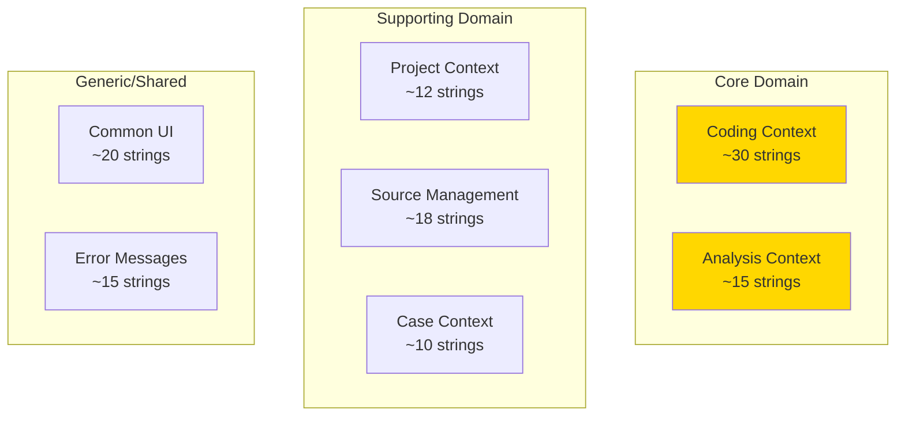
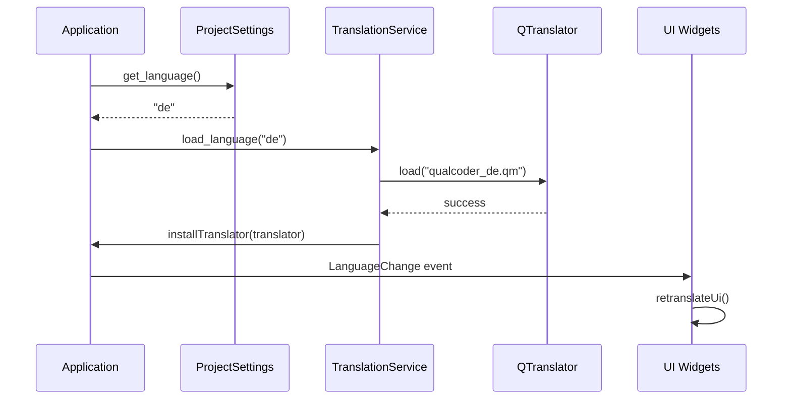
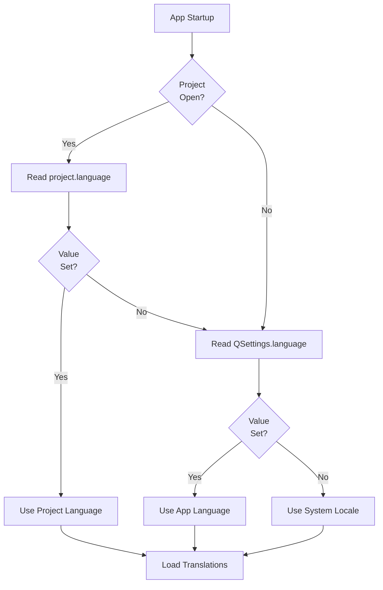
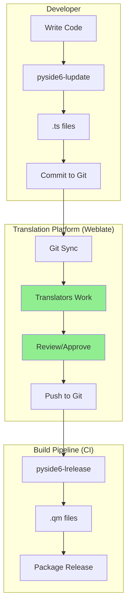

# QualCoder v2: Localization Analysis Report

## Executive Summary

This document provides a comprehensive analysis of internationalization (i18n) requirements for QualCoder v2. It covers:

1. **String Audit** - Inventory of translatable strings by component and bounded context
2. **Framework Evaluation** - Comparison of Qt Linguist vs GNU gettext
3. **Architecture Design** - Translation loading, locale storage, runtime switching
4. **Translation Workflow** - Platform selection and contributor processes

**Key Recommendation:** Use Qt Linguist (`.ts`/`.qm`) as the sole localization framework, replacing v1's hybrid gettext + Qt Linguist approach. This simplifies maintenance while enabling runtime language switching.

---

## Table of Contents

1. [Executive Summary](#executive-summary)
2. [Table of Contents](#table-of-contents)
3. [String Audit](#3-string-audit)
   - [3.1 Presentation Layer Strings](#31-presentation-layer-strings)
   - [3.2 Domain Layer Strings](#32-domain-layer-strings)
   - [3.3 Bounded Context Categorization](#33-bounded-context-categorization)
   - [3.4 v1 Translation Reuse Assessment](#34-v1-translation-reuse-assessment)
4. [Framework Evaluation](#4-framework-evaluation)
   - [4.1 Qt Linguist (.ts/.qm)](#41-qt-linguist-tsqm)
   - [4.2 GNU gettext (.po/.mo)](#42-gnu-gettext-pomo)
   - [4.3 Comparison Matrix](#43-comparison-matrix)
   - [4.4 Recommendation](#44-recommendation)
5. [Architecture Design](#5-architecture-design)
   - [5.1 Translation Loading](#51-translation-loading)
   - [5.2 Locale Preference Storage](#52-locale-preference-storage)
   - [5.3 Runtime Language Switching](#53-runtime-language-switching)
   - [5.4 RTL Support Strategy](#54-rtl-support-strategy)
6. [Translation Workflow](#6-translation-workflow)
   - [6.1 Platform Comparison](#61-platform-comparison)
   - [6.2 Recommended Workflow](#62-recommended-workflow)
   - [6.3 Target Languages](#63-target-languages)
7. [Implementation Roadmap](#7-implementation-roadmap)
8. [References](#8-references)

---

## 3. String Audit

### 3.1 Presentation Layer Strings

The v2 presentation layer contains approximately **100-120 user-facing strings** distributed across components:

#### 3.1.1 By Component Type

| Component | Location | Count | Examples |
|-----------|----------|-------|----------|
| **UI Labels** | `src/presentation/organisms/` | ~50 | "Codes", "Files", "Cases", "Add code", "Search" |
| **Tooltips** | `src/presentation/organisms/` | ~30 | "Previous code instance", "Expand all categories" |
| **Menu Items** | `src/presentation/templates/app_shell.py` | ~10 | "Project", "Coding", "Reports", "Help" |
| **Status Messages** | `src/presentation/templates/app_shell.py` | ~5 | "Ready", "0 files", "Loading..." |
| **Error Messages** | `src/domain/shared/types.py` | ~10 | "Code name already exists", "Invalid selection" |
| **Dialog Buttons** | Various | ~10 | "OK", "Cancel", "Apply", "Save", "Delete" |
| **Empty States** | `src/presentation/organisms/` | ~5 | "No codes yet", "Drop files here" |

#### 3.1.2 Detailed Component Breakdown

| File | Purpose | String Count | Categories |
|------|---------|--------------|------------|
| `organisms/codes_panel.py` | Code tree UI | ~20 | Labels, tooltips, context menu |
| `organisms/files_panel.py` | File browser | ~15 | Labels, tooltips, empty state |
| `organisms/details_panel.py` | Segment details | ~12 | Labels, placeholders |
| `organisms/coding_toolbar.py` | Coding actions | ~8 | Button labels, tooltips |
| `organisms/text_editor_panel.py` | Text display | ~10 | Labels, context menu |
| `templates/app_shell.py` | Main window | ~15 | Menus, status bar |
| `screens/text_coding.py` | Coding screen | ~10 | Labels, titles |

### 3.2 Domain Layer Strings

Domain layer error messages should be translated for user-friendly error handling:

| Category | Location | Count | Examples |
|----------|----------|-------|----------|
| **Validation Errors** | `domain/shared/types.py` | ~8 | "Name cannot be empty", "Value out of range" |
| **Business Rule Violations** | `domain/coding/invariants.py` | ~10 | "Code name already exists", "Circular hierarchy detected" |
| **Operation Failures** | `domain/*/derivers.py` | ~5 | "Cannot delete code with segments" |

**Note:** Domain errors should use error codes internally, with translation happening at the presentation boundary.

### 3.3 Bounded Context Categorization

Strings map to bounded contexts for translation context and maintenance:



| Bounded Context | String Count | Key Areas |
|-----------------|--------------|-----------|
| **Coding** | ~30 | Code tree, segments, categories, annotations |
| **Source Management** | ~18 | File browser, import/export, media types |
| **Analysis** | ~15 | Reports, charts, statistics |
| **Project** | ~12 | Settings, backup, project info |
| **Case** | ~10 | Case list, attributes, membership |
| **Common** | ~20 | Buttons, dialogs, status, navigation |
| **Errors** | ~15 | Validation, business rules, operations |

### 3.4 v1 Translation Reuse Assessment

QualCoder v1 provides translations in 9 languages that can be leveraged:

#### 3.4.1 v1 Translation Files

| Language | Code | gettext (`.po`) | Qt Linguist (`.ts`) | Status |
|----------|------|-----------------|---------------------|--------|
| German | de | `de.po` | `app_de.ts` | Verified |
| English | en | - | - | Source |
| Spanish | es | `es.po` | `app_es.ts` | Improved recently |
| French | fr | `fr.po` | `app_fr.ts` | Exists |
| Italian | it | `it.po` | `app_it.ts` | Exists |
| Japanese | ja | `ja.po` | `app_ja.ts` | Exists |
| Portuguese | pt | `pt.po` | `app_pt.ts` | Exists |
| Swedish | sv | `sv.po` | `app_sv.ts` | Verified |
| Chinese | zh | `zh.po` | `app_zh.ts` | Exists |

#### 3.4.2 Reuse Strategy

**High Reuse Potential (~60% of v2 strings):**
- Common UI elements (OK, Cancel, Delete, Save)
- Bounded context terminology (Codes, Files, Cases, Memos)
- Menu items and navigation
- Standard error messages

**Low Reuse Potential (~40% of v2 strings):**
- New v2 UI patterns (design system components)
- Revised UX copy
- New features not in v1

**Conversion Process:**
```bash
# Extract v1 gettext strings
msgunfmt locale/de/LC_MESSAGES/de.mo -o v1_de.po

# Convert to Qt format (using translate-toolkit)
po2ts v1_de.po v1_de.ts

# Cherry-pick relevant strings to v2 .ts files
```

---

## 4. Framework Evaluation

### 4.1 Qt Linguist (.ts/.qm)

#### Overview

Qt Linguist is Qt's native internationalization system, using XML-based `.ts` source files compiled to binary `.qm` files for runtime.

#### Tooling

| Tool | Purpose | Command |
|------|---------|---------|
| `pyside6-lupdate` | Extract strings from source | `pyside6-lupdate src/ -ts translations/*.ts` |
| `pyside6-lrelease` | Compile `.ts` to `.qm` | `pyside6-lrelease translations/*.ts` |
| `pyside6-linguist` | GUI translation editor | `pyside6-linguist translations/qualcoder_de.ts` |

#### API Usage

```python
from PySide6.QtCore import QCoreApplication, QTranslator

# Mark strings for translation
label.setText(QCoreApplication.translate("CodesPanel", "Codes"))

# Using tr() method in QObject subclasses
self.setWindowTitle(self.tr("QualCoder"))

# Plural forms
count = 5
text = QCoreApplication.translate(
    "CodesPanel",
    "%n code(s) selected",
    "",
    count
)
```

#### Advantages

- Native PySide6 integration
- Runtime language switching via `LanguageChange` events
- Context support (disambiguation)
- Plural forms with CLDR rules
- Visual translation editor
- Build pipeline integration

#### Disadvantages

- Qt-specific format
- Less universal than gettext
- XML verbose compared to PO

### 4.2 GNU gettext (.po/.mo)

#### Overview

GNU gettext is the standard Unix/Linux internationalization system, using text-based `.po` source files compiled to binary `.mo` files.

#### Tooling

| Tool | Purpose | Command |
|------|---------|---------|
| `xgettext` | Extract strings | `xgettext -o messages.pot src/**/*.py` |
| `msgfmt` | Compile `.po` to `.mo` | `msgfmt -o messages.mo messages.po` |
| `poedit` | GUI translation editor | N/A |

#### API Usage

```python
import gettext

# Initialize
translation = gettext.translation('qualcoder', 'locale', languages=['de'])
translation.install()

# Mark strings
_("Codes")

# Plural forms
ngettext("%d code", "%d codes", count) % count
```

#### Advantages

- Industry standard
- Universal format (many tools support PO)
- Simple text format
- v1 translations directly reusable

#### Disadvantages

- Separate from Qt (not native)
- No runtime switch without reload
- Requires manual integration with Qt widgets

### 4.3 Comparison Matrix

| Criteria | Weight | Qt Linguist | GNU gettext | Winner |
|----------|--------|-------------|-------------|--------|
| **PySide6 Integration** | 25% | ⭐⭐⭐⭐⭐ Native | ⭐⭐⭐ Manual | Qt |
| **Runtime Switch** | 20% | ⭐⭐⭐⭐⭐ Events | ⭐⭐ Reload | Qt |
| **Tooling** | 15% | ⭐⭐⭐⭐ Qt tools | ⭐⭐⭐⭐ poedit | Tie |
| **Plural Forms** | 10% | ⭐⭐⭐⭐⭐ CLDR | ⭐⭐⭐⭐⭐ CLDR | Tie |
| **v1 Compatibility** | 10% | ⭐⭐⭐ Conversion | ⭐⭐⭐⭐⭐ Direct | gettext |
| **Maintenance** | 10% | ⭐⭐⭐⭐⭐ Single | ⭐⭐⭐ Hybrid | Qt |
| **Universal Format** | 10% | ⭐⭐⭐ Qt-specific | ⭐⭐⭐⭐⭐ Standard | gettext |

**Weighted Score:** Qt Linguist wins on integration, runtime switching, and maintenance simplicity.

### 4.4 Recommendation

**Use Qt Linguist (`.ts`/`.qm`) as the sole localization framework.**

**Rationale:**

1. **No Qt Designer Files** - v2 has code-only UI, removing the primary driver for v1's hybrid approach
2. **Native Integration** - PySide6's translation APIs are first-class
3. **Runtime Switching** - `LanguageChange` events enable seamless language changes
4. **Maintenance Simplicity** - Single system reduces build complexity and contributor confusion
5. **Future-Proof** - Qt continues active development of i18n features

**Migration Cost:** Low - convert v1 `.po` files using `po2ts` or manual cherry-picking for ~100 strings.

---

## 5. Architecture Design

### 5.1 Translation Loading



#### Translation Service Interface

```python
# src/infrastructure/i18n/protocols.py
from typing import Protocol, Sequence

class TranslationService(Protocol):
    """Protocol for translation services."""

    def available_languages(self) -> Sequence[str]:
        """Return list of available locale codes."""
        ...

    def current_language(self) -> str:
        """Return current locale code."""
        ...

    def load_language(self, locale_code: str) -> bool:
        """Load translations for locale. Returns success."""
        ...

    def switch_language(self, locale_code: str) -> bool:
        """Switch language at runtime. Triggers UI refresh."""
        ...
```

#### Implementation

```python
# src/infrastructure/i18n/qt_translation.py
from PySide6.QtCore import QTranslator, QCoreApplication, QLocale
from pathlib import Path

class QtTranslationService:
    """Qt-based translation service."""

    TRANSLATIONS_PATH = Path(__file__).parent / "translations"
    SUPPORTED_LANGUAGES = ("en", "de", "es", "fr", "it", "ja", "pt", "sv", "zh")

    def __init__(self, app: QCoreApplication):
        self._app = app
        self._translator = QTranslator()
        self._qt_translator = QTranslator()  # For Qt built-in strings
        self._current = "en"

    def available_languages(self) -> tuple[str, ...]:
        return self.SUPPORTED_LANGUAGES

    def current_language(self) -> str:
        return self._current

    def load_language(self, locale_code: str) -> bool:
        if locale_code not in self.SUPPORTED_LANGUAGES:
            return False

        # Load app translations
        qm_path = self.TRANSLATIONS_PATH / f"qualcoder_{locale_code}.qm"
        if qm_path.exists():
            self._translator.load(str(qm_path))
            self._app.installTranslator(self._translator)

        # Load Qt translations (buttons, dialogs)
        qt_locale = QLocale(locale_code)
        self._qt_translator.load(qt_locale, "qtbase", "_",
                                  QLibraryInfo.path(QLibraryInfo.TranslationsPath))
        self._app.installTranslator(self._qt_translator)

        self._current = locale_code
        return True

    def switch_language(self, locale_code: str) -> bool:
        self._app.removeTranslator(self._translator)
        self._app.removeTranslator(self._qt_translator)
        return self.load_language(locale_code)
```

### 5.2 Locale Preference Storage

#### Storage Location

| Scope | Storage | Key | Default |
|-------|---------|-----|---------|
| **Application** | QSettings | `language` | System locale |
| **Project** | SQLite `project` table | `language` | Application setting |

#### Implementation

```python
# Application-level (persists across projects)
from PySide6.QtCore import QSettings

settings = QSettings("QualCoder", "QualCoder")
language = settings.value("language", QLocale.system().name()[:2])

# Project-level (overrides application)
# Stored in project SQLite: SELECT language FROM project WHERE ...
```

#### Locale Resolution Order



### 5.3 Runtime Language Switching

**Recommendation: YES** - Unlike v1's restart requirement, v2 should support runtime language switching.

#### Approach

1. **Event-Based Refresh** - PySide6 widgets receive `LanguageChange` events
2. **Wrapper Function** - Use `tr()` wrapper instead of raw `QCoreApplication.translate()`
3. **Retranslate Pattern** - Widgets implement `changeEvent()` to refresh text

#### Implementation Pattern

```python
from PySide6.QtCore import QEvent, QCoreApplication
from PySide6.QtWidgets import QWidget, QLabel, QPushButton

def tr(text: str, context: str = "QualCoder") -> str:
    """Translation wrapper for consistency."""
    return QCoreApplication.translate(context, text)

class CodesPanel(QWidget):
    def __init__(self):
        super().__init__()
        self._title_label = QLabel()
        self._add_button = QPushButton()
        self._retranslate_ui()

    def _retranslate_ui(self):
        """Update all translatable strings."""
        self._title_label.setText(tr("Codes"))
        self._add_button.setText(tr("Add Code"))
        self._add_button.setToolTip(tr("Create a new code"))

    def changeEvent(self, event: QEvent):
        if event.type() == QEvent.LanguageChange:
            self._retranslate_ui()
        super().changeEvent(event)
```

#### Settings UI

```python
class LanguageSelector(QComboBox):
    """Language selection dropdown."""

    LANGUAGES = {
        "en": "English",
        "de": "Deutsch",
        "es": "Español",
        "fr": "Français",
        "it": "Italiano",
        "ja": "日本語",
        "pt": "Português",
        "sv": "Svenska",
        "zh": "中文",
    }

    def __init__(self, translation_service: TranslationService):
        super().__init__()
        self._service = translation_service
        for code, name in self.LANGUAGES.items():
            self.addItem(name, code)
        self.currentIndexChanged.connect(self._on_language_changed)

    def _on_language_changed(self, index: int):
        locale_code = self.itemData(index)
        self._service.switch_language(locale_code)
```

### 5.4 RTL Support Strategy

Right-to-left (RTL) languages like Arabic, Hebrew, and Persian require layout mirroring.

#### PySide6 RTL Support

PySide6/Qt handles RTL automatically when:
1. `QApplication.setLayoutDirection(Qt.RightToLeft)` is called
2. `QLocale` is set to an RTL language

#### Strategy

| Phase | Action | Languages |
|-------|--------|-----------|
| **v2.0** | LTR languages only | en, de, es, fr, it, ja, pt, sv, zh |
| **v2.1+** | Add RTL support | ar (Arabic), he (Hebrew), fa (Persian) |

#### RTL Implementation (Future)

```python
def set_rtl_layout(app: QApplication, locale_code: str):
    rtl_languages = {"ar", "he", "fa", "ur"}
    if locale_code in rtl_languages:
        app.setLayoutDirection(Qt.RightToLeft)
    else:
        app.setLayoutDirection(Qt.LeftToRight)
```

#### Design Considerations for RTL

- Use `QHBoxLayout` / `QVBoxLayout` (auto-mirror)
- Avoid hardcoded left/right margins in stylesheets
- Test icon directions (arrows, chevrons)
- Ensure text alignment respects layout direction

---

## 6. Translation Workflow

### 6.1 Platform Comparison

| Platform | License | Cost | Git Integration | Translation Memory | Review |
|----------|---------|------|-----------------|-------------------|--------|
| **Weblate** | GPL/Proprietary | Free (self-host), $150+/mo (cloud) | Native | Yes | Voting, approval |
| **Crowdin** | Proprietary | Free (OSS), $50+/mo | Native | Yes | Voting, approval |
| **GitHub** | - | Free | Native | No | PR-based |
| **Transifex** | Proprietary | Free (OSS), $99+/mo | Native | Yes | Voting, approval |

#### Platform Deep Dive

**Weblate (Recommended)**
- Open source, can self-host
- Excellent Git integration (automatic sync)
- Supports `.ts` format natively
- Free for open source projects
- Active development, modern UI

**Crowdin**
- Polished UX, 600+ integrations
- Strong community features
- Good for large projects
- Cost scales with strings/languages

**GitHub-only**
- No extra tooling
- Familiar to contributors
- Limited translation UI (edit XML directly)
- No translation memory

### 6.2 Recommended Workflow



#### Step-by-Step Process

1. **String Extraction** (Developer)
   ```bash
   # Extract all translatable strings
   pyside6-lupdate src/ -ts translations/qualcoder.ts

   # Update language-specific files
   pyside6-lupdate src/ -ts translations/qualcoder_de.ts \
                            translations/qualcoder_es.ts \
                            translations/qualcoder_fr.ts
   ```

2. **Translation** (Translators via Weblate)
   - Log into Weblate
   - Select language
   - Translate strings with context
   - Use translation memory for consistency
   - Mark uncertain translations for review

3. **Review** (Reviewers)
   - Check translations for accuracy
   - Verify context-appropriate wording
   - Approve or suggest changes
   - Weblate voting for community consensus

4. **Build** (CI Pipeline)
   ```yaml
   # .github/workflows/build.yml
   - name: Compile translations
     run: |
       pyside6-lrelease translations/*.ts \
         -qm src/infrastructure/i18n/translations/
   ```

5. **Release** (Distribution)
   - `.qm` files bundled in release
   - Loaded at runtime by `TranslationService`

### 6.3 Target Languages

#### Initial Release (v2.0)

Based on v1 translation quality and user demand:

| Priority | Language | Code | Status | Notes |
|----------|----------|------|--------|-------|
| 1 | English | en | Source | Reference language |
| 2 | German | de | v1 verified | Active community |
| 3 | Spanish | es | v1 improved | Recently updated |
| 4 | French | fr | v1 exists | Needs review |
| 5 | Swedish | sv | v1 verified | Maintainer contributed |

#### Future Expansion (v2.1+)

| Priority | Language | Code | Rationale |
|----------|----------|------|-----------|
| 6 | Chinese | zh | Large user base potential |
| 7 | Portuguese | pt | v1 exists, Brazil demand |
| 8 | Japanese | ja | Academic research community |
| 9 | Italian | it | v1 exists |
| 10 | Arabic | ar | RTL support milestone |

---

## 7. Implementation Roadmap

### Phase 1: Infrastructure (QC-003.04)

**Goal:** Establish translation infrastructure

- [ ] Create `src/infrastructure/i18n/` module structure
- [ ] Implement `TranslationService` protocol and Qt implementation
- [ ] Add locale preference storage (QSettings, project DB)
- [ ] Create `tr()` wrapper function
- [ ] Set up translation directory structure

### Phase 2: String Extraction (QC-003.05)

**Goal:** Extract and organize all translatable strings

- [ ] Add `tr()` calls to all presentation layer components
- [ ] Create `translations/qualcoder.ts` source file
- [ ] Create context files for bounded contexts
- [ ] Document string extraction conventions

### Phase 3: Initial Translations

**Goal:** Provide initial language support

- [ ] Convert v1 `.po` files to `.ts` format
- [ ] Cherry-pick relevant translations
- [ ] Complete German (de) translations
- [ ] Complete Spanish (es) translations

### Phase 4: Workflow Setup

**Goal:** Enable community contributions

- [ ] Set up Weblate instance or cloud account
- [ ] Configure Git sync
- [ ] Document contributor process
- [ ] Add translation status badges to README

### Phase 5: Runtime Switching

**Goal:** Enable language changes without restart

- [ ] Implement `retranslateUi()` pattern in all widgets
- [ ] Add `changeEvent()` handlers
- [ ] Create language settings UI
- [ ] Test all components for proper refresh

---

## 8. References

### Official Documentation

- [Qt Internationalization](https://doc.qt.io/qt-6/internationalization.html)
- [PySide6 Translation Tutorial](https://doc.qt.io/qtforpython-6/tutorials/basictutorial/translations.html)
- [pyside6-lupdate Tool](https://doc.qt.io/qtforpython-6/tools/pyside-lupdate.html)
- [pyside6-lrelease Tool](https://doc.qt.io/qtforpython-6/tools/pyside-lrelease.html)
- [pyside6-linguist Tool](https://doc.qt.io/qtforpython-6/tools/pyside-linguist.html)

### Translation Platforms

- [Weblate Documentation](https://docs.weblate.org/)
- [Crowdin Documentation](https://support.crowdin.com/)
- [Weblate vs Crowdin Comparison](https://stackshare.io/stackups/crowdin-vs-weblate)

### Format Conversion

- [translate-toolkit po2ts](https://docs.translatehouse.org/projects/translate-toolkit/en/latest/commands/po2ts.html)

### QualCoder v1 Reference

- Source: `/Users/sathish.narayanan/Documents/git/qualcoder/`
- Translation loading: `src/qualcoder/__main__.py` (lines 3300-3353)
- gettext files: `src/qualcoder/{lang}.po`
- Qt files: `src/qualcoder/GUI/app_{lang}.ts`

---

## Appendix A: Acceptance Criteria Mapping

| AC # | Requirement | Section | Status |
|------|-------------|---------|--------|
| #1 | Identify all user-facing strings | §3.1 | ✅ |
| #2 | Categorize by component type | §3.1.1 | ✅ |
| #3 | Map to bounded contexts | §3.3 | ✅ |
| #4 | Assess v1 translation reuse | §3.4 | ✅ |
| #5 | Evaluate Qt Linguist | §4.1 | ✅ |
| #6 | Evaluate GNU gettext | §4.2 | ✅ |
| #7 | Create comparison matrix | §4.3 | ✅ |
| #8 | Provide recommendation | §4.4, ADR-003 | ✅ |
| #9 | Design translation loading | §5.1 | ✅ |
| #10 | Design locale storage | §5.2 | ✅ |
| #11 | Design runtime switching | §5.3 | ✅ |
| #12 | Design RTL support | §5.4 | ✅ |
| #13 | Compare translation platforms | §6.1 | ✅ |
| #14 | Design contributor workflow | §6.2 | ✅ |
| #15 | Identify target languages | §6.3 | ✅ |

---

## Appendix B: String Formatting Guidelines

### Named Placeholders (Recommended)

```python
# Good - named placeholders
tr("File {filename} loaded successfully")
tr("{count} codes in {category}")

# Acceptable - Qt-style positional
tr("File %1 loaded in %2 ms").arg(filename).arg(time)

# Avoid - Python format without names
tr("File %s loaded")  # Hard for translators to understand context
```

### Pluralization

```python
# Qt plural forms
count = 5
text = QCoreApplication.translate(
    "CodesPanel",
    "%n code(s) selected",
    "",  # disambiguation
    count
)
# Result: "5 codes selected" (English)
# Result: "5 Codes ausgewählt" (German)
```

### Context Disambiguation

```python
# When same English word has different translations
QCoreApplication.translate("Menu", "File")      # Menu item
QCoreApplication.translate("Dialog", "File")    # Dialog button
```

---

## Appendix C: Text Expansion Guidelines

Different languages require different space for the same content:

| Language | Expansion Factor | Example |
|----------|------------------|---------|
| German | +30% | "Save" → "Speichern" |
| French | +20% | "Save" → "Enregistrer" |
| Finnish | +30% | "Code" → "Koodi" |
| Japanese | -30% | "Settings" → "設定" |
| Chinese | -30% | "Settings" → "设置" |

**Design Recommendations:**
- Avoid fixed-width buttons
- Use `QSizePolicy.Expanding` for labels
- Test UI with German/Finnish for length
- Test UI with CJK for font rendering

---

*Document Version: 1.0*
*Last Updated: 2026-01-30*
*Related ADR: decision-003 localization-framework.md*
