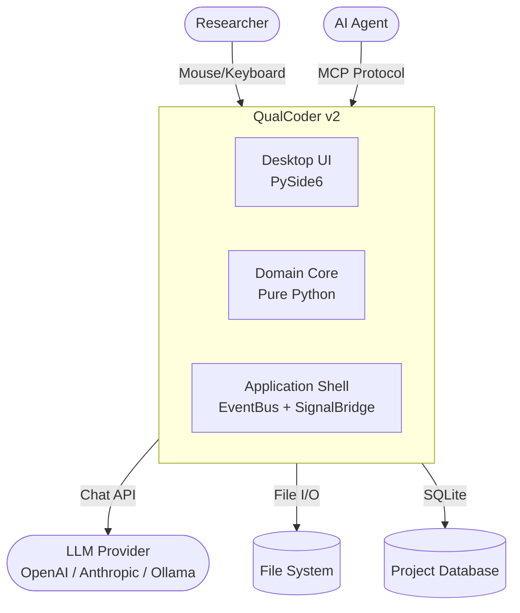

# QualCoder v2 Developer Guide

Welcome to the QualCoder v2 developer documentation.

## What is QualCoder v2?

QualCoder v2 is a desktop qualitative data analysis (QDA) tool for researchers. It enables applying semantic codes to research data (text, audio, video, images, PDFs) and generating insights through analysis.

## System Overview



**Actors:**

- **Researcher** — Qualitative researcher applying codes to research data
- **AI Agent** — Automated agent (Claude Code, Gemini CLI) suggesting codes and generating insights

**External Systems:**

- **LLM Provider** — AI service for code suggestions and analysis
- **File System** — Local storage for project files and media
- **Project Database** — SQLite database for codes, segments, and metadata

## Documentation

| Section | Description |
|---------|-------------|
| [Architecture](ARCHITECTURE.md) | C4 model, bounded contexts, data flow, design decisions |
| [Tutorials](tutorials/README.md) | Hands-on fDDD onboarding through a practical example |
| [Design System](api/index.md) | 180+ PySide6 components, tokens, and patterns |
| [Design Documents](design/) | Detailed specs (Functional DDD, Agent Context) |
| [AI Plans](ai/) | AI-generated planning documents (historical reference) |
| [Archive](archive/) | Historical planning documents |

## Bounded Contexts

| Context | Purpose |
|---------|---------|
| **Coding** | Apply semantic codes to data (includes AI suggestions) |
| **Sources** | Manage documents, audio, video files |
| **Cases** | Group and categorize by participant |
| **Projects** | Project lifecycle management |
| **Settings** | User preferences (theme, font, language) |
| **Folders** | Organize sources in folders |

## Quick Start

**New to the project?**

1. Read the [Architecture Overview](ARCHITECTURE.md)
2. Complete the [Onboarding Tutorial](tutorials/README.md)
3. Explore the [Design System](api/index.md)

**Adding a feature?**

1. Identify the [Bounded Context](ARCHITECTURE.md#9-bounded-contexts)
2. Follow fDDD patterns: Invariants → Derivers → Events
3. Use [Design System components](api/components/index.md) for UI

## Technology Stack

| Layer | Technology |
|-------|------------|
| UI | PySide6 (Qt 6) |
| Database | SQLite |
| Vector Store | ChromaDB |
| AI | OpenAI / Anthropic / Ollama |
| Icons | qtawesome (mdi6) |
| Charts | pyqtgraph |

## Building the Docs

```bash
uv sync --group docs
uv run mkdocs serve
```
