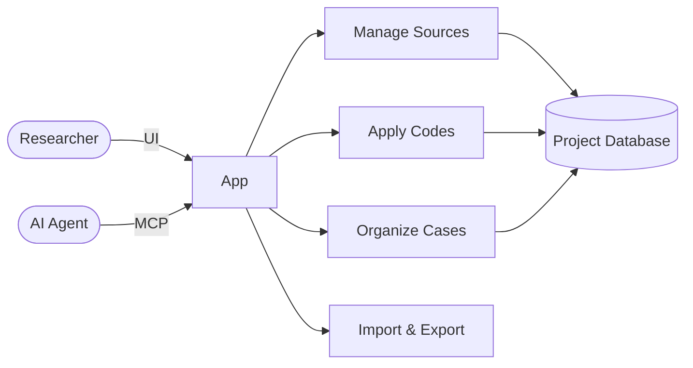

# QualCoder v2

A desktop qualitative data analysis (QDA) tool that helps researchers apply semantic codes to text, audio, video, images, and PDFs — with built-in AI assistance.

---

## Choose Your Path

| | Path | Description |
|---|------|-------------|
| **Researcher** | [User Guide](user-manual/index.md) | Learn how to use QualCoder for your research projects |
| **Developer** | [Developer Guide](ARCHITECTURE.md) | Understand the architecture and contribute code |
| **AI Agent** | [MCP API Reference](api/mcp-api.md) | Connect via MCP to automate coding tasks |
| **Designer** | [Design System](api/index.md) | Browse 180+ reusable PySide6 components |

---

## What Can QualCoder Do?

| Feature | Description |
|---------|-------------|
| **Manage Sources** | Import text, PDF, image, audio, and video files |
| **Apply Codes** | Create codes and apply them to text selections, image regions, or time ranges |
| **Organize Cases** | Group sources by participant, site, or any category |
| **AI Assistance** | Get code suggestions, detect duplicates, and auto-code with AI |
| **Import & Export** | REFI-QDA, RQDA, codebooks, HTML, and CSV formats |
| **MCP Integration** | AI agents can read, code, and analyze your data via the MCP protocol |

---

## Quick Start

=== "Researcher"

    1. [Install QualCoder](user-manual/getting-started.md)
    2. Create or open a project
    3. [Import your sources](user-manual/sources.md) (text, PDF, media)
    4. [Create codes](user-manual/codes.md) and start coding
    5. [Set up AI features](user-manual/ai-features.md) for suggestions

=== "Developer"

    1. Read the [Architecture Overview](ARCHITECTURE.md)
    2. Complete the [Onboarding Tutorial](tutorials/README.md)
    3. Follow fDDD patterns: Invariants → Derivers → Events
    4. Use [Design System components](api/components/index.md) for UI

=== "AI Agent"

    1. [Set up MCP connection](user-manual/mcp-setup.md)
    2. Browse the [MCP API Reference](api/mcp-api.md)
    3. Use tools like `list_codes`, `apply_code`, `suggest_codes`

---

## How It Works

```mermaid
graph LR
    R([Researcher]) -->|UI| App
    A([AI Agent]) -->|MCP| App

    App --> Sources[Manage Sources]
    App --> Codes[Apply Codes]
    App --> Cases[Organize Cases]
    App --> Exchange[Import & Export]

    Sources --> DB[(Project Database)]
    Codes --> DB
    Cases --> DB
```

Both researchers and AI agents work with the same data through different interfaces — every change by either actor is immediately visible to the other.

---

## Technology

| | |
|---|---|
| **Desktop UI** | PySide6 (Qt 6) |
| **Database** | SQLite (local-first) |
| **AI Providers** | OpenAI, Anthropic, Ollama |
| **Agent Protocol** | MCP (Model Context Protocol) |
