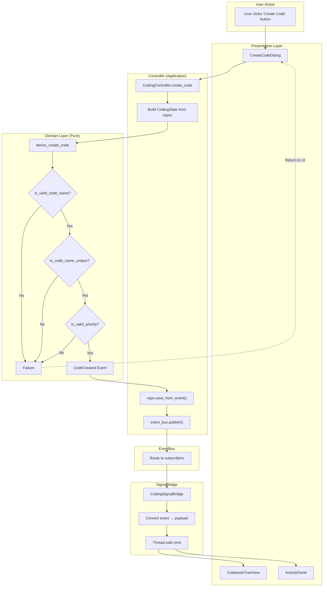
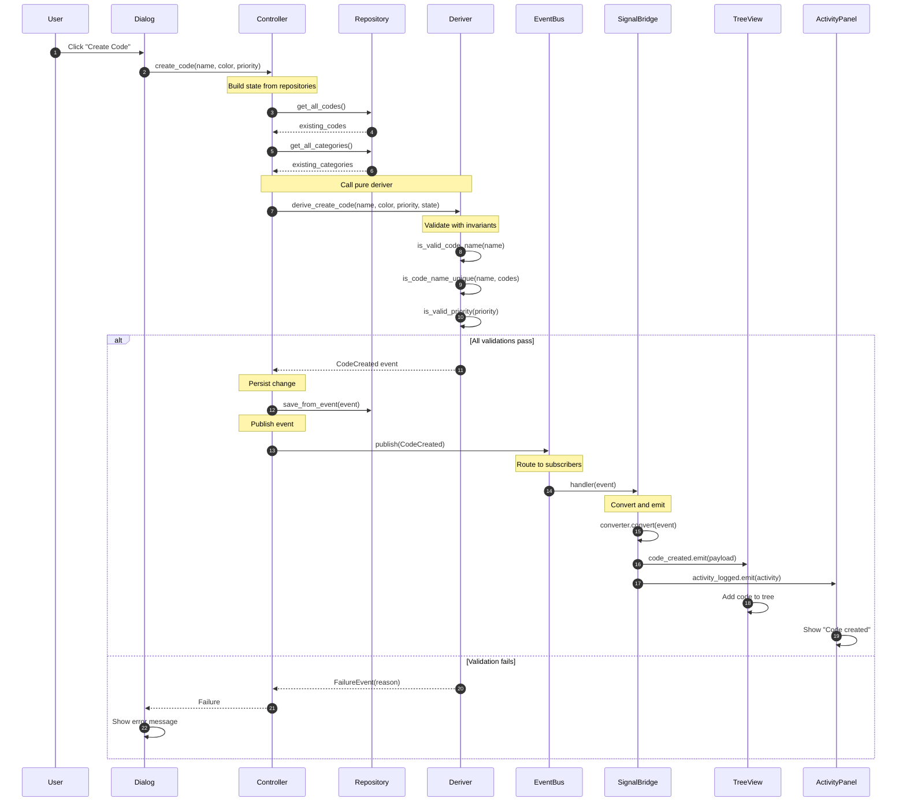
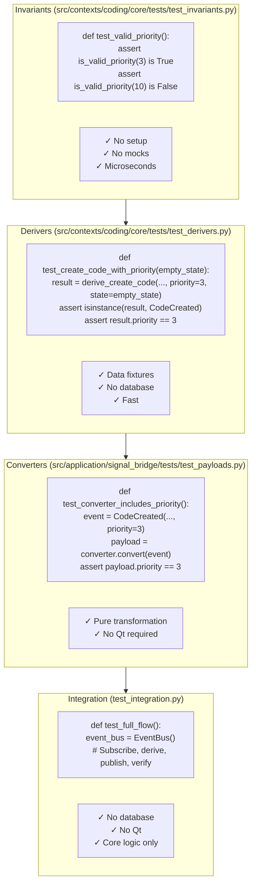

# Part 7: Complete Flow Reference

This is your reference for the complete Code creation flow with priority.

## The Full Diagram



## Layer Summary

| Layer | Responsibility | Pure? | Side Effects |
|-------|---------------|-------|--------------|
| Presentation | User input, rendering | No | UI events |
| Controller | Orchestration | No | Read/write repos, publish |
| Domain | Business logic | **Yes** | None |
| EventBus | Message routing | No | Handler invocation |
| SignalBridge | Event→Signal conversion | No | Thread marshaling |
| UI Widgets | Display updates | No | Qt rendering |

## Key Files

```
src/contexts/coding/core/
├── invariants.py          # is_valid_priority()
├── derivers.py            # derive_create_code()
├── events.py              # CodeCreated (with priority)
├── failure_events.py      # CodeNotCreated, CodeNotDeleted, etc.
└── entities.py            # Code entity

src/contexts/shared/core/
├── types.py               # DomainEvent, typed IDs
└── failure_events.py      # FailureEvent base class

src/application/
├── event_bus.py           # EventBus
└── signal_bridge/
    ├── base.py            # BaseSignalBridge
    └── payloads.py        # CodeCreatedPayload (with priority)
```

## Detailed Sequence



## Testing at Each Layer



## Quick Reference: Adding a New Field

To add a new field (like `priority`) to an existing flow:

```mermaid
flowchart LR
    subgraph Step1 ["1. Invariant"]
        I["core/invariants.py<br/>is_valid_priority()"]
    end

    subgraph Step2 ["2. Failure Event"]
        F["core/failure_events.py<br/>CodeNotCreated.invalid_priority()"]
    end

    subgraph Step3 ["3. Deriver"]
        D["core/derivers.py<br/>Add parameter<br/>Add validation"]
    end

    subgraph Step4 ["4. Event"]
        E["core/events.py<br/>Add field to CodeCreated"]
    end

    subgraph Step5 ["5. Payload"]
        P["signal_bridge/payloads.py<br/>Add field to payload"]
    end

    subgraph Step6 ["6. Converter"]
        C["Map event.priority<br/>to payload.priority"]
    end

    subgraph Step7 ["7. Tests"]
        T["core/tests/test_invariants.py<br/>core/tests/test_derivers.py"]
    end

    Step1 --> Step2 --> Step3 --> Step4 --> Step5 --> Step6 --> Step7
```



### Checklist

1. **Invariant** (`src/contexts/coding/core/invariants.py`)
   - [ ] Add `is_valid_<field>()` pure predicate

2. **Failure Event** (`src/contexts/coding/core/failure_events.py`)
   - [ ] Add factory method to existing failure event class (e.g., `CodeNotCreated.invalid_priority()`)

3. **Deriver** (`src/contexts/coding/core/derivers.py`)
   - [ ] Add parameter to function signature
   - [ ] Add validation call
   - [ ] Return failure event if invalid (e.g., `CodeNotCreated.invalid_priority(value)`)

4. **Event** (`src/contexts/coding/core/events.py`)
   - [ ] Add field to event dataclass
   - [ ] Add to `create()` factory method

5. **Payload** (`src/application/signal_bridge/payloads.py`)
   - [ ] Add field to payload dataclass

6. **Converter** (context-specific)
   - [ ] Map `event.<field>` to `payload.<field>`

7. **Tests**
   - [ ] `src/contexts/coding/core/tests/test_invariants.py`: Test the predicate
   - [ ] `src/contexts/coding/core/tests/test_derivers.py`: Test valid/invalid cases

## You're Ready!

You now understand the complete fDDD architecture:

- **Invariants** validate business rules (pure)
- **Derivers** compose invariants and produce events (pure)
- **Events** are immutable records of what happened
- **EventBus** routes events to subscribers
- **SignalBridge** converts events to UI payloads
- **Payloads** carry data to Qt widgets

For common patterns and recipes, see the appendices.

---

**Appendices:**
- [Appendix A: Common Patterns & Recipes](./appendices/A-common-patterns.md)
- [Appendix B: When to Create New Patterns](./appendices/B-when-to-create.md)
