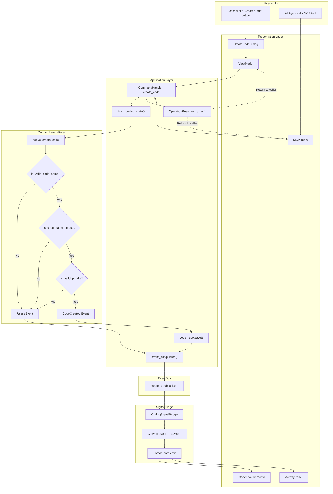
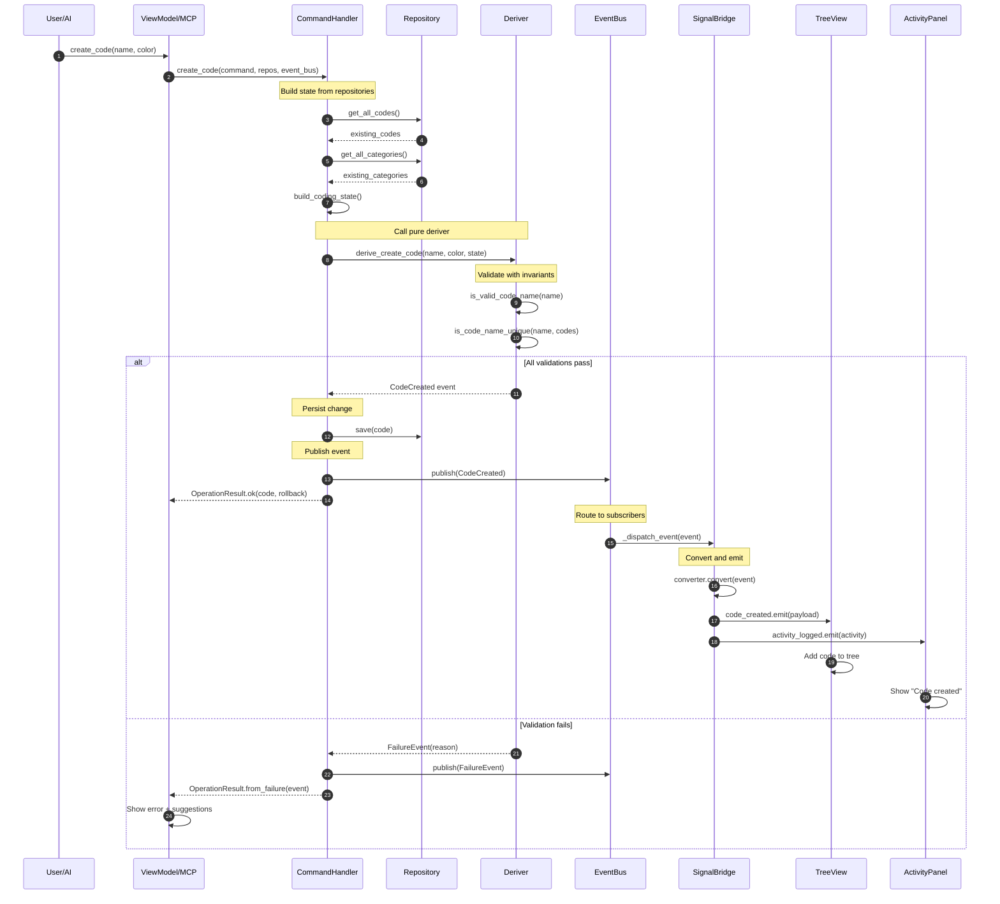
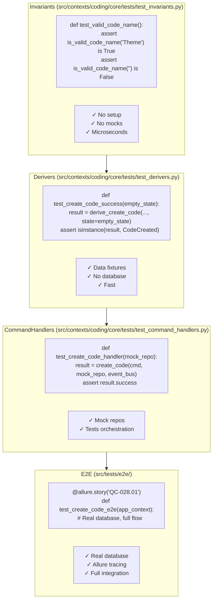

# Part 7: Complete Flow Reference

This is your reference for the complete Code creation flow with priority.

## The Full Diagram



## Layer Summary

| Layer | Responsibility | Pure? | Side Effects |
|-------|---------------|-------|--------------|
| Presentation | User input, rendering, AI interface | No | UI events, MCP responses |
| ViewModel | UI state, calls command handlers | No | Calls command handlers |
| CommandHandler | Orchestration (load state, call deriver, persist, publish) | No | Read/write repos, publish events |
| Domain (Derivers, Invariants) | Business logic | **Yes** | None |
| EventBus | Message routing | No | Handler invocation |
| SignalBridge | Event→Signal conversion | No | Thread marshaling |
| UI Widgets | Display updates | No | Qt rendering |

## Key Files

```
src/contexts/coding/core/
├── invariants.py          # is_valid_code_name(), is_code_name_unique(), etc.
├── derivers.py            # derive_create_code(), derive_rename_code(), etc.
├── events.py              # CodeCreated, CodeRenamed, etc.
├── failure_events.py      # CodeNotCreated, CodeNotDeleted, etc.
├── entities.py            # Code, Category, Segment entities
├── commands.py            # CreateCodeCommand, DeleteCodeCommand, etc.
└── commandHandlers/       # Use cases (orchestration)
    ├── create_code.py     # create_code() handler
    ├── rename_code.py     # rename_code() handler
    └── _state.py          # build_coding_state() helper

src/shared/common/
├── types.py               # DomainEvent, CodeId, SegmentId, etc.
├── operation_result.py    # OperationResult for command handlers
└── failure_events.py      # FailureEvent base class

src/shared/infra/
├── event_bus.py           # EventBus
└── signal_bridge/
    ├── base.py            # BaseSignalBridge
    ├── payloads.py        # SignalPayload, ActivityItem
    └── thread_utils.py    # Thread-safe emission

src/tests/e2e/             # End-to-end tests with Allure
```

## Detailed Sequence



## Testing at Each Layer



## Quick Reference: Adding a New Field

To add a new field (like `priority`) to an existing flow:

```mermaid
flowchart LR
    subgraph Step1 ["1. Invariant"]
        I["core/invariants.py<br/>is_valid_priority()"]
    end

    subgraph Step2 ["2. Failure Event"]
        F["core/failure_events.py<br/>CodeNotCreated.invalid_priority()"]
    end

    subgraph Step3 ["3. Deriver"]
        D["core/derivers.py<br/>Add parameter<br/>Add validation"]
    end

    subgraph Step4 ["4. Event"]
        E["core/events.py<br/>Add field to CodeCreated"]
    end

    subgraph Step5 ["5. Payload"]
        P["signal_bridge/payloads.py<br/>Add field to payload"]
    end

    subgraph Step6 ["6. Converter"]
        C["Map event.priority<br/>to payload.priority"]
    end

    subgraph Step7 ["7. Tests"]
        T["core/tests/test_invariants.py<br/>core/tests/test_derivers.py"]
    end

    Step1 --> Step2 --> Step3 --> Step4 --> Step5 --> Step6 --> Step7
```



### Checklist

1. **Invariant** (`src/contexts/coding/core/invariants.py`)
   - [ ] Add `is_valid_<field>()` pure predicate

2. **Failure Event** (`src/contexts/coding/core/failure_events.py`)
   - [ ] Add factory method to failure event class (e.g., `CodeNotCreated.invalid_priority()`)
   - [ ] Include `suggestions` tuple for recovery hints

3. **Deriver** (`src/contexts/coding/core/derivers.py`)
   - [ ] Add parameter to function signature
   - [ ] Add validation call using invariant
   - [ ] Return failure event if invalid

4. **Event** (`src/contexts/coding/core/events.py`)
   - [ ] Add field to event dataclass
   - [ ] Add to `create()` factory method

5. **Command** (`src/contexts/coding/core/commands.py`)
   - [ ] Add field to command dataclass

6. **CommandHandler** (`src/contexts/coding/core/commandHandlers/`)
   - [ ] Update handler to pass new field to deriver
   - [ ] Update entity creation from event

7. **Payload** (`src/shared/infra/signal_bridge/payloads.py`)
   - [ ] Add field to payload dataclass

8. **Converter** (in signal bridge)
   - [ ] Map `event.<field>` to `payload.<field>`

9. **Tests**
   - [ ] `src/contexts/coding/core/tests/test_invariants.py`: Test the predicate
   - [ ] `src/contexts/coding/core/tests/test_derivers.py`: Test valid/invalid cases
   - [ ] `src/contexts/coding/core/tests/test_command_handlers.py`: Test orchestration
   - [ ] `src/tests/e2e/`: Add E2E test with `@allure.story` decorator

## You're Ready!

You now understand the complete fDDD architecture:

- **Invariants** validate business rules (pure functions)
- **Derivers** compose invariants and produce events (pure functions)
- **Events** are immutable records of what happened
- **CommandHandlers** orchestrate the flow (load state → call deriver → persist → publish)
- **OperationResult** wraps results for UI/AI consumers (error codes, suggestions, rollback)
- **EventBus** routes events to subscribers
- **SignalBridge** converts events to UI payloads
- **Payloads** carry data to Qt widgets
- **ViewModels and MCP Tools** both call the same command handlers

For common patterns and recipes, see the appendices.

---

**Appendices:**
- [Appendix A: Common Patterns & Recipes](./appendices/A-common-patterns.md)
- [Appendix B: When to Create New Patterns](./appendices/B-when-to-create.md)
