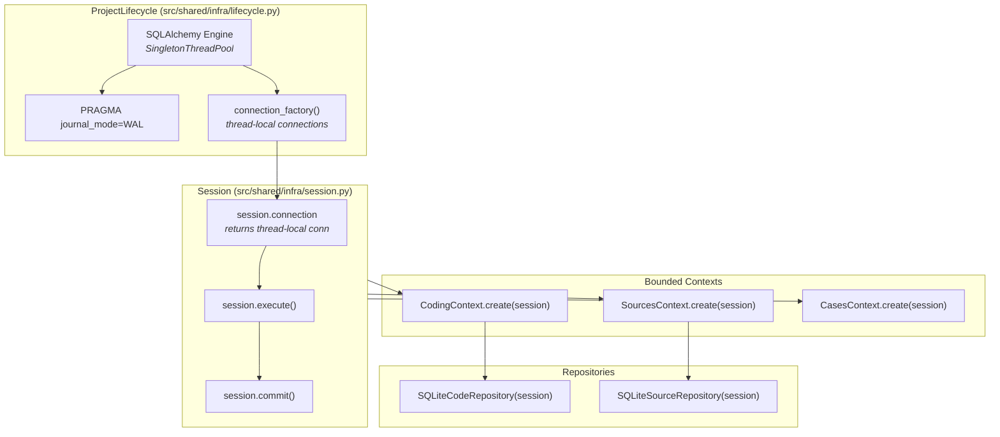
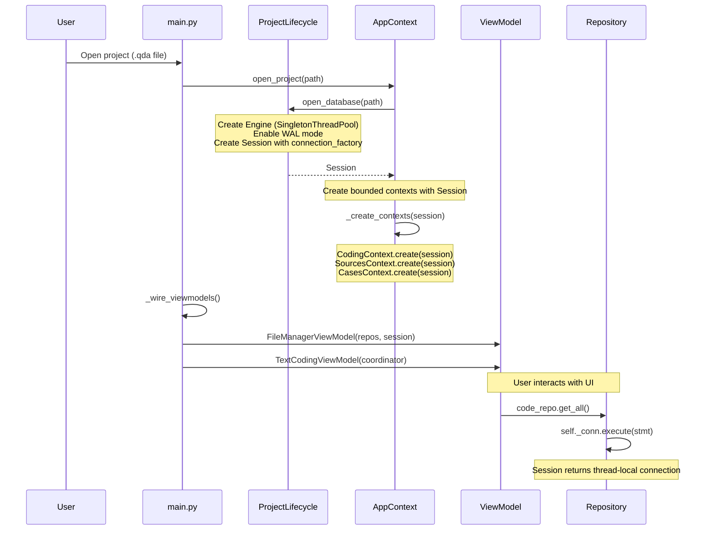

# Part 8: Database Connection Lifecycle

How does QualCoder v2 manage database connections across bounded contexts?

## The Problem

QualCoder uses SQLite, which has strict threading rules:
- A connection created on one thread **cannot be used** on another
- Concurrent writes cause "database is locked" errors
- The MCP server handles requests in worker threads via `asyncio.to_thread()`

## The Solution: ProjectLifecycle + Session



## Step 1: ProjectLifecycle Opens the Database

When a user opens a project, `ProjectLifecycle` creates the engine:

```python
# src/shared/infra/lifecycle.py
class ProjectLifecycle:
    def open_database(self, path: Path) -> Result[Connection, str]:
        # SingletonThreadPool: each thread gets its own connection
        self._engine = create_engine(
            f"sqlite:///{path}",
            echo=False,
            poolclass=SingletonThreadPool,
        )

        # WAL mode allows concurrent readers + single writer
        with self._engine.connect() as setup_conn:
            setup_conn.execute(text("PRAGMA journal_mode=WAL"))
            setup_conn.commit()

        # Main thread connection
        self._connection = self._engine.connect()
        self._thread_local = threading.local()
        self._thread_local.connection = self._connection

        # Session wraps the connection factory
        self._session = Session(
            self._engine,
            connection_factory=self._get_or_create_connection,
        )
```

Key choices:
- **SingletonThreadPool** - Each thread gets its own persistent SQLite connection
- **WAL mode** - Allows concurrent readers alongside a single writer
- **thread-local storage** - Main thread and worker threads never share connections

## Step 2: Session Provides Thread-Local Connections

The `Session` class is what repositories actually receive:

```python
# src/shared/infra/session.py
SQLITE_BUSY_TIMEOUT_MS = 5000

class Session:
    """Project-scoped database session with thread-local connections."""

    def __init__(self, engine, connection_factory=None):
        self._engine = engine
        self._connection_factory = connection_factory

    @property
    def connection(self) -> Connection:
        """Same thread always gets the same connection."""
        if self._connection_factory is not None:
            return self._connection_factory()

    def execute(self, *args, **kwargs):
        return self.connection.execute(*args, **kwargs)

    def commit(self):
        self.connection.commit()
```

When a worker thread (MCP) calls `session.execute()`, the `connection_factory` creates a new connection for that thread with `busy_timeout`:

```python
# src/shared/infra/lifecycle.py
def _get_or_create_connection(self) -> Connection:
    conn = getattr(self._thread_local, "connection", None)
    if conn is not None:
        return conn

    conn = self._engine.connect()
    # Worker threads get busy_timeout to avoid immediate lock errors
    conn.execute(text(f"PRAGMA busy_timeout = {SQLITE_BUSY_TIMEOUT_MS}"))
    conn.commit()
    self._thread_local.connection = conn
    return conn
```

## Step 3: Bounded Contexts Receive Session

When `AppContext` opens a project, it creates each bounded context with the session:

```python
# src/shared/infra/app_context/context.py
def _create_contexts(self, connection, project_path=None):
    session = self.lifecycle.session

    self.coding_context = CodingContext.create(
        connection=session,  # Session, not raw Connection
        event_bus=self.event_bus,
    )
    self.sources_context = SourcesContext.create(
        connection=session,
        event_bus=self.event_bus,
    )
    # ... cases, folders, projects
```

Each context factory passes the session to its repositories:

```python
# src/shared/infra/app_context/bounded_contexts.py
@dataclass
class CodingContext:
    @classmethod
    def create(cls, connection=None, **kwargs):
        return cls(
            code_repo=SQLiteCodeRepository(connection),      # receives Session
            category_repo=SQLiteCategoryRepository(connection),
            segment_repo=SQLiteSegmentRepository(connection),
        )
```

## Step 4: Repositories Use Session Transparently

Repositories treat the session as a connection. Thread safety is invisible to them:

```python
# src/contexts/coding/infra/repositories.py
class SQLiteCodeRepository:
    def __init__(self, connection, outbox=None):
        self._conn = connection  # Actually a Session

    def get_all(self) -> list[Code]:
        stmt = select(code_name).order_by(code_name.c.name)
        result = self._conn.execute(stmt)  # Session.execute() → thread-local conn
        return [self._row_to_code(row) for row in result]
```

## The Complete Wiring



## Project Close

When the project closes, everything is cleaned up:

```python
# src/shared/infra/app_context/context.py
def close_project(self):
    self._clear_contexts()  # Sets all contexts to None
    close_project(lifecycle=self.lifecycle, ...)

# src/shared/infra/lifecycle.py
def _cleanup(self):
    self._connection_factory = None
    self._session = None
    self._thread_local = threading.local()  # Drop all thread-local connections
    self._engine.dispose()                   # Close all pooled connections
```

## Key Takeaways

| Concept | Implementation | Why |
|---------|---------------|-----|
| **SingletonThreadPool** | One connection per thread | SQLite threading rules |
| **WAL mode** | `PRAGMA journal_mode=WAL` | Concurrent read + write |
| **busy_timeout** | 5000ms for worker threads | Retry instead of immediate lock error |
| **Session wrapper** | Thread-local connection factory | Repos don't need threading awareness |
| **Contexts receive Session** | Not raw Connection | Bounded contexts stay thread-safe |
| **Repos are thread-unaware** | Just call `self._conn.execute()` | Session handles thread dispatch |

## Rules

1. **Never create raw SQLAlchemy connections** - Always go through `ProjectLifecycle`
2. **Never pass Connection across threads** - Use `Session` which handles this
3. **Repos should not import threading** - Session abstracts it away
4. **Always close projects properly** - `_cleanup()` disposes the engine

---

**Next:** [Part 9: Threading Model](./09-threading-model.md)
