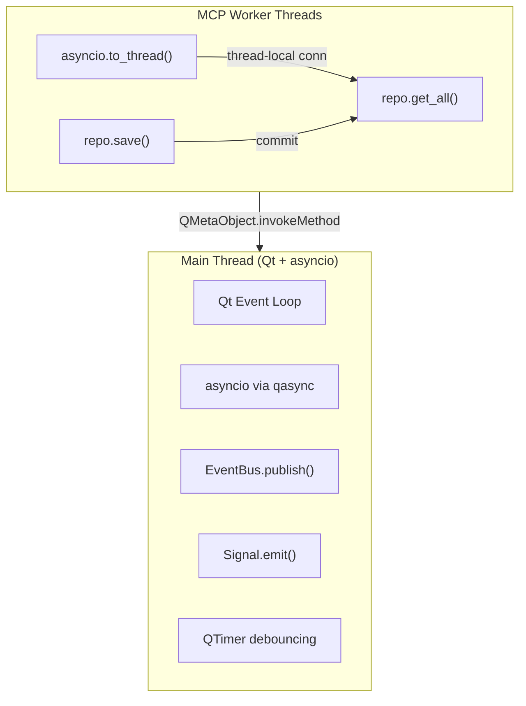
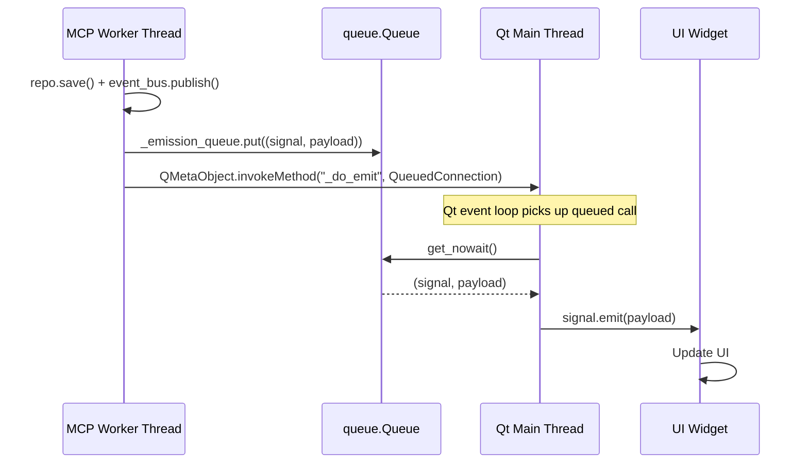

# Part 9: Threading Model

How does QualCoder v2 handle concurrency between the Qt UI and MCP server?

## Two Thread Domains



## Pattern 1: Unified Event Loop (qasync)

QualCoder merges Qt and asyncio into one event loop using `qasync`:

```python
# src/main.py
import qasync

class QualCoderApp:
    def __init__(self):
        self._app = QApplication(sys.argv)
        # qasync merges Qt event loop with asyncio
        # MCP server runs as asyncio coroutine on the same loop
```

**Why this matters:**
- The MCP server (aiohttp) runs on the same loop as Qt
- No separate thread needed for HTTP handling
- Tool calls still use `asyncio.to_thread()` for blocking DB operations

## Pattern 2: Thread-Safe Signal Emission

The most critical threading pattern. Background threads **cannot** call `Signal.emit()` directly - Qt requires signals to be emitted on the main thread.

```python
# src/shared/infra/signal_bridge/base.py
class BaseSignalBridge(QObject):
    def __init__(self):
        self._emission_queue = queue.Queue()  # Thread-safe

    def _emit_threadsafe(self, signal, payload):
        if is_main_thread():
            signal.emit(payload)  # Direct emit
        else:
            # Queue the emission and schedule processing on main thread
            self._emission_queue.put((signal, payload))
            QMetaObject.invokeMethod(
                self,
                "_do_emit",
                Qt.ConnectionType.QueuedConnection,  # Marshals to main thread
            )

    @Slot()
    def _do_emit(self):
        """Drains queue on main thread."""
        while True:
            try:
                signal, payload = self._emission_queue.get_nowait()
                signal.emit(payload)  # Safe: we're on main thread
            except queue.Empty:
                break
```

The flow:



## Pattern 3: EventBus with RLock

The EventBus uses a reentrant lock and **copies handler lists under lock, then invokes without lock**:

```python
# src/shared/infra/event_bus.py
class EventBus:
    def __init__(self):
        self._lock = RLock()  # Reentrant: same thread can re-acquire
        self._handlers: dict[str, list[Handler]] = {}

    def subscribe(self, event_type, handler):
        with self._lock:
            self._handlers.setdefault(event_type, []).append(handler)

    def publish(self, event):
        # Copy under lock
        with self._lock:
            type_handlers = list(self._handlers.get(event_type, []))

        # Invoke WITHOUT lock (prevents deadlock if handler subscribes)
        for handler in type_handlers:
            handler(event)
```

**Why RLock?** A handler might publish another event (reentrant), which needs to acquire the lock again on the same thread.

**Why copy?** If we held the lock during handler invocation, a handler that calls `subscribe()` would deadlock (even with RLock, if handler is on another thread).

## Pattern 4: MCP asyncio.to_thread

MCP tool calls run blocking DB operations in worker threads:

```python
# Conceptual flow in MCP server
async def handle_tool_call(tool_name, args):
    # asyncio.to_thread() runs in ThreadPoolExecutor
    result = await asyncio.to_thread(
        server._execute_tool, tool_name, args, None
    )
    return result

# Inside _execute_tool (runs in worker thread):
def _execute_tool(self, tool_name, args, context):
    # repo.get_all() → Session → thread-local connection
    codes = self._ctx.coding_context.code_repo.get_all()
    return {"codes": codes}
```

Each worker thread gets its own SQLite connection via `SingletonThreadPool` (see [Part 8](./08-database-lifecycle.md)).

## Pattern 5: QTimer Debouncing (No Threading)

For events that arrive frequently (e.g., mutations for version control), use `QTimer` instead of threads:

```python
# src/contexts/projects/infra/version_control_listener.py
class VersionControlListener:
    DEBOUNCE_MS = 500

    def __init__(self, event_bus, ...):
        self._pending_events = []
        self._timer = QTimer()
        self._timer.setSingleShot(True)
        self._timer.setInterval(self.DEBOUNCE_MS)
        self._timer.timeout.connect(self._flush)

    def _on_mutation(self, event):
        self._pending_events.append(event)
        self._timer.start()  # Restarts on each event

    def _flush(self):
        events = tuple(self._pending_events)
        self._pending_events.clear()
        auto_commit(...)
```

**Why no threading?** All events arrive on the main thread (via EventBus), so `QTimer` is simpler and correct.

## Thread Safety Utilities

```python
# src/shared/infra/signal_bridge/thread_utils.py

def is_main_thread() -> bool:
    app = QCoreApplication.instance()
    if app is not None:
        return QThread.currentThread() == app.thread()
    return threading.current_thread() is threading.main_thread()

class ThreadChecker:
    @staticmethod
    def assert_main_thread(context=""):
        if not is_main_thread():
            raise RuntimeError(
                f"Expected main thread but on '{get_current_thread_name()}'"
            )
```

Use `ThreadChecker.assert_main_thread()` in code that must run on the UI thread (e.g., dialog creation).

## Summary

| Pattern | When to Use | Key Mechanism |
|---------|------------|---------------|
| **qasync unified loop** | Always (app startup) | Merge Qt + asyncio |
| **_emit_threadsafe** | Signal emission from any thread | queue.Queue + QMetaObject |
| **RLock + copy** | EventBus publish/subscribe | Copy under lock, invoke without |
| **asyncio.to_thread** | MCP tool DB operations | ThreadPoolExecutor + thread-local conn |
| **QTimer debounce** | High-frequency main-thread events | Single-shot timer restart |

## Rules

1. **Never call `Signal.emit()` from a background thread** - Use `_emit_threadsafe()`
2. **Never share SQLite connections across threads** - Session handles this
3. **Never hold locks during handler invocation** - Copy list, release lock, then invoke
4. **Use daemon threads for I/O** - Clean shutdown via `stop_event`
5. **Prefer QTimer over threading** for main-thread event batching
6. **Use module-level functions** for thread targets to avoid PyO3 issues

---

**Previous:** [Part 8: Database Connection Lifecycle](./08-database-lifecycle.md)

**Appendices:**
- [Appendix A: Common Patterns & Recipes](./appendices/A-common-patterns.md)
- [Appendix B: When to Create New Patterns](./appendices/B-when-to-create.md)
