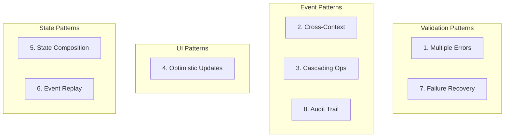
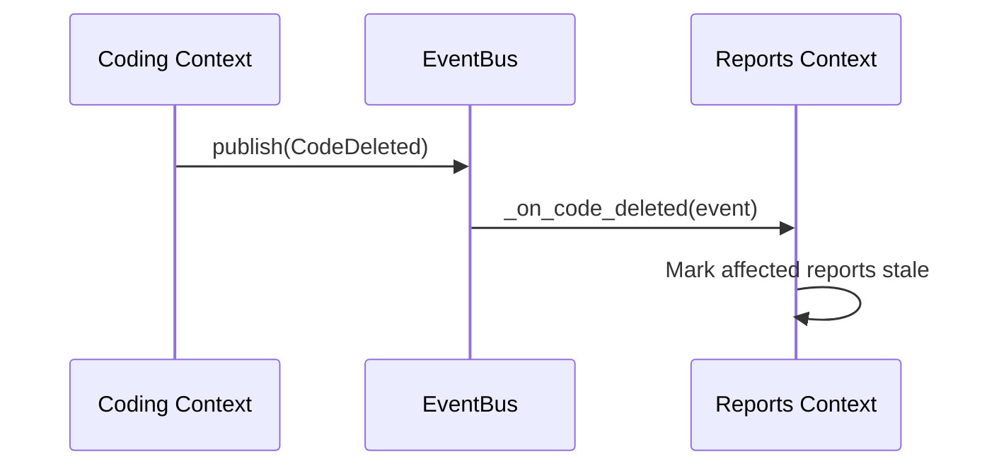
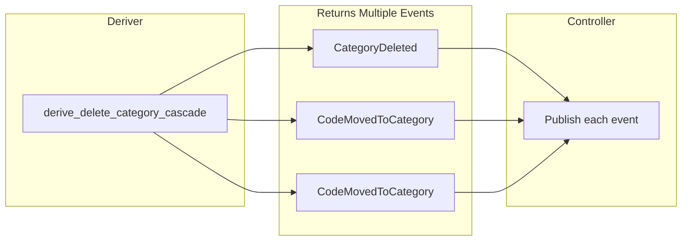
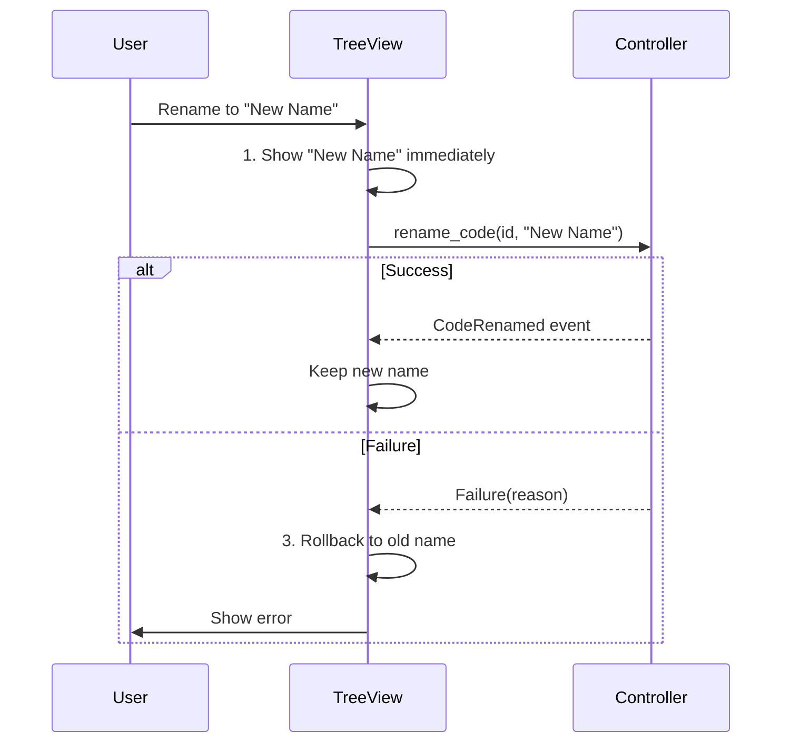
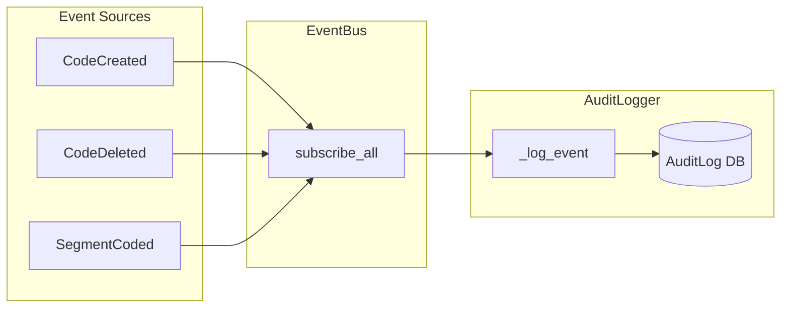

# Appendix A: Common Patterns & Recipes

This appendix provides recipes for common scenarios you'll encounter.

## Patterns Overview



## Pattern 1: Handling Multiple Validation Errors

Sometimes you want to collect all validation errors, not just the first one.

### The Problem

Default derivers return on first failure:

```python
def derive_create_code(name, color, priority, state):
    if not is_valid_code_name(name):
        return Failure(EmptyName())  # Stops here
    if not is_valid_priority(priority):
        return Failure(InvalidPriority(priority))  # Never reached
```

User sees one error, fixes it, sees another, fixes it... frustrating!

### The Solution: Collect Errors

```python
from dataclasses import dataclass
from typing import List

@dataclass(frozen=True)
class ValidationErrors:
    """Multiple validation errors."""
    errors: tuple[object, ...]

    @property
    def message(self) -> str:
        return "; ".join(getattr(e, 'message', str(e)) for e in self.errors)


def derive_create_code_with_all_errors(name, color, priority, state):
    errors: List[object] = []

    if not is_valid_code_name(name):
        errors.append(EmptyName())

    if not is_code_name_unique(name, state.existing_codes):
        errors.append(DuplicateName(name))

    if not is_valid_priority(priority):
        errors.append(InvalidPriority(priority))

    if errors:
        return Failure(ValidationErrors(tuple(errors)))

    return CodeCreated.create(...)
```

### In UI

```python
if isinstance(result, Failure):
    if isinstance(result.failure(), ValidationErrors):
        for error in result.failure().errors:
            self.show_field_error(error)
    else:
        self.show_error(result.failure().message)
```

## Pattern 2: Cross-Context Event Subscription

Bounded contexts can react to each other's events.



### Scenario

When a Code is deleted in the Coding context, the Reports context needs to update any reports using that code.

### Implementation

```python
# In ReportsSignalBridge or a policy handler
class ReportUpdatePolicy:
    def __init__(self, event_bus, report_repo):
        self._report_repo = report_repo
        event_bus.subscribe("coding.code_deleted", self._on_code_deleted)

    def _on_code_deleted(self, event: CodeDeleted):
        # Find reports using this code
        affected_reports = self._report_repo.find_by_code(event.code_id)

        for report in affected_reports:
            # Update or invalidate the report
            self._report_repo.mark_stale(report.id)
```

### Key Points

- Subscribe by event type string
- Handler receives the domain event
- Keep handlers focused (single responsibility)

## Pattern 3: Cascading Operations

One operation triggers others (e.g., deleting a category orphans its codes).



### The Problem

When deleting a category with codes:
1. Category must be deleted
2. Codes must be moved or deleted
3. UI must update for both

### Solution: Deriver Returns Multiple Events

```python
from typing import List

@dataclass(frozen=True)
class CategoryDeletedWithOrphans:
    """Batch event for category deletion."""
    category_deleted: CategoryDeleted
    codes_moved: tuple[CodeMovedToCategory, ...]


def derive_delete_category_cascade(
    category_id: CategoryId,
    orphan_strategy: str,
    state: CodingState,
) -> CategoryDeletedWithOrphans | Failure:
    # ... validation ...

    # Find affected codes
    affected_codes = [c for c in state.existing_codes
                      if c.category_id == category_id]

    # Create move events
    code_moves = tuple(
        CodeMovedToCategory.create(
            code_id=code.id,
            old_category_id=category_id,
            new_category_id=None,  # Move to uncategorized
        )
        for code in affected_codes
    )

    category_event = CategoryDeleted.create(category_id=category_id, ...)

    return CategoryDeletedWithOrphans(
        category_deleted=category_event,
        codes_moved=code_moves,
    )
```

### Controller Publishes All

```python
def delete_category(self, category_id, strategy):
    result = derive_delete_category_cascade(category_id, strategy, state)

    if isinstance(result, Failure):
        return result

    # Publish each event
    self._event_bus.publish(result.category_deleted)
    for move_event in result.codes_moved:
        self._event_bus.publish(move_event)

    return result
```

## Pattern 4: Optimistic UI Updates

Update the UI immediately, then confirm with server/domain.



### Scenario

User renames a code. Show the new name immediately, but validate asynchronously.

### Implementation

```python
class CodebookTreeView:
    def on_code_rename_requested(self, code_id: int, new_name: str):
        # 1. Optimistic update
        item = self.find_item(code_id)
        old_name = item.text()
        item.setText(new_name)

        # 2. Send to controller (might be async)
        result = self.controller.rename_code(code_id, new_name)

        # 3. Rollback if failed
        if isinstance(result, Failure):
            item.setText(old_name)
            self.show_error(result.failure().message)
```

## Pattern 5: State Composition for Complex Validation

Build state incrementally for complex operations.

### Scenario

Applying a code to text requires:
- Code must exist
- Source must exist
- Position must be valid for source length

### Solution: Layered State Building

```python
def apply_code_to_text(self, code_id, source_id, start, end, text):
    # Layer 1: Basic state
    codes = tuple(self._code_repo.get_all())

    # Layer 2: Source-specific state
    source = self._source_repo.get_by_id(source_id)
    source_length = len(source.content) if source else None
    source_exists = source is not None

    # Layer 3: Segment context
    segments = tuple(self._segment_repo.get_by_source(source_id))

    # Compose state
    state = CodingState(
        existing_codes=codes,
        existing_segments=segments,
        source_length=source_length,
        source_exists=source_exists,
    )

    return derive_apply_code_to_text(..., state=state)
```

## Pattern 6: Event Replay for Testing

Replay events to reconstruct state.

### Use Case

Test that a sequence of operations produces expected final state.

```python
def test_complex_scenario():
    """Create codes, merge them, verify final state."""
    event_bus = EventBus(history_size=100)

    # Execute operations
    code1 = derive_create_code("Theme A", ..., empty_state)
    event_bus.publish(code1)

    code2 = derive_create_code("Theme B", ..., state_with(code1))
    event_bus.publish(code2)

    merge = derive_merge_codes(code1.code_id, code2.code_id, state_with(code1, code2))
    event_bus.publish(merge)

    # Inspect history
    history = event_bus.get_history()
    assert len(history) == 3
    assert isinstance(history[2].event, CodesMerged)
```

## Pattern 7: Failure Recovery

Provide suggestions with failures.

### Enhanced Failure Type

```python
@dataclass(frozen=True)
class DuplicateName:
    name: str
    existing_code_id: CodeId
    suggestions: tuple[str, ...] = ()
    message: str = ""

    def __post_init__(self):
        msg = f"Code name '{self.name}' already exists"
        if self.suggestions:
            msg += f". Try: {', '.join(self.suggestions)}"
        object.__setattr__(self, 'message', msg)


def derive_create_code(...):
    if not is_code_name_unique(name, state.existing_codes):
        existing = next(c for c in state.existing_codes
                       if c.name.lower() == name.lower())
        suggestions = generate_name_suggestions(name, state.existing_codes)
        return Failure(DuplicateName(
            name=name,
            existing_code_id=existing.id,
            suggestions=tuple(suggestions),
        ))
```

### In UI

```python
if isinstance(error, DuplicateName):
    self.show_error(error.message)
    if error.suggestions:
        self.show_suggestions(error.suggestions)
```

## Pattern 8: Audit Trail

Events naturally form an audit trail.



### Subscribe to All Events

```python
class AuditLogger:
    def __init__(self, event_bus, log_repo):
        event_bus.subscribe_all(self._log_event)

    def _log_event(self, event):
        self._log_repo.save(AuditEntry(
            timestamp=event.occurred_at,
            event_type=type(event).__name__,
            event_id=event.event_id,
            data=asdict(event),  # Serialize event
        ))
```

### Query Audit Trail

```python
def get_code_history(code_id: CodeId) -> List[AuditEntry]:
    return audit_repo.find_by_entity("code", code_id.value)
```

## Summary

These patterns help you:

1. **Multiple errors** - Collect all validation issues
2. **Cross-context** - React to events from other contexts
3. **Cascading** - Handle related operations together
4. **Optimistic UI** - Update immediately, rollback on failure
5. **State composition** - Build validation state incrementally
6. **Event replay** - Test complex scenarios
7. **Recovery suggestions** - Help users fix errors
8. **Audit trail** - Track all changes automatically

Each pattern leverages the fDDD architecture's strengths: pure functions, explicit data, and event-driven communication.
