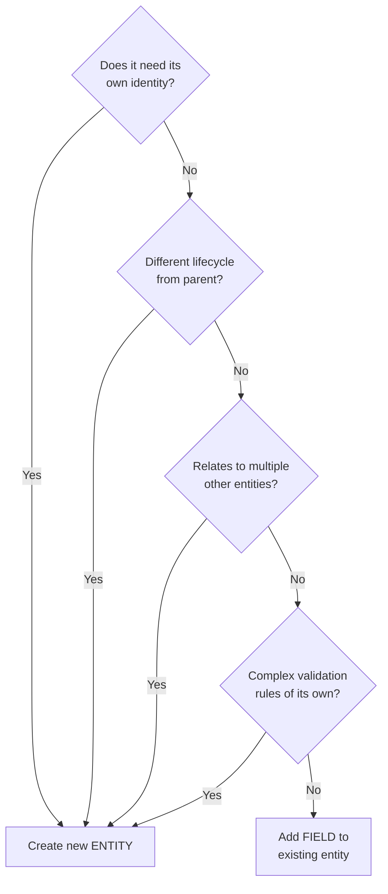
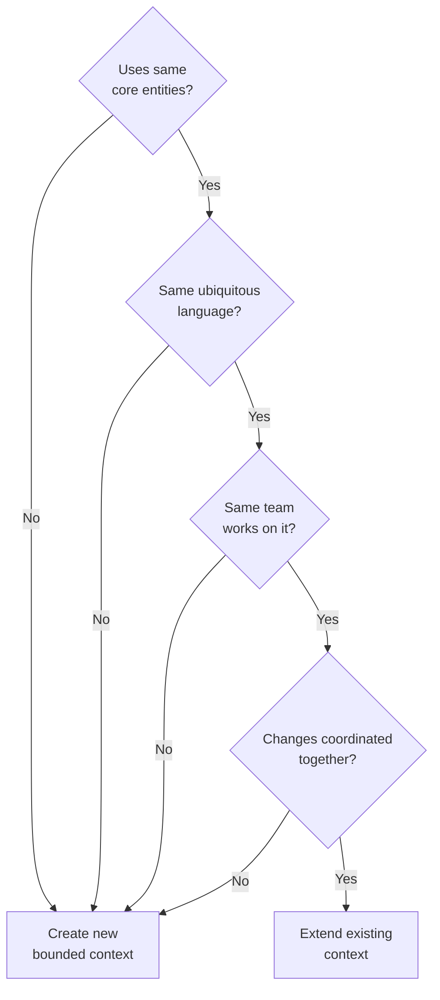
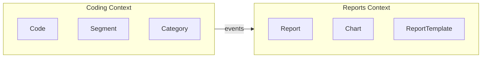
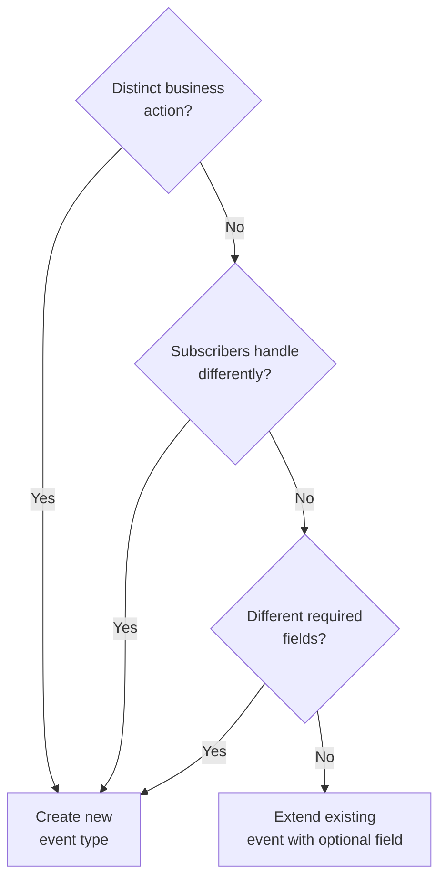
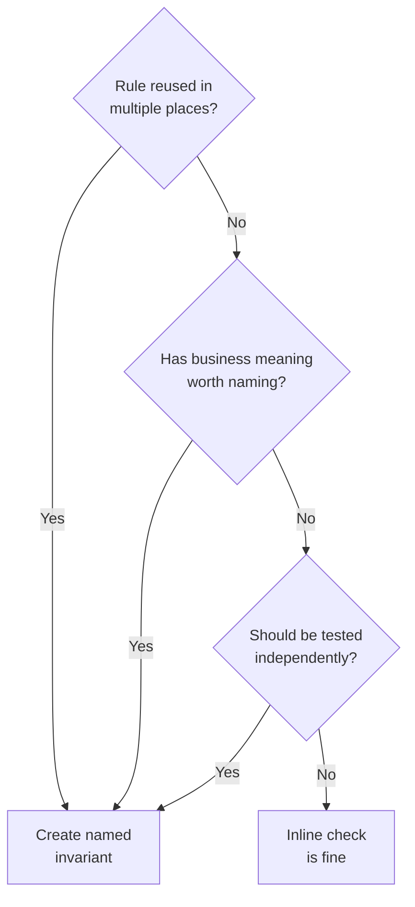
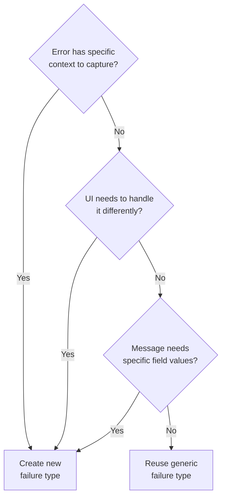
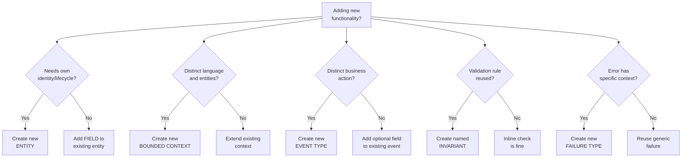

# Appendix B: When to Create New Patterns

This appendix helps you decide when to create new entities, contexts, or event types.

## Decision 1: New Entity vs. New Field

**Question:** Should I add a field to an existing entity, or create a new entity?



### Add a Field When:

- The data belongs to the same aggregate root
- It shares the same lifecycle (created/deleted together)
- Validation rules are related to existing rules
- It doesn't introduce a new identity

**Example:** Adding `priority` to Code

```python
# Good: Priority is an attribute of Code
@dataclass(frozen=True)
class Code:
    id: CodeId
    name: str
    color: Color
    priority: Optional[int] = None  # Just add the field
```

### Create a New Entity When:

- It has its own identity (needs its own ID)
- It has a different lifecycle
- It relates to multiple other entities
- It has complex validation rules of its own

**Example:** Tags (many-to-many with Codes)

```python
# Good: Tag is its own entity
@dataclass(frozen=True)
class Tag:
    id: TagId          # Own identity
    name: str
    color: Color

@dataclass(frozen=True)
class CodeTag:         # Junction entity
    code_id: CodeId
    tag_id: TagId
```

Not just a field on Code, because:
- Tags can exist independently
- One Tag can be on multiple Codes
- Tags have their own CRUD operations

## Decision 2: New Bounded Context vs. Extending Existing

**Question:** Should this feature be a new bounded context, or part of an existing one?



### Extend Existing Context When:

- The new feature uses the same core entities
- It shares the same ubiquitous language
- Changes would be coordinated together
- The team working on it is the same

**Example:** Adding priority to Coding context

Priority is part of how researchers organize codes. It uses Code entities and the same language ("high priority codes").

### Create New Context When:

- It has distinct entities and language
- Different teams might work on it
- It could be deployed/scaled independently
- It only needs to react to other contexts' events

**Example:** Reports context



Reports:
- Has its own entities (Report, ReportTemplate, Chart)
- Uses different language ("generate report", "export PDF")
- Can be developed independently
- Just subscribes to Coding events

## Decision 3: New Event Type vs. Reusing Existing

**Question:** Should I create a new event type, or can I reuse/extend an existing one?



### Reuse/Extend When:

- It's a variation of the same business action
- Subscribers would handle it the same way
- The extra data is optional

**Example:** Adding priority to CodeCreated

```python
# Good: Just add the field
@dataclass(frozen=True)
class CodeCreated(DomainEvent):
    code_id: CodeId
    name: str
    color: Color
    priority: Optional[int] = None  # Optional, backwards compatible
```

Existing subscribers still work (they ignore `priority`).

### Create New Event When:

- It represents a distinct business action
- Subscribers need to handle it differently
- It has different required fields

**Example:** CodePriorityChanged

```python
# Good: Distinct action, distinct event
@dataclass(frozen=True)
class CodePriorityChanged(DomainEvent):
    code_id: CodeId
    old_priority: Optional[int]
    new_priority: Optional[int]
```

This is a separate action from creating a code. UI might:
- Show "Priority changed" in activity feed
- Update priority indicator without full refresh
- Trigger priority-based notifications

## Decision 4: New Invariant vs. Inline Check

**Question:** Should I create a named invariant, or just check inline?



### Create Named Invariant When:

- The rule is reused in multiple places
- The rule has business meaning worth naming
- It helps documentation/understanding
- It should be tested independently

**Example:** `is_valid_priority`

```python
# Good: Named, reusable, testable
def is_valid_priority(priority: Optional[int]) -> bool:
    """Priority must be 1-5, or None."""
    if priority is None:
        return True
    return 1 <= priority <= 5
```

Used in:
- `derive_create_code`
- `derive_update_code_priority`
- Potentially in UI validation

### Inline Check When:

- It's a one-off, context-specific check
- The logic is trivial and obvious
- It would clutter the invariants module

**Example:** Simple null check

```python
# Fine: Inline for obvious checks
if category_id is not None:
    if not does_category_exist(category_id, state.existing_categories):
        return CodeNotCreated.category_not_found(category_id)
```

The `category_id is not None` check doesn't need a named invariant.

## Decision 5: New Failure Event Reason vs. Reusing Existing

**Question:** Should I create a new failure event reason, or reuse an existing one?



### Create New Failure Event Reason When:

- The error has specific context to capture
- UI needs to handle it differently
- It helps debugging/logging
- The message needs specific field values

**Example:** `CodeNotCreated.invalid_priority()`

```python
@dataclass(frozen=True)
class CodeNotCreated(FailureEvent):
    priority_value: int | None = None  # Capture the bad value

    @classmethod
    def invalid_priority(cls, value: int) -> "CodeNotCreated":
        return cls(
            event_type="CODE_NOT_CREATED/INVALID_PRIORITY",
            priority_value=value,
            ...
        )

    @property
    def message(self) -> str:
        if self.reason == "INVALID_PRIORITY":
            return f"Priority must be 1-5, got {self.priority_value}"
        ...
```

UI can show: "Priority must be 1-5, got 10" with the actual bad value.

### Reuse Existing Failure Event Reason When:

- The error is truly generic
- No specific context helps
- It's a rare edge case

**Example:** Generic validation error

```python
# Sometimes fine for rare cases - use a generic reason
return CodeNotCreated(
    event_type="CODE_NOT_CREATED/VALIDATION_ERROR",
    ...
)
```

But usually, a specific reason is better for debugging and UI handling.

## Master Decision Tree



## Practical Examples

### Example 1: Adding "Due Date" to Codes

**Analysis:**
- Due date is an attribute of Code (same lifecycle) → **Add field**
- Still Coding context (organizing codes) → **Extend existing**
- Setting due date is distinct from creating → **New event** (`CodeDueDateSet`)
- Due date validation is reusable → **New invariant** (`is_valid_due_date`)
- Invalid date has specific info → **New failure** (`InvalidDueDate`)

### Example 2: Adding User Permissions

**Analysis:**
- Users have own identity and lifecycle → **New entity** (`User`, `Permission`)
- Permissions are cross-cutting, own language → **New context** (`Auth`)
- Each permission action is distinct → **New events** (`PermissionGranted`, etc.)
- Permission rules are complex → **New invariants**
- Permission errors need context → **New failures**

### Example 3: Adding Code Description

**Analysis:**
- Description is an attribute of Code → **Add field**
- Same context → **Extend existing**
- Updating description is like memo → **Extend `CodeMemoUpdated`** or rename to `CodeDescriptionUpdated`
- Validation is simple (max length) → **New invariant** (`is_valid_description`)
- Empty/too long have context → **New failures** (`DescriptionTooLong`)

## Summary

When in doubt:

1. **Start simple** - Add a field before creating an entity
2. **Keep contexts focused** - Don't merge unrelated concerns
3. **Name things explicitly** - New event types are cheap
4. **Test drives design** - If hard to test, probably wrong structure
5. **Ask the domain expert** - Does this match how they think about it?

The fDDD architecture is flexible. You can always refactor as understanding grows.
