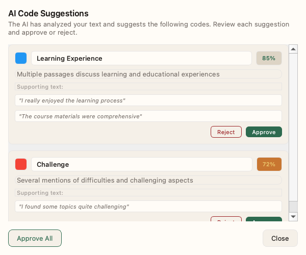

# AI-Assisted Features

QualCoder v2 includes AI-powered features to accelerate your qualitative analysis while keeping you in control.

> **Info: Human-in-the-Loop**
>
> All AI features are designed as suggestions. You always review and approve before changes are made to your data.

## Code Suggestions

The AI analyzes your documents and suggests new codes based on patterns it detects.

### Getting Suggestions

1. Click **AI > Suggest Codes** from the menu
2. The AI analyzes your document content
3. Review the suggestions (each shows name, description, and confidence level)
4. **Approve** to add, **Reject** to dismiss, or **Edit** to modify before approving

## Duplicate Detection

Over time, you may create similar or redundant codes. The duplicate detector identifies potential matches.

### Finding Duplicates

1. Click **AI > Find Duplicates**
2. The AI compares all codes using semantic similarity
3. Review candidate pairs (each shows code names, similarity %, and segment counts)
4. **Merge A → B** to combine codes, or **Dismiss** if they're not duplicates

> **Tip: Similarity Threshold**
> - **90%+** - Very likely duplicates
> - **70-90%** - Possibly related, review carefully
> - **Below 70%** - Probably distinct concepts

## Auto-Code

Automatically apply codes to text matching a pattern.

### Pattern-Based Auto-Coding

1. Click **AI > Auto-Code**
2. Enter a search pattern:
   - Plain text: `"interview"`
   - Regex: `"participant\s+\d+"`
3. Select the code to apply
4. Click **Preview** to see matches
5. Click **Apply All** to code all matches

### Auto-Code by Speaker

For transcripts with speaker labels:

1. Click **AI > Auto-Code by Speaker**
2. Select a speaker (e.g., "Interviewer", "P01")
3. Select the code to apply
4. All text by that speaker is coded

## Find Similar

Find passages similar to a coded segment.

### Using Find Similar

1. Select a coded segment
2. Click **AI > Find Similar**
3. Review passages with similar meaning
4. Apply the same code to matches

> **Tip: Semantic Search**
>
> This uses semantic similarity, not just keyword matching. It finds passages with similar meaning even if they use different words.

## AI Agent Integration

QualCoder v2 supports AI agents (like Claude Code) working alongside human researchers via the MCP protocol.

See [MCP Setup Guide](./mcp-setup.md) for configuration and available tools.

## Best Practices

> **Review All Suggestions**
> - Never blindly accept AI suggestions
> - Check if suggested codes fit your conceptual framework
> - Consider if distinctions are meaningful for your research

> **Iterative Refinement**
> - Start with AI suggestions as a first pass
> - Refine and merge codes as understanding develops
> - Use duplicate detection periodically

> **Document Decisions**
> - Add memos explaining why you accepted/rejected suggestions
> - Note merge decisions in code memos
> - Keep an audit trail of AI-assisted changes
