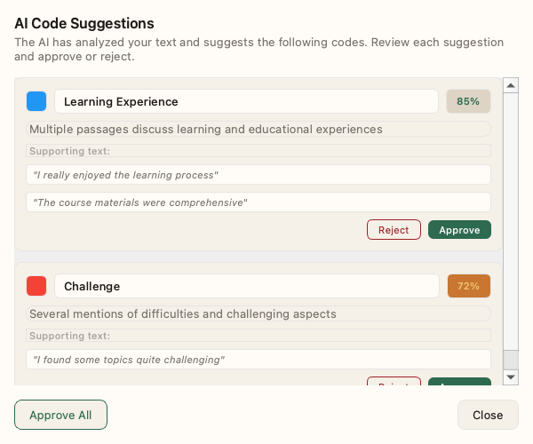
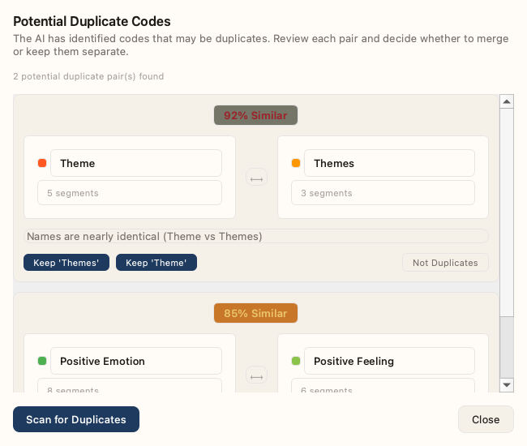
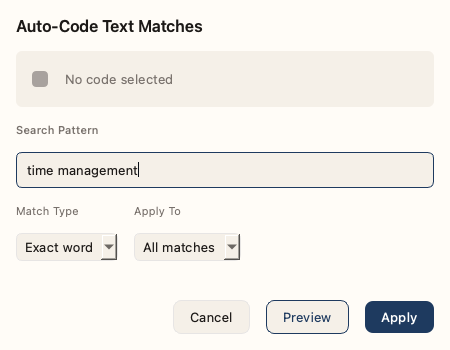
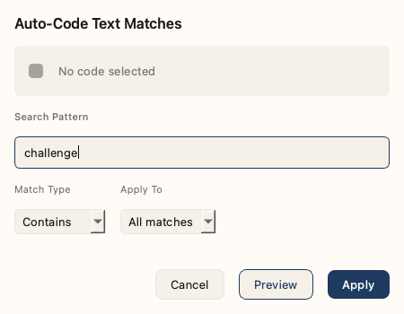

# AI-Assisted Features

QualCoder v2 includes AI-powered features to accelerate your qualitative analysis while keeping you in control.

> **Info: Human-in-the-Loop**
>
> All AI features are designed as suggestions. You always review and approve before changes are made to your data.

## Code Suggestions

The AI analyzes your documents and suggests new codes based on patterns it detects.

### Getting Suggestions

1. Click **AI > Suggest Codes** from the menu
2. The AI analyzes your document content
3. Review the suggestions (each shows name, description, and confidence level)
4. **Approve** to add, **Reject** to dismiss, or **Edit** to modify before approving

## Duplicate Detection

Over time, you may create similar or redundant codes. The duplicate detector identifies potential matches.

### Finding Duplicates

1. Click **AI > Find Duplicates**
2. The AI compares all codes using token-level similarity (word matching, not character matching)
3. Review candidate pairs (each shows code names, similarity %, and segment counts)
4. **Merge A → B** to combine codes, or **Dismiss** if they're not duplicates

> **Tip: Similarity Threshold**
> - **90%+** - Very likely duplicates
> - **70-90%** - Possibly related, review carefully
> - **Below 70%** - Probably distinct concepts

> **How It Works**
>
> Duplicate detection uses word-level (token) matching rather than character-level comparison. This means codes like "Sports & Recreation" and "Trust & Verification" are correctly identified as distinct, even though they share similar character patterns. When both codes have memos, their descriptions are also compared for a more accurate score.

## Auto-Code

Automatically apply codes to text matching a pattern.

### Pattern-Based Auto-Coding

1. Click **AI > Auto-Code**
2. Enter a search pattern:
   - Plain text: `"interview"`
   - Regex: `"participant\s+\d+"`
3. Select the code to apply
4. Click **Preview** to see matches
5. Click **Apply All** to code all matches

*The Auto-Code dialog showing pattern entry and match options.*

*Preview of matches before applying the code.*

### Auto-Code by Speaker

For transcripts with speaker labels:

1. Click **AI > Auto-Code by Speaker**
2. Select a speaker (e.g., "Interviewer", "P01")
3. Select the code to apply
4. All text by that speaker is coded

## Find Similar

Find passages similar to a coded segment.

### Using Find Similar

1. Select a coded segment
2. Click **AI > Find Similar**
3. Review passages with similar meaning
4. Apply the same code to matches

> **Tip: Semantic Search**
>
> This uses semantic similarity, not just keyword matching. It finds passages with similar meaning even if they use different words.

## AI Agent Integration

QualCoder v2 supports AI agents (like Claude Code) working alongside human researchers via the MCP protocol. The agent can:

- **Open and close projects** programmatically for automated workflows
- **Add text sources** directly from agent-generated or agent-collected content
- **Organize sources** into folders (create, rename, delete folders; move sources)
- **Remove sources** with a safe preview-then-confirm workflow
- **Read and analyze** document content, suggest codes, and apply coding
- **Manage codes** — rename codes, update memos, merge overlapping codes, delete irrelevant codes
- **Organize themes** — create categories, move codes into categories, list category hierarchy

### Trust Levels

Agent tools operate at different trust levels for safety:

| Level | Meaning | Example Tools |
|-------|---------|---------------|
| T1 (Autonomous) | Agent acts freely | `get_project_context`, `list_sources` |
| T2 (Notify) | Agent acts, researcher is notified | `open_project`, `close_project` |
| T3 (Suggest) | Agent proposes, researcher confirms | `add_text_source`, `remove_source` |

Destructive operations like `remove_source` default to **preview mode** — the agent shows what would be affected before you approve the action.

### Code Management Tools

Agents can perform the full qualitative analysis workflow using these code management tools:

| Tool | Purpose | Thematic Analysis Phase |
|------|---------|------------------------|
| `rename_code` | Rename a code | Phase 5: Defining Themes |
| `update_code_memo` | Set/update code definitions | Phase 5: Defining Themes |
| `create_category` | Create theme categories | Phase 3: Searching for Themes |
| `move_code_to_category` | Organize codes under themes | Phase 3: Searching for Themes |
| `merge_codes` | Consolidate overlapping codes | Phase 4: Reviewing Themes |
| `delete_code` | Remove irrelevant codes | Phase 4: Reviewing Themes |
| `list_categories` | View thematic structure | All phases |

These tools delegate to domain command handlers, ensuring proper event publishing and UI refresh via SignalBridge.

See [MCP Setup Guide](./mcp-setup.md) for configuration and the full list of available tools.

## Best Practices

> **Review All Suggestions**
> - Never blindly accept AI suggestions
> - Check if suggested codes fit your conceptual framework
> - Consider if distinctions are meaningful for your research

> **Iterative Refinement**
> - Start with AI suggestions as a first pass
> - Refine and merge codes as understanding develops
> - Use duplicate detection periodically

> **Document Decisions**
> - Add memos explaining why you accepted/rejected suggestions
> - Note merge decisions in code memos
> - Keep an audit trail of AI-assisted changes
