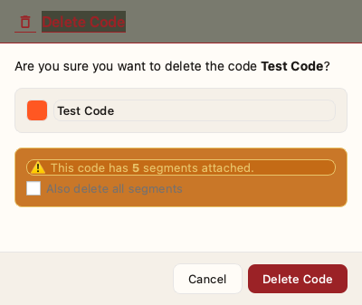

# Managing Codes

Codes are labels you apply to segments of your data. They help categorize and analyze patterns in your research.

## Understanding Codes

A **code** represents a concept, theme, or category in your data. Each code has:

- **Name** - A descriptive label (e.g., "Positive Experience")
- **Color** - Visual identifier for highlighting
- **Memo** - Optional notes about the code's meaning

## Creating Codes

### Create a New Code

1. In the **Coding** screen, press `N` (or click the **+** button)
2. Enter a code name
3. Select a color from the palette or enter a custom hex color
4. Optionally add a description
5. Click **Create Code**


> **Tip: Hex Colors**
>
> Hex colors start with `#` followed by 6 characters (e.g., `#FF5733`).

## Organizing Codes

### Create Categories

Categories group related codes into a hierarchy:

1. Click **Create Category**
2. Enter a category name
3. Optionally select a parent category for nesting
4. Add an optional memo to describe the category
5. Click **Create**


### Hierarchy Example

```
Emotions (category)
├── Positive (code)
│   ├── Joy (code)
│   └── Gratitude (code)
└── Negative (code)
    ├── Frustration (code)
    └── Disappointment (code)
```

## Editing Codes

### Rename or Recolor

1. Right-click a code in the code list
2. Select **Edit**
3. Modify the name, color, or memo
4. Click **Save**

### Add a Memo

Memos help document what a code means and when to use it:

1. Right-click a code
2. Select **Edit Memo**
3. Enter your description
4. Click **Save**

> **Tip: Good Memo Practice**
>
> Include:
> - Definition of the code
> - Examples of when to apply it
> - Boundaries (what it doesn't include)

## Deleting Codes

1. Right-click a code and select **Delete**
2. If the code has coded segments, you'll see a warning with options:
   - **Delete code only** - Removes the code but keeps segments (they become orphaned)
   - **Delete code and segments** - Removes both
3. Click **Delete** to confirm



## AI-Assisted Code Management

### Suggest New Codes

The AI can analyze your data and suggest new codes:

1. Click **AI > Suggest Codes**
2. Review the suggestions (each shows name, description, and confidence level)
3. Click **Approve** to add a code, or **Reject** to dismiss


### Detect Duplicate Codes

Over time, similar codes may accumulate. The duplicate detector helps clean up:

1. Click **AI > Find Duplicates**
2. Review candidate pairs (each shows code names, similarity percentage, and segment counts)
3. Click **Merge A → B** to combine codes, or **Dismiss** if they're not duplicates


## Best Practices

> **Code Naming**
> - Use clear, descriptive names
> - Be consistent with verb tense ("Expressing" vs "Expressed")
> - Avoid overly long names

> **Color Usage**
> - Use similar colors for related codes
> - Reserve bright colors for important codes
> - Consider colorblind-friendly palettes

> **Categories**
> - Don't over-categorize early
> - Let categories emerge from your data
> - Reorganize as your understanding grows

## Next Steps

With your coding scheme ready:

1. [Start coding your text](coding.md)
2. [Use auto-code for patterns](ai-features.md)
