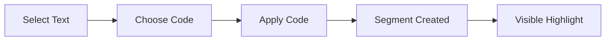
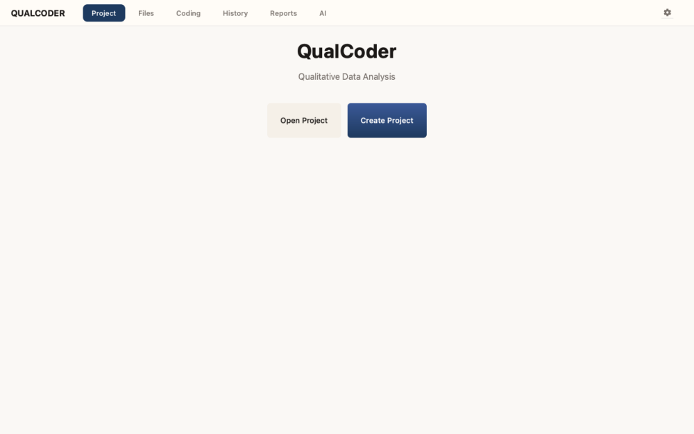

# Coding Text

Coding is the process of applying codes to segments of your data. This is the core activity in qualitative analysis.

## The Coding Workflow

## The Coding Screen

The coding screen has a streamlined toolbar with:

- **Media Type Tabs** - Switch between Text, A/V, Image, and PDF sources
- **Search Box** - Search within the current transcript
- **Show Details** - Toggle the details panel to view segment information

## Opening a Source

1. Navigate to the **Coding** screen
2. Select a source from the source list
3. The document opens in the main viewer

## Selecting Text

### Basic Selection

1. Click at the start of your desired text
2. Drag to the end of the selection
3. Release the mouse button

The selected text is highlighted.

### Selection Tips

> **Tip: Precise Selections**
> - Double-click to select a word
> - Triple-click to select a paragraph
> - Hold `Shift` and click to extend selection

*The coding screen with document viewer and code panel.*

## Applying Codes

### Method 1: Quick Mark (Recommended)

The fastest way to code:

1. Select a code from the code list (it becomes "active")
2. Select text in the document
3. Press `Q` to apply the code

> **Info: Quick Mark**
>
> The `Q` key instantly applies the currently active code to your selection. This is the most efficient way to code.

### Method 2: Right-Click Menu

1. Select text in the document
2. Right-click the selection
3. Choose **Apply Code**
4. Select a code from the submenu

### Method 3: Code Panel

1. Select text in the document
2. Click a code in the code panel
3. The code is applied

## Viewing Coded Segments

### Highlights

Coded segments appear as colored highlights matching the code's color:

- Hover over a highlight to see the code name
- Overlapping codes show as mixed colors
- Click a highlight to select that segment

### Segment List

View all segments for the current source:

1. Click **Show Details** in the toolbar to reveal the details panel
2. See a list of all coded segments for the selected code
3. Click a segment to jump to it in the document

## Removing Codes

### Remove from Segment

1. Click on a coded segment
2. Right-click and select **Remove Code**
3. Choose which code to remove (if multiple)

### Remove All from Selection

1. Select the coded text
2. Press `Delete` or `Backspace`
3. Confirm the removal

## Multiple Codes

You can apply multiple codes to the same text:

1. Code a segment with the first code
2. Select the same (or overlapping) text
3. Apply a second code

The segment will show a combined color and list all applied codes on hover.

*A text segment with multiple codes applied, showing combined highlighting.*

## Creating Codes While Coding

You can create new codes without leaving the coding screen:

1. Press `N` to open the **Create Code** dialog
2. Enter a code name
3. Select a color from the palette
4. Optionally add a description
5. Click **Create Code**

*The Create Code dialog opened via the N key shortcut.*

The new code is immediately available for use and can be applied to your current selection.

> **Tip: In-Vivo Coding**
>
> Press `V` to create a code from your selected text. The selection becomes the code name automatically.

## Keyboard Shortcuts

| Action | Shortcut |
|--------|----------|
| Quick Mark | `Q` |
| New Code | `N` |
| In-Vivo Code | `V` |
| Unmark | `U` |
| Undo | `Cmd+Z` / `Ctrl+Z` |
| Redo | `Cmd+Shift+Z` / `Ctrl+Y` |
| Remove Code | `Delete` |

## Segment Memos

Add notes to coded segments:

1. Right-click on a coded segment
2. Select **Add Memo**
3. Enter your notes about this segment
4. Click **Save**

View all memos in the Memos Panel:

*The Memos Panel showing all segment memos for the current source.*

## Best Practices

> **Consistent Boundaries**
> - Include complete phrases or sentences
> - Avoid cutting words in half
> - Be consistent with punctuation inclusion

> **Granularity**
> - Code meaningful units of meaning
> - Don't code too large (entire paragraphs)
> - Don't code too small (single words) unless meaningful

> **Overlap Strategy**
> - Decide early if codes can overlap
> - Document your overlap rules
> - Be consistent throughout

## Next Steps

- [Use AI features](ai-features.md) to accelerate coding
- [Manage your codes](codes.md) as your scheme evolves
