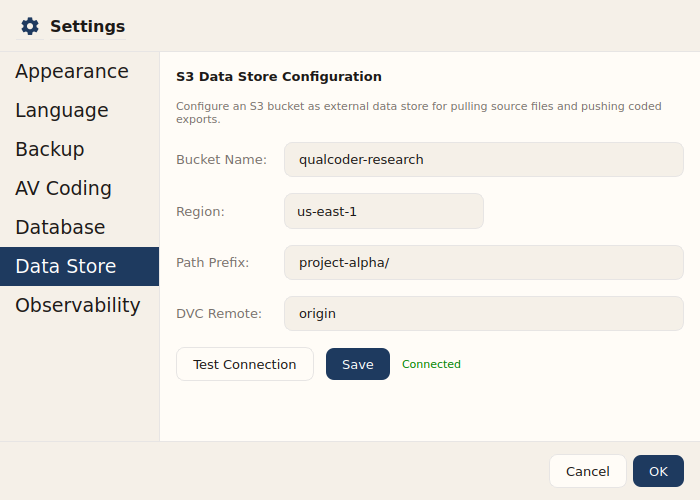
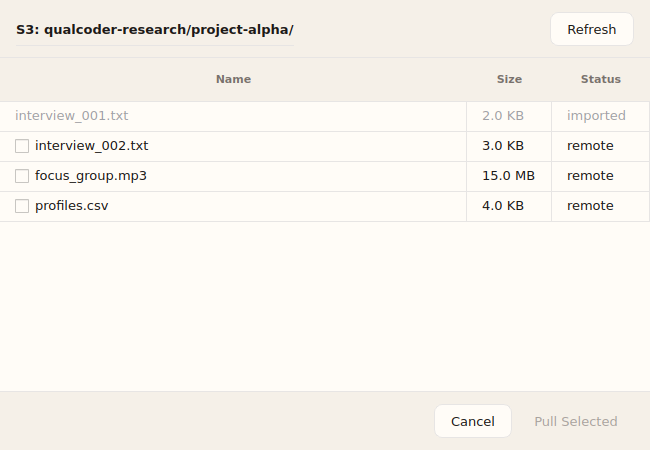

# Data Store (S3 + DVC)

QualCoder v2 supports connecting to an **S3 data store** for cloud-based
research data management. Files are version-controlled with **DVC** (Data
Version Control), enabling reproducible research workflows.

## Overview

The data store feature lets you:

- **Configure** an S3 bucket as your project's data store
- **Scan/browse** files in the bucket
- **Pull** source files from S3 into your project
- **Push** coded exports back to S3
- **Version** all data transfers with DVC for reproducibility

## Prerequisites

- An AWS account with an S3 bucket
- AWS credentials configured (via `~/.aws/credentials` or environment variables)
- `boto3` Python package (included with QualCoder)
- `dvc` Python package (included with QualCoder)

## Configuration

### Via Settings Dialog

Open **Settings > Data Store** to configure your S3 bucket connection.



Enter your bucket name, AWS region, optional path prefix, and DVC remote name.
Use **Test Connection** to verify S3 access before saving.

### Via MCP Tool (AI Agent)

The AI agent can configure the data store using the `configure_datastore` tool:

```
configure_datastore(
    bucket_name="my-research-data",
    region="us-east-1",
    prefix="project-alpha/",
    dvc_remote_name="origin"
)
```

### Parameters

| Parameter | Required | Description |
|-----------|----------|-------------|
| `bucket_name` | Yes | S3 bucket name (3-63 chars, lowercase) |
| `region` | Yes | AWS region (e.g., `us-east-1`) |
| `prefix` | No | S3 key prefix to scope the store |
| `dvc_remote_name` | No | DVC remote name (default: `origin`) |

## Importing Files from S3

Use the **Import > From S3 Data Store...** menu in the File Manager toolbar
to open the import dialog.



The dialog shows all files in the configured S3 bucket. Files already imported
into your project are greyed out with an "imported" status. Check the files
you want to pull and click **Pull Selected** to download and auto-import them.

## Scanning Files

Browse available files in the data store:

```
scan_datastore(prefix="raw/")
```

Returns file metadata: key, size, last modified, extension.

## Pulling Files

Download a file from S3 into your local project via DVC:

```
pull_source(
    key="raw/interview_001.txt",
    local_path="/path/to/project/sources/interview_001.txt"
)
```

Files are tracked by DVC for version control.

## Pushing Exports

Upload coded exports to S3:

```
push_results(
    local_path="/path/to/codebook.txt",
    destination_key="exports/codebook_v1.txt"
)
```

## DVC Pipeline Support

For advanced workflows, use the DVC pipeline template at
`scripts/dvc_pipeline_template.yaml`. This defines stages for:

1. **Aggregate data** — Pull raw data from external sources
2. **Import profiles** — Convert to QualCoder sources
3. **Export results** — Export coded data
4. **Triangulation** — Cross-reference coded data with analytics

Copy to your project and customize:

```bash
cp scripts/dvc_pipeline_template.yaml dvc.yaml
dvc repro  # Run all stages
```

## Offline Mode

The data store works gracefully when offline:

- Scan operations return an empty list if S3 is unreachable
- Pull/push operations fail with a clear error message
- All local operations (coding, analysis) continue to work
- DVC tracks changes locally; push when back online

## MCP Tools Reference

| Tool | Description |
|------|-------------|
| `configure_datastore` | Set up S3 bucket + DVC remote |
| `scan_datastore` | List files in S3 |
| `pull_source` | Pull file from S3 via DVC |
| `push_results` | Push export to S3 via DVC |
| `export_and_push` | Export project data + push |
| `scan_and_import` | Pull + auto-import by format |
