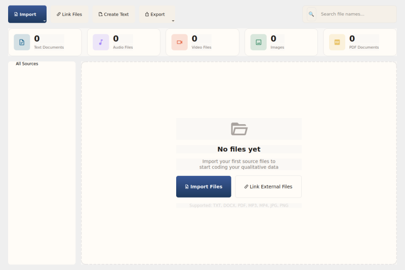

# Import & Export

QualCoder supports importing and exporting project data in multiple formats for interoperability with other QDA tools and for sharing your work.

## Accessing Import/Export

All import and export operations are available from the **File Manager** toolbar:

- **Import** button dropdown: Import source files, code lists, survey CSV, REFI-QDA, and RQDA projects
- **Export** button dropdown: Export selected sources, codebooks, coded HTML, and REFI-QDA projects


*The Import dropdown showing all available import formats.*



*The Export dropdown showing all available export formats.*

## Export Formats

### Export Codebook (.txt)

Export your codebook as a plain text file with codes organized by category.

1. Click **Export** > **Codebook (.txt)...**
2. Choose a save location
3. Click **Save**

The codebook includes code names, colors (as hex values), and category groupings.

### Export Coded HTML (.html)

Export coded text as an HTML file with color-highlighted segments.

1. Click **Export** > **Coded HTML (.html)...**
2. Choose a save location
3. Click **Save**

Each coded segment is highlighted with its code's color. Hover over a highlight to see the code name.

### Export REFI-QDA Project (.qdpx)

Export the entire project in REFI-QDA format for interoperability with NVivo, ATLAS.ti, MAXQDA, and other tools that support the standard.

1. Click **Export** > **REFI-QDA Project (.qdpx)...**
2. Choose a save location
3. Click **Save**

The `.qdpx` file is a ZIP archive containing:
- `project.qde` — XML with codes, categories, sources, and coded segments
- `Sources/` — Embedded source files

## Import Formats

### Import Code List (.txt)

Import a list of codes from a plain text file. Each line becomes a code. Indented lines (tabs or spaces) are placed under the preceding category.

1. Click **Import** > **Code List (.txt)...**
2. Select the text file
3. Click **Open**

**Format example:**
```
Emotions
    Joy
    Anger
    Sadness
Themes
    Resilience
    Growth
```

### Import Survey CSV (.csv)

Import survey data as cases with attributes. Each row becomes a case.

1. Click **Import** > **Survey CSV (.csv)...**
2. Select the CSV file
3. Click **Open**

The first column is used as the case name by default. All other columns become case attributes.

### Import REFI-QDA Project (.qdpx)

Import a project exported from another QDA tool in REFI-QDA format.

1. Click **Import** > **REFI-QDA Project (.qdpx)...**
2. Select the `.qdpx` file
3. Click **Open**

Codes, categories, sources, and coded segments are imported. Existing data is preserved.

### Import RQDA Project (.rqda)

Import a project from RQDA (R package for Qualitative Data Analysis).

1. Click **Import** > **RQDA Project (.rqda)...**
2. Select the `.rqda` file
3. Click **Open**

Active codes, sources, coded segments, and categories are imported. Deleted items (status != 1) are skipped.
