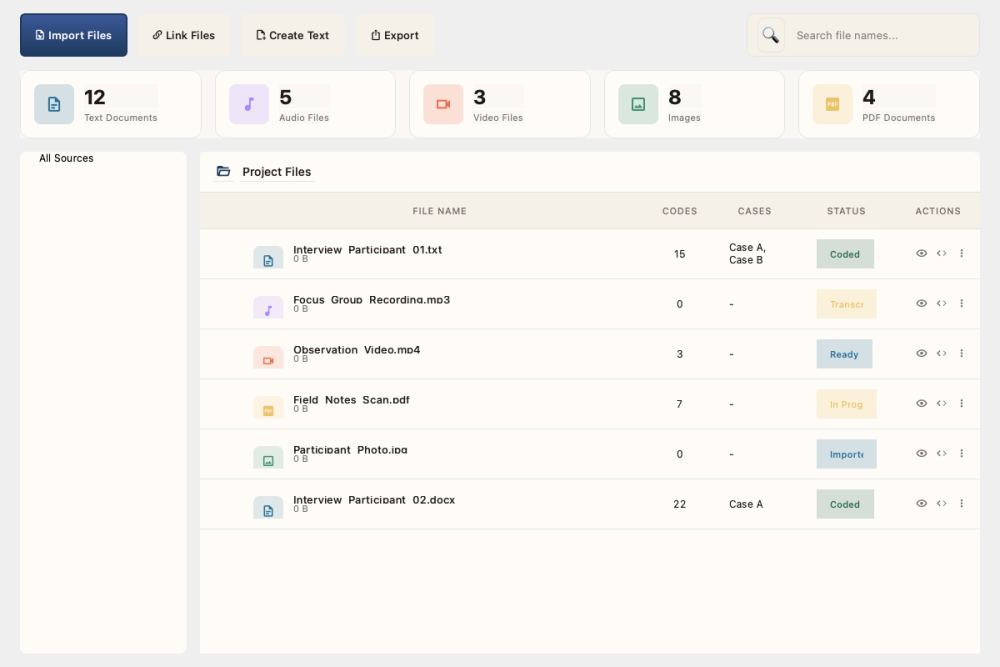
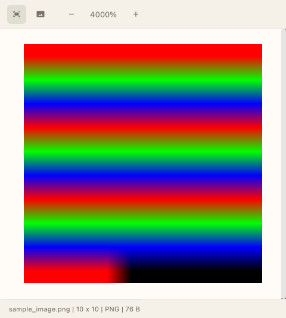

# Managing Sources

Sources are the documents and media files you analyze. QualCoder supports text, PDF, images, audio, and video.

## Supported File Types

| Type | Extensions | Features |
|------|------------|----------|
| Text | `.txt`, `.docx`, `.rtf` | Full-text search, coding |
| PDF | `.pdf` | Text extraction, region coding |
| Images | `.png`, `.jpg`, `.gif` | Region selection, coding |
| Audio | `.mp3`, `.wav`, `.m4a` | Timeline coding, transcription |
| Video | `.mp4`, `.mov`, `.avi` | Timeline coding, frame extraction |

## Importing Sources

### Import Individual Files

1. Navigate to the **File Manager** screen
2. Click **Import Files**
3. Select one or more files
4. Click **Open**

*The File Manager showing imported source files with type statistics.*

> **Tip: Bulk Import**
>
> You can select multiple files at once. Hold `Cmd` (macOS) or `Ctrl` (Windows) while clicking to select multiple files.

### Import a Folder

To import all files from a folder:

1. Click **Import Folder**
2. Select the folder containing your files
3. Choose file type filters (optional)
4. Click **Import**

## Organizing Sources

### Create Folders

Organize sources into folders for better management:

1. Click **New Folder** button
2. Enter a folder name
3. Click **Create**

### Move Sources

Drag and drop sources into folders to organize them.

### Source Metadata

Each source has metadata you can view and edit:

1. Right-click a source
2. Select **View Metadata**
3. Edit fields like:
   - Author
   - Date
   - Description
   - Custom attributes

## Viewing Sources

### Text Documents

Click a text source to open it in the document viewer. The text is displayed with:

- Line numbers
- Coding highlights
- Search functionality

### PDF Documents

PDFs are displayed page-by-page with:

- Page navigation
- Zoom controls
- Text selection for coding

### Images

Images open in the image viewer with:

- Pan and zoom
- Region selection tools
- Overlay of coded regions

*The Image Viewer displaying an imported image with zoom controls.*

### Audio/Video

Media files open in the media player with:

- Playback controls
- Timeline visualization
- Segment marking tools

*The Media Player with playback controls for audio/video files.*

### Empty State

When no sources have been imported yet:

*The File Manager empty state with import options.*

## AI Agent Source Management

When an AI assistant is connected via MCP (see [MCP Setup](./mcp-setup.md)), it can manage sources programmatically:

### Adding Text Sources

The agent can add text sources directly using the `add_text_source` tool, providing a name and content without needing a file on disk. This is useful for:

- Ingesting interview transcripts from other tools
- Adding field notes collected during research
- Creating sources from processed or transformed text

Each source must have a unique name within the project.

### Importing Files

The agent can import file-based sources (PDFs, images, audio, video) using the `import_file_source` tool by providing an absolute file path. The file type is auto-detected from the extension:

- **Text:** `.txt`, `.docx`, `.rtf`, `.md`, `.odt`, `.epub`
- **PDF:** `.pdf` (with automatic text extraction)
- **Images:** `.png`, `.jpg`, `.gif`, `.bmp`, `.tiff`, `.webp`
- **Audio:** `.mp3`, `.wav`, `.m4a`, `.ogg`, `.flac`
- **Video:** `.mp4`, `.mov`, `.avi`, `.mkv`, `.webm`

Use the `dry_run` parameter to validate a file before importing. The optional `name` parameter overrides the default filename-based source name.

### Organizing into Folders

The agent can create folders (`create_folder`), rename them (`rename_folder`), and move sources between folders (`move_source_to_folder`). This enables automated organization of large source collections.

### Removing Sources

The agent uses a **preview-then-confirm** workflow for safe deletion:

1. `remove_source` with `confirm=false` (default) shows what would be deleted
2. You review the preview (source name, type, number of coded segments affected)
3. `remove_source` with `confirm=true` performs the actual deletion

This ensures you always know what will be removed before it happens.

## Deleting Sources

> **Warning: Caution**
>
> Deleting a source also removes all coded segments associated with it.

1. Right-click the source
2. Select **Delete**
3. Confirm the deletion

## Next Steps

With your sources imported, you're ready to:

1. [Create a coding scheme](codes.md)
2. [Start coding your data](coding.md)
