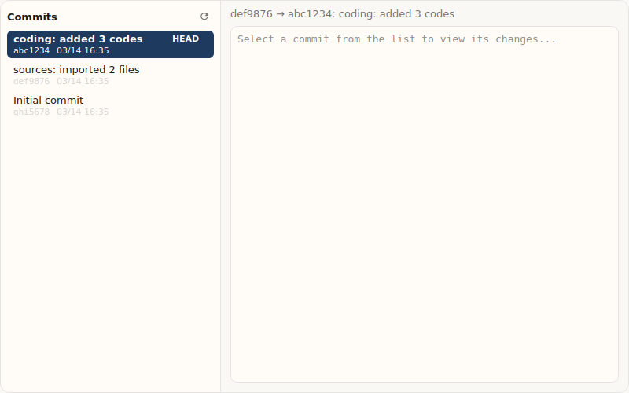
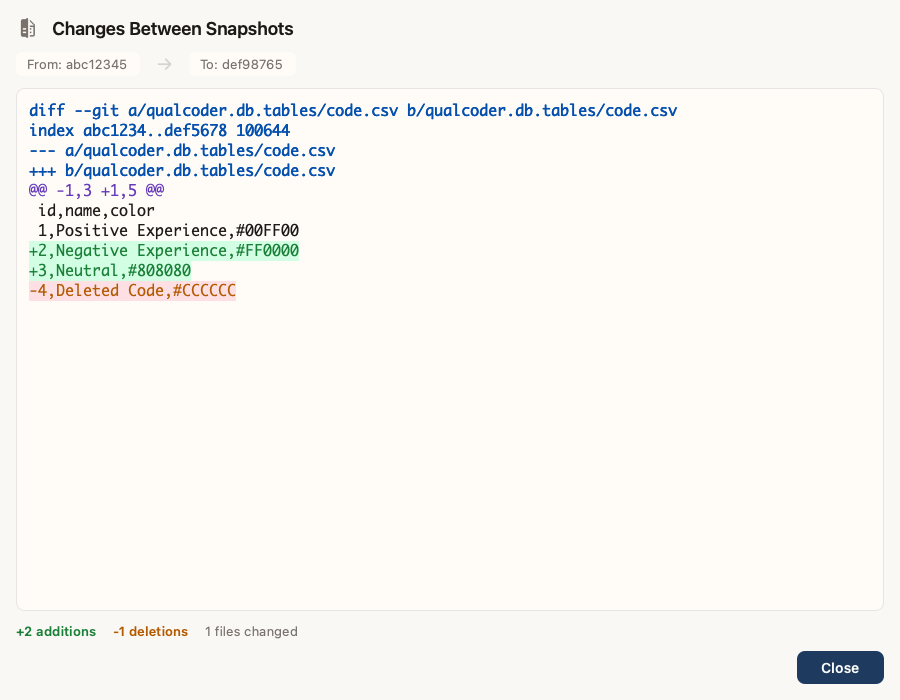

# Version Control

QualCoder v2 includes built-in version control that automatically tracks changes to your project. You can view history, compare changes, and restore previous states.

## How It Works

Version control uses **sqlite-diffable** to convert your database into human-readable text files, then tracks changes with Git. This means:

- Every change is automatically recorded
- You can see exactly what changed between versions
- You can restore to any previous state
- Your data is safe from accidental loss

## Viewing History

### Open the History Screen

1. Click **History** in the sidebar (or press the history icon)
2. You'll see a timeline of all snapshots

Each snapshot shows:
- **Timestamp** - When the change was recorded
- **Message** - What changed (e.g., "coding: 2 events, sources: 1 event")
- **SHA** - Unique identifier for the snapshot



### Understanding the Timeline

The timeline shows snapshots from newest to oldest. The top entry (marked **Current**) represents your current state.

```
● Current - coding: 3 events              2 minutes ago
○ coding: 1 event                        15 minutes ago
○ sources: 2 events                      1 hour ago
○ Initial snapshot                       Yesterday
```

## Viewing Changes (Diff)

To see what changed between two snapshots:

1. Select two snapshots from the history list
2. Click **View Diff** (or double-click a snapshot to compare with current)
3. A diff viewer shows the changes

### Reading the Diff

The diff uses color highlighting:

| Color | Meaning |
|-------|---------|
| **Green background** | Lines added |
| **Red background** | Lines removed |
| **Blue text** | File headers |
| **Purple text** | Section markers (`@@`) |



> **Tip: Stats Summary**
>
> The diff viewer shows a summary at the bottom:
> - `+15 additions` - Lines added
> - `-3 deletions` - Lines removed
> - `2 files changed` - Number of affected files

## Restoring Previous States

To restore your project to a previous state:

1. Find the snapshot you want in the history
2. Click **Restore** (or right-click and select "Restore to this snapshot")
3. Confirm the restore action

> **Warning: Data Loss**
>
> Restoring will replace your current data with the selected snapshot.
> Any changes made after that snapshot will be lost.
> Consider exporting your current state first if unsure.

### What Gets Restored

When you restore:
- All codes, categories, and segments return to that state
- Sources and their metadata return to that state
- Cases and attributes return to that state

### What Stays the Same

- Project settings (stored separately)
- External source files (only references are tracked)

## Auto-Commit Behavior

QualCoder automatically creates snapshots when you:

- Create, edit, or delete codes
- Code text segments
- Import or remove sources
- Create or modify cases

Changes are batched for 500ms before committing, so rapid edits become a single snapshot.

### Commit Messages

Auto-generated messages describe what changed:

| Message | Meaning |
|---------|---------|
| `coding.code_created` | Single code was created |
| `coding: 5 events` | Multiple coding operations |
| `coding: 2 events, sources: 1 event` | Mixed operations |

## Initializing Version Control

Version control is automatically initialized when you create a new project. For existing projects:

1. Open the project
2. Go to **History**
3. Click **Initialize Version Control**
4. An initial snapshot is created

## Technical Details

### Storage Location

Version control data is stored in `.qualcoder-vcs/` inside your project folder:

```
MyProject/
├── MyProject.qda        # SQLite database
└── .qualcoder-vcs/      # Version control
    ├── .git/            # Git repository
    └── *.sql            # Diffable SQL files
```

### Disk Space

Each snapshot stores only changes (diffs), so disk usage grows slowly. A typical project with hundreds of changes uses only a few MB.

## Troubleshooting

### "Version control not initialized"

This means the project was created before VCS was available:
1. Go to **History**
2. Click **Initialize Version Control**

### "Cannot restore: uncommitted changes"

Commit or discard current changes before restoring:
1. Make a small change to trigger auto-commit
2. Wait 1 second for the commit
3. Try restore again

### History not updating

If the history doesn't show recent changes:
1. Click **Refresh** in the history panel
2. Check that VCS is initialized

## Best Practices

> **Regular Backups**
> While version control protects against accidental changes,
> also keep external backups of your `.qda` file.

> **Meaningful Milestones**
> For important milestones, manually create a commit with a
> descriptive message by saving and waiting for auto-commit.

> **Before Major Changes**
> Note the current snapshot SHA before major reorganization,
> so you can easily restore if needed.

## Next Steps

- [View and manage codes](codes.md)
- [Start coding text](coding.md)
- [Configure settings](settings.md)
